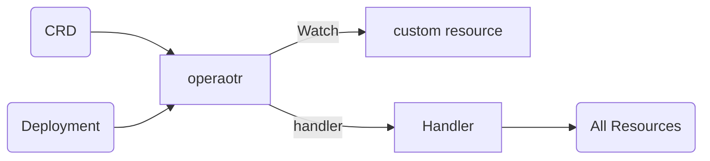

准备用CRD做一个数据迁移的operator, 将不同结点的pvc迁移. 于是决定使用operator-sdk.

operator-sdk能够自动生成operator相关代码, 并能够直接部署到k8s集群中, 使用起来还是相当方便的.

operator-sdk需要搭配operator-lifecycle-manager来使用, 安装配置方法这里不做赘述, 可以参考官网,或者这篇文章:[Developing Kubernetes Operator is now easy with Operator Framework](https://devops.college/developing-kubernetes-operator-is-now-easy-with-operator-framework-d3194a7428ff)

operator的大体框架如下所示:

通过operator-sdk可以自动生成 crd.yaml, operator.yaml, cr.yaml, rbac.yaml. 这些都需要手动部署到k8s. 

operator.yaml是最重要的一个. 里面包含handle逻辑和type结构, 它是你需要去实现和填充的业务逻辑, 理论上handle可以实现任何逻辑, 比如对修改apiserver中的某些资源内容, 或者创建新的资源, 或者起一个pod和job做一些hack的事情. 

做完这些就可以生成operator了, 他会build一个image, operator是一个deployment的, 它去拉这个image然后watch你定义的cr, 当你创建或者删除cr, 就会触发handle操作.	