# etcd架构设计深度剖析

## 整体架构图

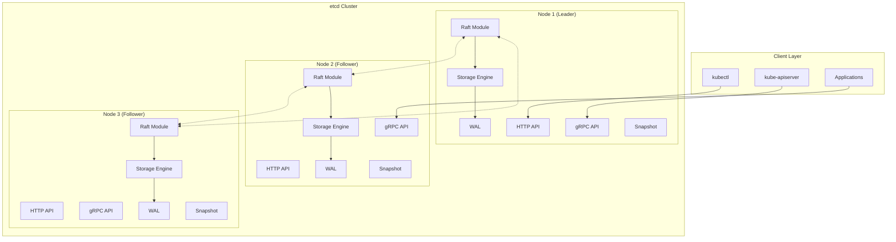

## 核心模块详解

### 1. API层设计

#### gRPC API接口
```protobuf
// etcd gRPC服务定义
service KV {
    // 单点操作
    rpc Range(RangeRequest) returns (RangeResponse);
    rpc Put(PutRequest) returns (PutResponse);
    rpc DeleteRange(DeleteRangeRequest) returns (DeleteRangeResponse);

    // 事务操作
    rpc Txn(TxnRequest) returns (TxnResponse);

    // 压缩操作
    rpc Compact(CompactionRequest) returns (CompactionResponse);
}

service Watch {
    // Watch流
    rpc Watch(stream WatchRequest) returns (stream WatchResponse);
}

service Lease {
    // 租约管理
    rpc LeaseGrant(LeaseGrantRequest) returns (LeaseGrantResponse);
    rpc LeaseRevoke(LeaseRevokeRequest) returns (LeaseRevokeResponse);
    rpc LeaseKeepAlive(stream LeaseKeepAliveRequest) returns (stream LeaseKeepAliveResponse);
    rpc LeaseTimeToLive(LeaseTimeToLiveRequest) returns (LeaseTimeToLiveResponse);
}

service Cluster {
    // 集群管理
    rpc MemberAdd(MemberAddRequest) returns (MemberAddResponse);
    rpc MemberRemove(MemberRemoveRequest) returns (MemberRemoveResponse);
    rpc MemberUpdate(MemberUpdateRequest) returns (MemberUpdateResponse);
    rpc MemberList(MemberListRequest) returns (MemberListResponse);
}
```

#### HTTP RESTful API
```bash
# HTTP API端点映射
GET    /v3/kv/range           # 读取键值
POST   /v3/kv/put             # 写入键值
POST   /v3/kv/deleterange     # 删除键值
POST   /v3/kv/txn             # 事务操作

GET    /v3/watch              # Watch操作
POST   /v3/lease/grant        # 租约授权
POST   /v3/lease/revoke       # 租约撤销

POST   /v3/cluster/member/add    # 添加成员
POST   /v3/cluster/member/remove # 移除成员
GET    /v3/cluster/member/list   # 列出成员
```

### 2. Raft共识层

#### Raft状态机
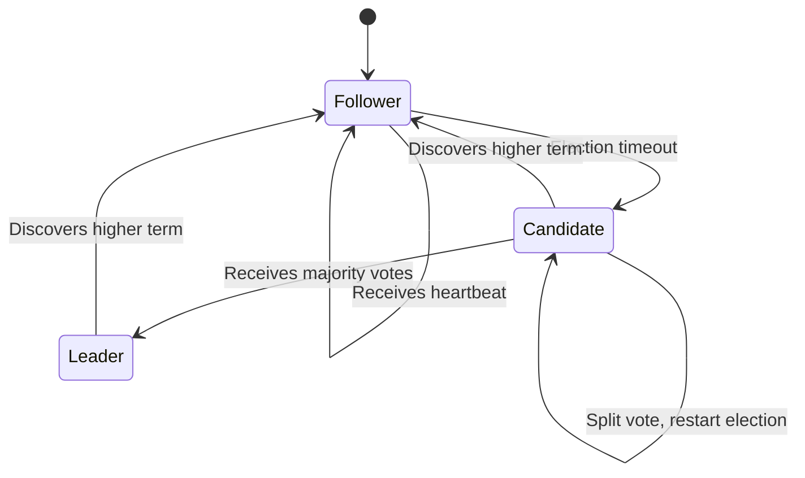

#### Raft核心组件
```go
// Raft节点状态
type NodeState int

const (
    StateFollower NodeState = iota
    StateCandidate
    StateLeader
)

// Raft日志条目
type Entry struct {
    Term   uint64    // 任期号
    Index  uint64    // 日志索引
    Type   EntryType // 条目类型
    Data   []byte    // 数据载荷
}

// Raft配置
type Config struct {
    ID                        uint64        // 节点ID
    ElectionTick             int           // 选举超时tick数
    HeartbeatTick            int           // 心跳间隔tick数
    Storage                  Storage       // 存储接口
    Applied                  uint64        // 已应用的日志索引
    MaxSizePerMsg            uint64        // 消息最大大小
    MaxInflightMsgs          int           // 最大在途消息数
    CheckQuorum              bool          // 是否检查仲裁
    PreVote                  bool          // 是否启用预投票
}
```

#### Leader选举流程
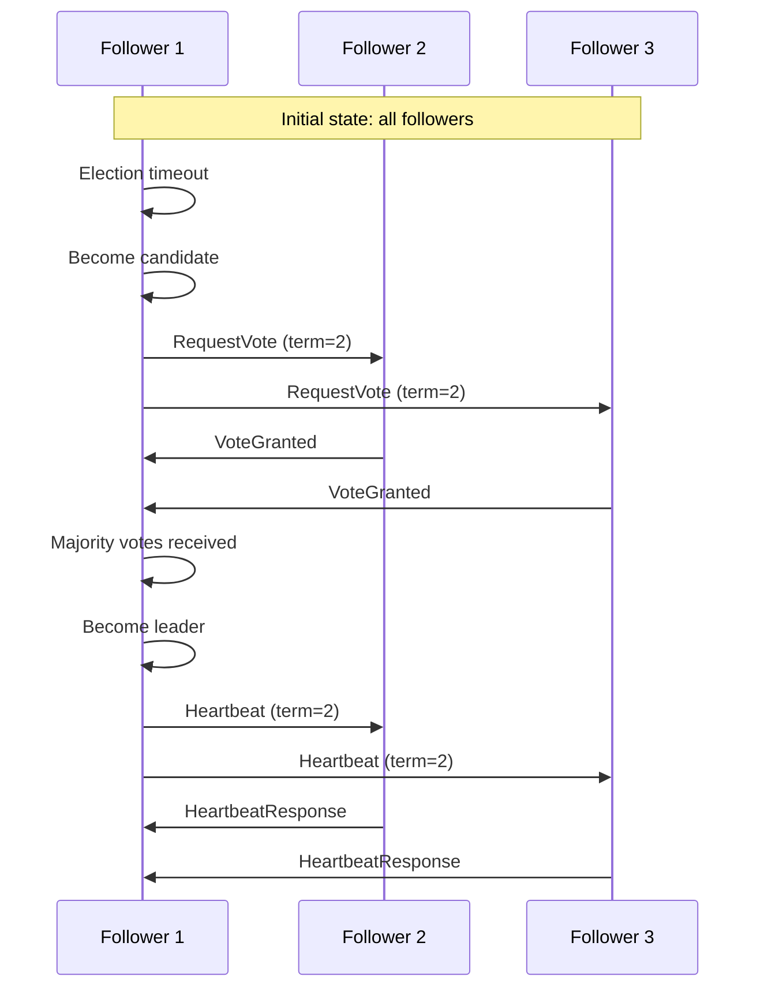

### 3. 存储引擎层

#### BoltDB存储架构
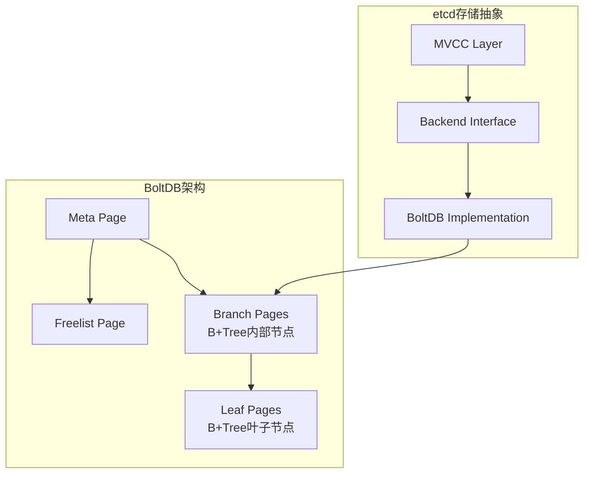

#### MVCC数据模型
```go
// 键空间结构
type KeyValue struct {
    Key            []byte   // 用户键
    CreateRevision int64    // 创建版本号
    ModRevision    int64    // 修改版本号
    Version        int64    // 键的版本号
    Value          []byte   // 值
    Lease          int64    // 租约ID
}

// MVCC存储接口
type KVStore interface {
    // 读操作
    Range(key, end []byte, limit, rangeRev int64) (*RangeResult, error)

    // 写操作
    Put(key, value []byte, lease lease.LeaseID) int64
    DeleteRange(key, end []byte) (n, rev int64)

    // 事务操作
    TxnBegin() TxnID
    TxnEnd(txnID TxnID) error
    TxnRange(txnID TxnID, key, end []byte, limit, rangeRev int64) (*RangeResult, error)
    TxnPut(txnID TxnID, key, value []byte, lease lease.LeaseID) (rev int64, err error)
    TxnDeleteRange(txnID TxnID, key, end []byte) (n, rev int64)

    // 压缩操作
    Compact(rev int64) (<-chan struct{}, error)
}
```

#### 存储层次结构
```bash
# etcd存储目录结构
/var/lib/etcd/
├── member/
│   ├── snap/                    # 快照文件目录
│   │   ├── 0000000000000001-0000000000000001.snap
│   │   └── db                   # BoltDB数据文件
│   └── wal/                     # Write-Ahead Log目录
│       ├── 0000000000000000-0000000000000000.wal
│       └── 0.tmp
└── proxy/                       # 代理相关文件
```

### 4. WAL日志系统

#### WAL文件格式
```go
// WAL记录类型
type Record struct {
    Type EntryType // 记录类型
    Crc  uint32    // CRC校验和
    Data []byte    // 数据内容
}

// WAL文件头
type WalHeader struct {
    Magic   uint64 // 魔数标识
    Version uint64 // WAL版本
    ID      uint64 // 集群ID
    NodeID  uint64 // 节点ID
}

// 日志条目类型
type EntryType uint8

const (
    EntryNormal     EntryType = 0  // 普通日志条目
    EntryConfChange EntryType = 1  // 配置变更条目
)
```

#### WAL写入流程
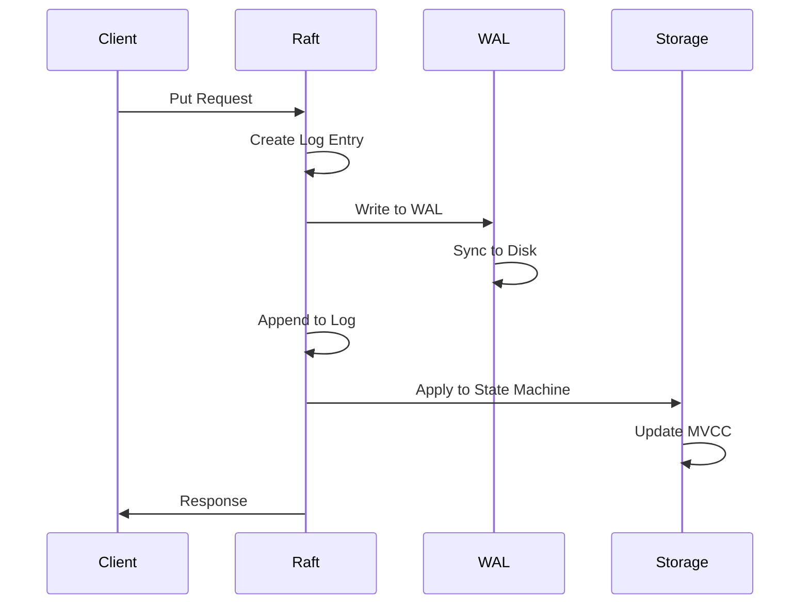

### 5. 快照机制

#### 快照数据结构
```go
// 快照元数据
type Snapshot struct {
    Index     uint64 // 快照对应的日志索引
    Term      uint64 // 快照对应的任期
    ConfState ConfState // 集群配置状态
    Data      []byte // 快照数据
}

// 快照管理器
type Snapshotter struct {
    dir string // 快照目录
}

func (s *Snapshotter) SaveSnap(snapshot raftpb.Snapshot) error {
    // 保存快照到磁盘
    fname := fmt.Sprintf("%016x-%016x.snap", snapshot.Metadata.Term, snapshot.Metadata.Index)
    return s.save(fname, snapshot)
}

func (s *Snapshotter) Load() (*raftpb.Snapshot, error) {
    // 加载最新快照
    return s.loadMatching(func(fileName string) bool { return true })
}
```

#### 快照创建流程
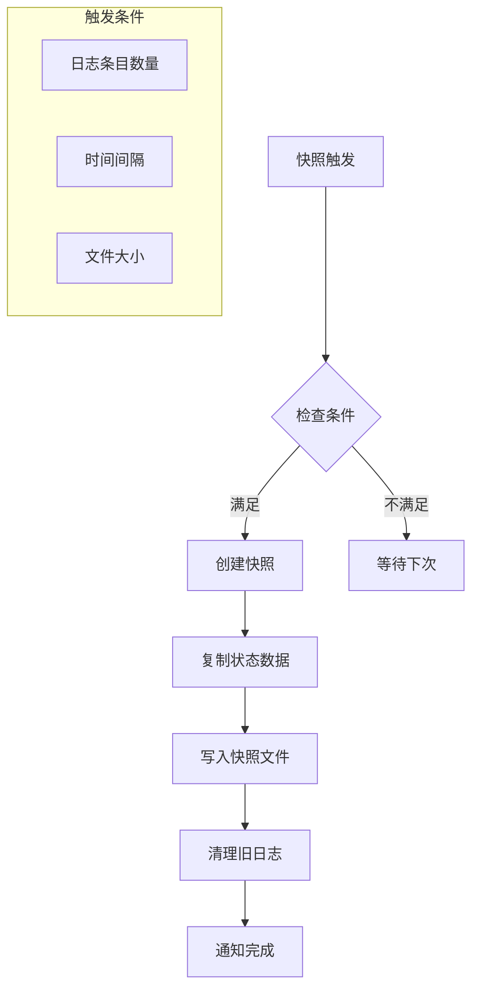

### 6. 租约系统

#### 租约管理架构
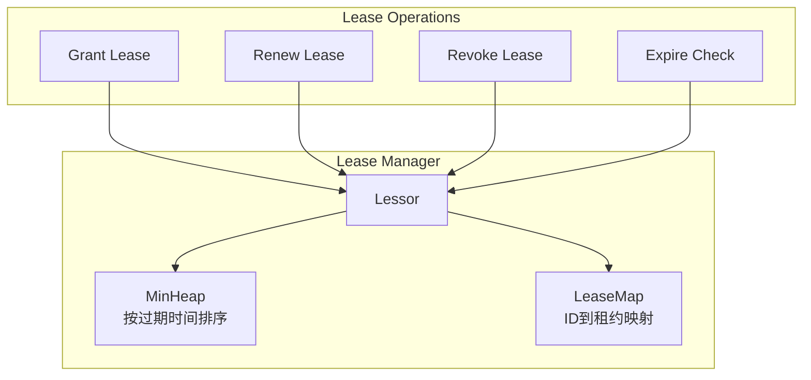

#### 租约数据结构
```go
// 租约定义
type Lease struct {
    ID           LeaseID           // 租约ID
    TTL          int64            // 生存时间（秒）
    RemainingTTL int64            // 剩余时间
    Keys         map[string]struct{} // 关联的键
    Expiry       time.Time         // 过期时间
}

// 租约管理器
type Lessor struct {
    mu        sync.RWMutex
    leaseMap  map[LeaseID]*Lease    // 租约映射
    leaseHeap LeaseQueue            // 过期时间堆
    backend   backend.Backend      // 存储后端
}

// 租约操作接口
type Lessor interface {
    Grant(id LeaseID, ttl int64) (*Lease, error)
    Revoke(id LeaseID) error
    Renew(id LeaseID) (int64, error)
    Lookup(id LeaseID) *Lease
    ExpiredLeasesC() <-chan []*Lease
}
```

## 数据流分析

### 写操作流程
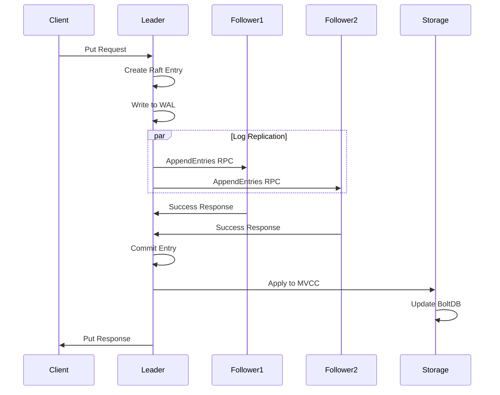

### 读操作流程
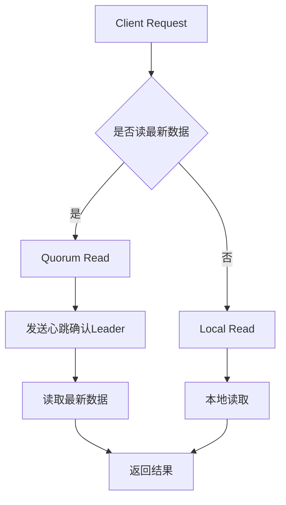

### Watch事件流
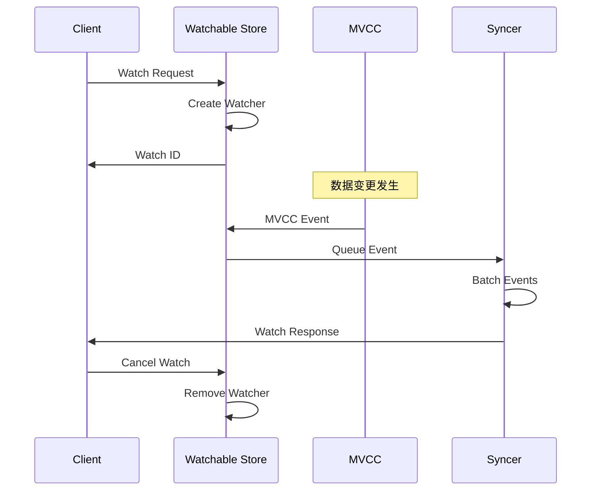

## 集群管理架构

### 成员管理
```go
// 集群成员定义
type Member struct {
    ID         uint64   `json:"id"`
    Name       string   `json:"name"`
    PeerURLs   []string `json:"peerURLs"`
    ClientURLs []string `json:"clientURLs"`
}

// 集群配置
type Cluster struct {
    id      uint64
    token   string
    members map[uint64]*Member

    // 集群状态
    version int
    index   uint64
}

// 成员变更操作
type ConfChange struct {
    Type    ConfChangeType // ADD, REMOVE, UPDATE
    NodeID  uint64
    Context []byte         // 成员信息
}
```

### 动态重配置流程
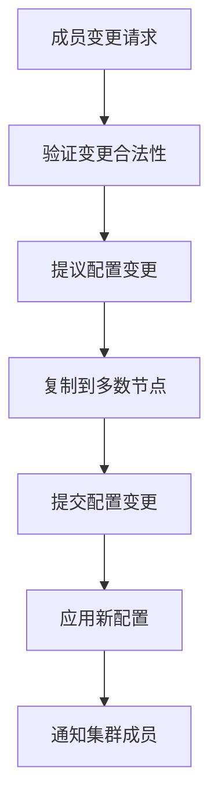

## 网络通信架构

### gRPC通信栈
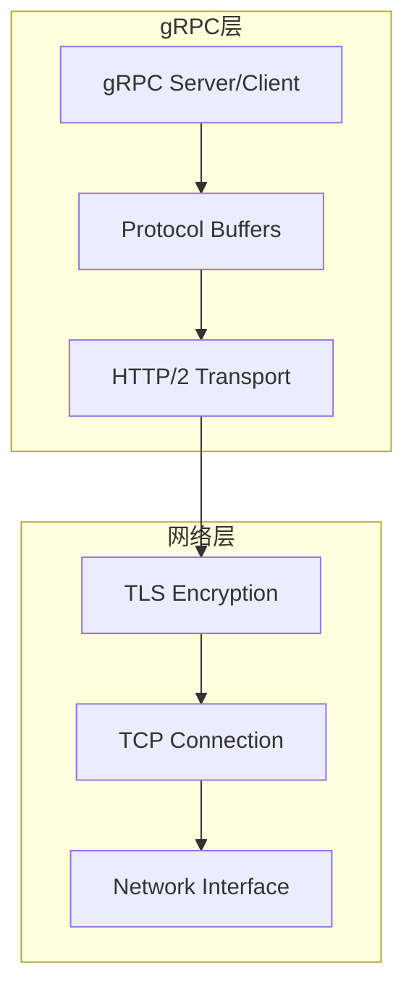

### 连接池管理
```go
// 连接池配置
type ClientConfig struct {
    DialTimeout      time.Duration
    DialKeepAliveTime time.Duration
    DialKeepAliveTimeout time.Duration
    MaxCallSendMsgSize   int
    MaxCallRecvMsgSize   int
    TLS                  *tls.Config
    Username             string
    Password             string
}

// 负载均衡器
type Balancer interface {
    // 选择端点
    Pick() (Endpoint, error)
    // 更新端点列表
    UpdateAddrs(addrs []string) error
    // 标记端点状态
    MarkUnhealthy(addr string)
}
```

## 性能优化设计

### 批量操作优化
```go
// 批量读取
type RangeRequest struct {
    Key           []byte
    RangeEnd      []byte
    Limit         int64
    SortOrder     RangeRequest_SortOrder
    SortTarget    RangeRequest_SortTarget
    Serializable  bool   // 是否可序列化读
    KeysOnly      bool   // 只返回键
    CountOnly     bool   // 只返回计数
}

// 批量写入事务
type TxnRequest struct {
    Compare []Compare  // 条件比较
    Success []RequestOp // 成功时的操作
    Failure []RequestOp // 失败时的操作
}
```

### 缓存机制
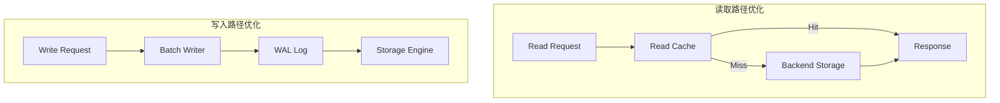

## 核心设计原则

### 1. 强一致性保证
- **Raft共识**: 保证分布式环境下的数据一致性
- **WAL日志**: 确保数据持久性和恢复能力
- **MVCC**: 提供快照隔离和版本控制

### 2. 高性能设计
- **gRPC协议**: 高效的二进制通信
- **批量操作**: 减少网络开销
- **缓存机制**: 提升读取性能

### 3. 高可用性
- **集群部署**: 支持多节点容错
- **自动故障转移**: Leader选举机制
- **数据复制**: 多副本保证数据安全

---

**这是etcd架构的深度技术解析，展现了分布式一致性存储的核心设计思想。接下来我们将探讨具体的实现细节和最佳实践。**

**系列文章导航：**
- [etcd分布式存储原理与实践](./kubernetes-etcd-distributed-storage) ← 基础概述
- [etcd核心概念与MVCC机制](./etcd-core-concepts-mvcc) ← 下一篇
- [etcd源码分析与性能优化](./etcd-source-code-performance)
- [etcd实战操作指南](./kubernetes-etcd-hands-on-guide)