# API Server架构设计深度剖析

## 整体架构图

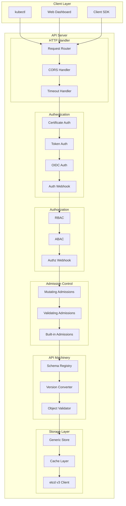

## 核心模块详解

### 1. HTTP服务层

#### Request Router (请求路由)
负责将HTTP请求路由到相应的处理器：

```go
// API路由示例结构
type APIHandler struct {
    group      string    // API组 (如 "apps")
    version    string    // 版本 (如 "v1")
    resource   string    // 资源类型 (如 "deployments")
    namespace  string    // 命名空间
    name       string    // 资源名称
}

// 路由规则
/api/v1/namespaces/{namespace}/pods/{name}
/apis/apps/v1/namespaces/{namespace}/deployments
/apis/apiextensions.k8s.io/v1/customresourcedefinitions
```

#### HTTP中间件链
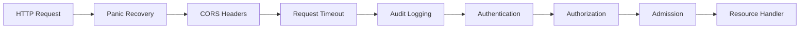

### 2. 认证模块 (Authentication)

#### 多种认证方式支持
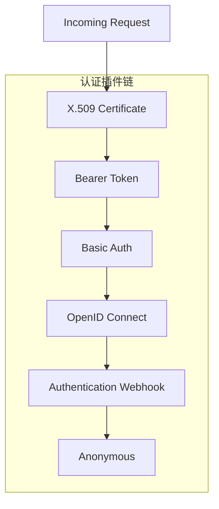

#### 认证流程代码示例
```go
// 认证接口定义
type Authenticator interface {
    AuthenticateRequest(req *http.Request) (*Response, bool, error)
}

// 认证响应
type Response struct {
    User   *user.DefaultInfo
    Groups []string
}

// X.509证书认证示例
func (ca *x509Authenticator) AuthenticateRequest(req *http.Request) (*Response, bool, error) {
    // 提取客户端证书
    clientCerts := req.TLS.PeerCertificates
    if len(clientCerts) == 0 {
        return nil, false, nil
    }

    // 验证证书链
    cert := clientCerts[0]
    if err := ca.verifier.Verify(cert); err != nil {
        return nil, false, err
    }

    // 提取用户信息
    user := &user.DefaultInfo{
        Name:   cert.Subject.CommonName,
        UID:    cert.Subject.SerialNumber,
        Groups: cert.Subject.Organization,
    }

    return &Response{User: user}, true, nil
}
```

### 3. 授权模块 (Authorization)

#### RBAC授权架构
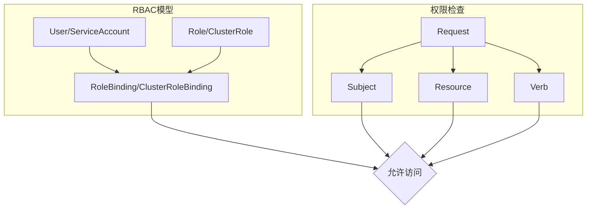

#### 授权决策流程
```go
// 授权接口
type Authorizer interface {
    Authorize(ctx context.Context, a Attributes) (Decision, string, error)
}

// 授权属性
type Attributes interface {
    GetUser() user.Info
    GetVerb() string
    GetResource() string
    GetNamespace() string
    GetName() string
    GetAPIGroup() string
    GetAPIVersion() string
}

// RBAC授权实现
func (r *RBACAuthorizer) Authorize(ctx context.Context, requestAttributes authorizer.Attributes) (authorizer.Decision, string, error) {
    rules, err := r.GetRules(requestAttributes.GetUser())
    if err != nil {
        return authorizer.DecisionDeny, "", err
    }

    for _, rule := range rules {
        if ruleAllows(requestAttributes, &rule) {
            return authorizer.DecisionAllow, "", nil
        }
    }

    return authorizer.DecisionDeny, "", nil
}
```

### 4. 准入控制模块 (Admission Control)

#### 准入控制器链
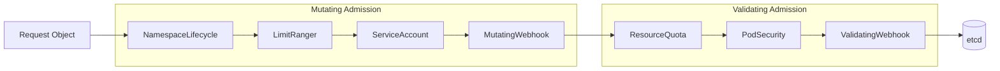

#### 关键准入控制器

| 控制器 | 类型 | 功能 |
|--------|------|------|
| NamespaceLifecycle | Built-in | 命名空间生命周期管理 |
| LimitRanger | Built-in | 资源限制检查 |
| ResourceQuota | Built-in | 资源配额控制 |
| ServiceAccount | Built-in | 自动注入ServiceAccount |
| PodSecurity | Built-in | Pod安全策略 |
| MutatingAdmissionWebhook | Dynamic | 动态对象修改 |
| ValidatingAdmissionWebhook | Dynamic | 动态验证检查 |

### 5. API机制层

#### 版本转换机制
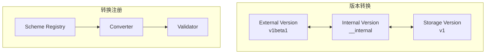

#### 对象序列化/反序列化
```go
// 序列化器接口
type Serializer interface {
    Encode(obj runtime.Object, w io.Writer) error
    Decode(data []byte, gvk *schema.GroupVersionKind, obj runtime.Object) (runtime.Object, error)
}

// JSON序列化器
type jsonSerializer struct {
    scheme *runtime.Scheme
}

func (s *jsonSerializer) Encode(obj runtime.Object, w io.Writer) error {
    // 获取对象的GroupVersionKind
    gvk := obj.GetObjectKind().GroupVersionKind()

    // 转换为外部版本
    external, err := s.scheme.ConvertToVersion(obj, schema.GroupVersion{
        Group: gvk.Group,
        Version: gvk.Version,
    })
    if err != nil {
        return err
    }

    // JSON编码
    return json.NewEncoder(w).Encode(external)
}
```

### 6. 存储层架构

#### 通用存储接口
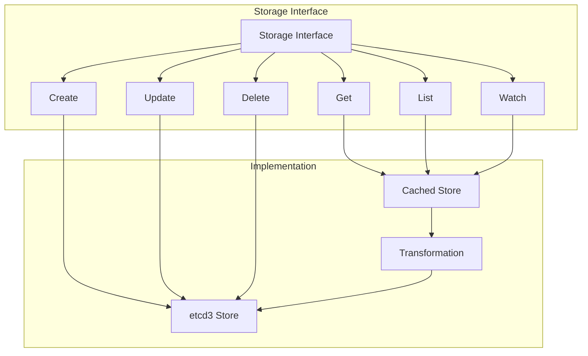

#### etcd存储实现
```go
// etcd存储接口
type etcdStore struct {
    client      etcdclient.Client
    pathPrefix  string
    keyFunc     func(obj runtime.Object) (string, error)
    transformer Transformer
}

// 创建对象
func (s *etcdStore) Create(ctx context.Context, key string, obj runtime.Object) error {
    // 序列化对象
    data, err := s.transformer.TransformToStorage(obj)
    if err != nil {
        return err
    }

    // 存储到etcd
    key = path.Join(s.pathPrefix, key)
    _, err = s.client.Put(ctx, key, string(data))
    return err
}

// Watch实现
func (s *etcdStore) Watch(ctx context.Context, prefix string, opts storage.ListOptions) (watch.Interface, error) {
    watchKey := path.Join(s.pathPrefix, prefix)
    watcher := s.client.Watch(ctx, watchKey, clientv3.WithPrefix())

    return newEtcdWatcher(watcher, s.transformer), nil
}
```

## 数据流分析

### 创建Pod的完整数据流
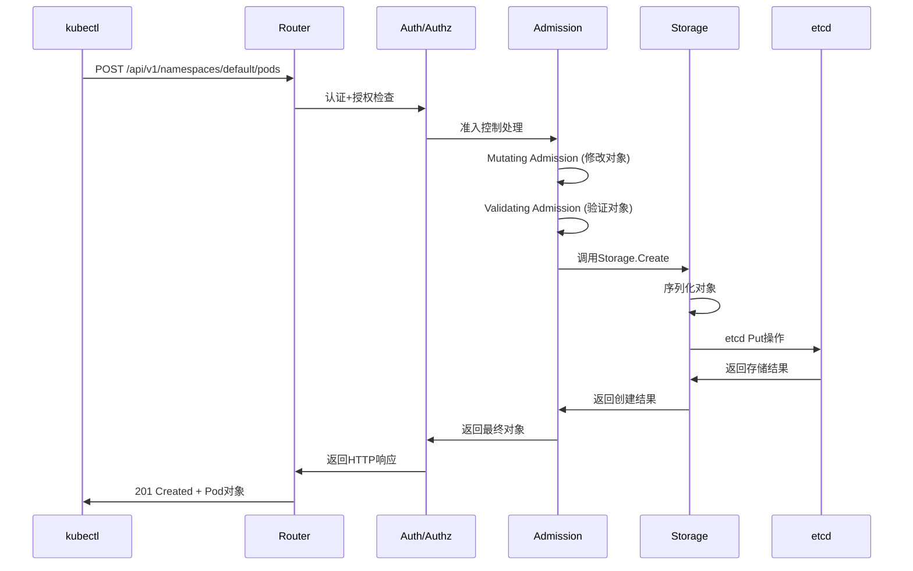

### Watch事件流
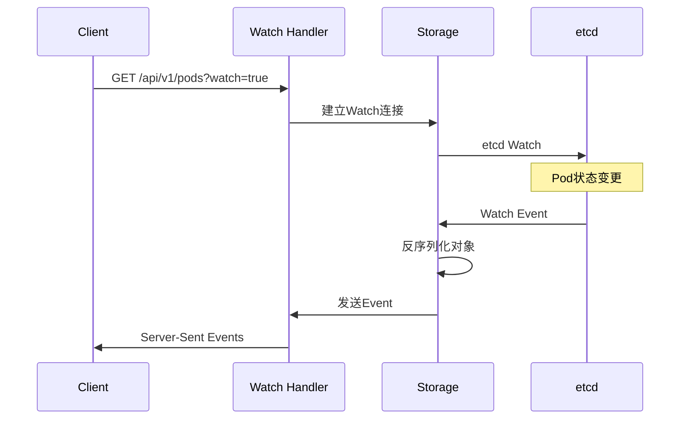

## 性能优化设计

### 1. 缓存策略
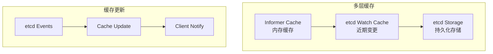

### 2. 请求限流
```go
// 限流配置
type FlowControlConfig struct {
    MaxRequestsInFlight int
    MaxRequestWaitTime  time.Duration
    RequestTimeout     time.Duration
}

// 限流器实现
type requestLimiter struct {
    semaphore chan struct{}
    timeout   time.Duration
}

func (rl *requestLimiter) Limit(handler http.Handler) http.Handler {
    return http.HandlerFunc(func(w http.ResponseWriter, r *http.Request) {
        select {
        case rl.semaphore <- struct{}{}:
            defer func() { <-rl.semaphore }()
            handler.ServeHTTP(w, r)
        case <-time.After(rl.timeout):
            http.Error(w, "Request timeout", http.StatusTooManyRequests)
        }
    })
}
```

## 高可用架构

### 多实例部署
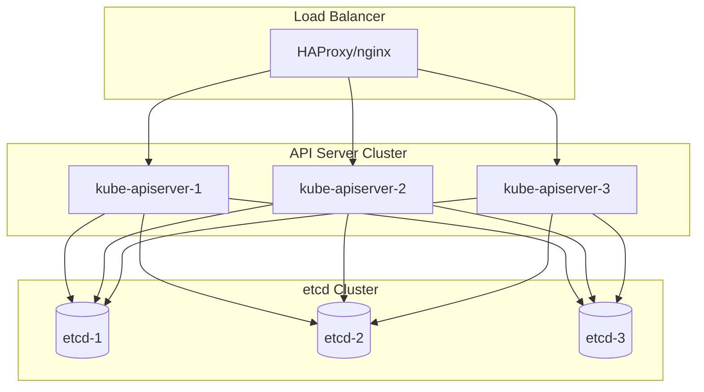

### 故障转移机制
- **健康检查**: `/healthz` 端点监控
- **自动恢复**: 重启失败的API Server实例
- **会话亲和**: 避免Watch连接中断

## 关键设计思想

### 1. 插件化架构
API Server的认证、授权、准入控制都采用插件化设计，支持：
- 多种认证方式并存
- 可配置的授权策略
- 动态的准入控制器

### 2. 分层抽象
从HTTP层到存储层，每层都有清晰的职责边界：
- HTTP层: 协议处理
- 安全层: 认证授权
- 业务层: 准入控制
- 存储层: 数据持久化

### 3. 事件驱动
通过Watch机制实现事件驱动的架构，确保：
- 实时状态同步
- 减少轮询开销
- 支持大规模集群

---

**这是API Server架构深度解析，展现了Kubernetes控制平面的核心设计思想。接下来我们将探讨具体的技术挑战和性能优化策略。**

**系列文章导航：**
- [Kubernetes API Server深度解析](./kubernetes-apiserver-deep-dive) ← 基础概述
- [API Server核心概念与源码分析](./kubernetes-apiserver-core-concepts) ← 下一篇
- [API Server性能优化实战](./kubernetes-apiserver-performance)
- [API Server故障排查指南](./kubernetes-apiserver-troubleshooting)