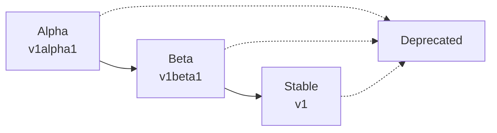
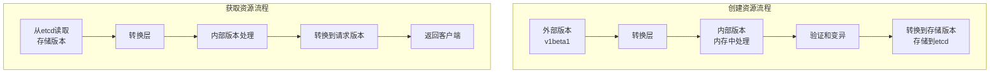
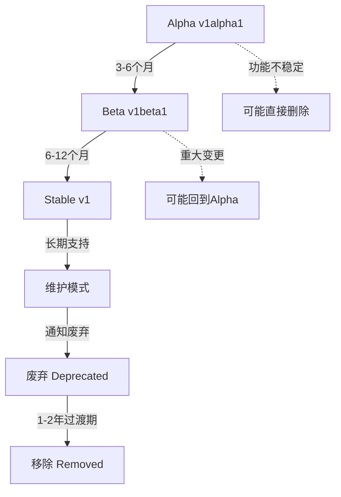
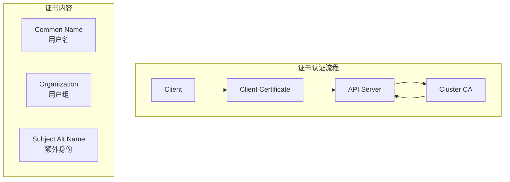
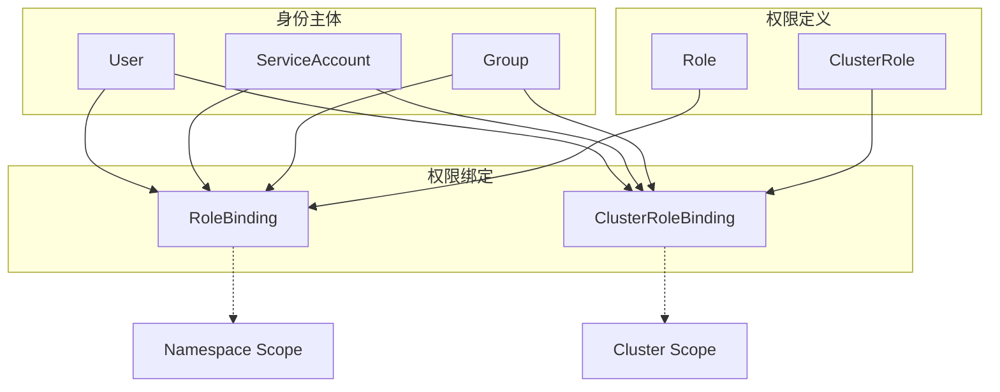
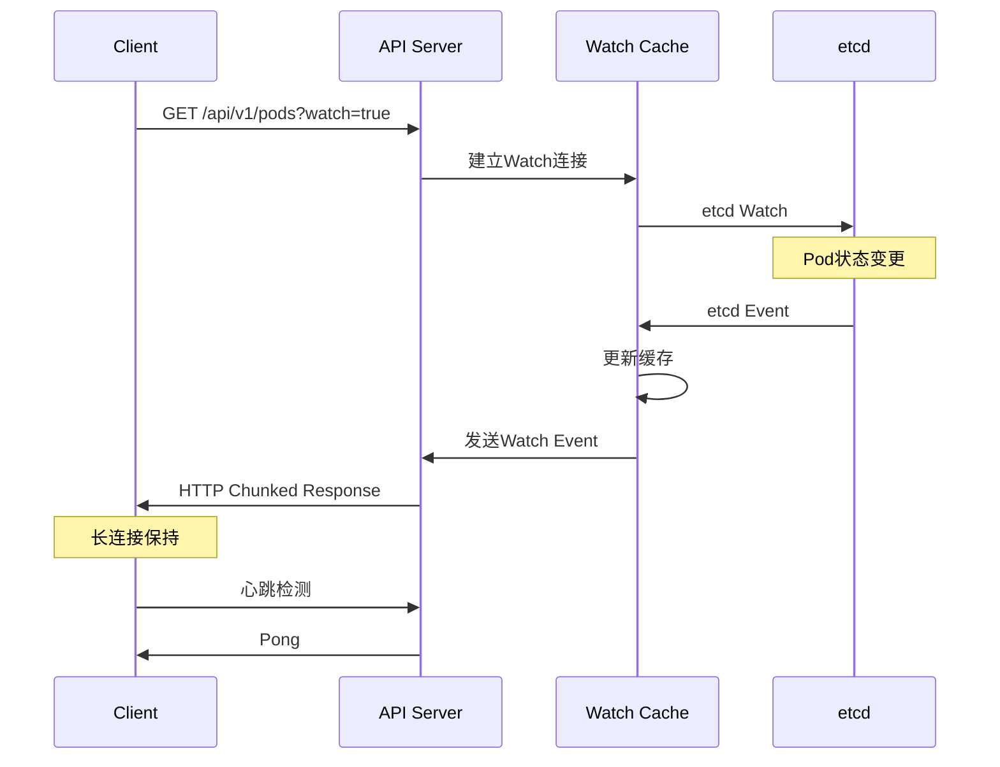
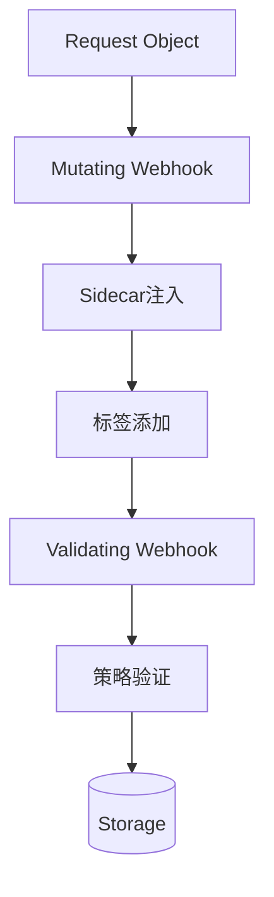

# API Server核心概念详解

## 关键术语和定义

### 1. API对象模型

#### Resource (资源)
Kubernetes中的基本管理单元：

```yaml
# 资源示例
apiVersion: v1        # API版本
kind: Pod             # 资源类型
metadata:             # 元数据
  name: my-pod
  namespace: default
  labels:
    app: web
spec:                 # 期望状态
  containers:
  - name: web
    image: nginx
status:               # 当前状态
  phase: Running
```

#### API Group (API组)
将相关资源组织在一起：

| API组 | 资源类型 | 示例 |
|-------|----------|------|
| core (空字符串) | Pod, Service, Node | `/api/v1/pods` |
| apps | Deployment, DaemonSet | `/apis/apps/v1/deployments` |
| networking.k8s.io | NetworkPolicy, Ingress | `/apis/networking.k8s.io/v1/networkpolicies` |
| storage.k8s.io | StorageClass, VolumeAttachment | `/apis/storage.k8s.io/v1/storageclasses` |

#### API版本策略


### 2. 版本转换机制详解

#### 什么是版本转换机制
版本转换机制是系统在不同API版本之间自动转换数据格式的过程，确保向后兼容性和平滑升级。

#### 为什么需要版本转换？

**1. 向后兼容性**
```yaml
# 旧版本客户端仍能工作
apiVersion: apps/v1beta1  # 旧版本
kind: Deployment
# 系统自动转换为 apps/v1
```

**2. 平滑升级**
- 避免"大爆炸"式升级
- 允许渐进式迁移
- 减少业务中断

**3. 多版本共存**
```
客户端A (v1beta1) ↘
                  → 内部存储 (最新版本)
客户端B (v1)     ↗
```

#### 各版本特点详解

| 版本类型 | 稳定性 | 默认启用 | 向后兼容 | 使用场景 | 生命周期 |
|----------|--------|----------|----------|----------|----------|
| **Alpha** | 不稳定 | 否 | 不保证 | 实验性功能 | 3-6个月 |
| **Beta** | 相对稳定 | 是 | 尽力保证 | 测试新功能 | 6-12个月 |
| **Stable/GA** | 稳定 | 是 | 强保证 | 生产环境 | 长期支持 |

##### Alpha版本特点
```yaml
# Alpha版本示例
apiVersion: storage.k8s.io/v1alpha1
kind: VolumeSnapshot
metadata:
  name: test-snapshot
spec:
  source:
    persistentVolumeClaimName: my-pvc
```

**特征：**
- 功能可能有bug或不完整
- 默认禁用，需要特性门控开启
- API可能随时变更或删除
- 不建议生产环境使用

##### Beta版本特点
```yaml
# Beta版本示例 (已废弃)
apiVersion: extensions/v1beta1
kind: Ingress
metadata:
  name: test-ingress
spec:
  rules:
  - http:
      paths:
      - path: /test
        backend:
          serviceName: test-service
          servicePort: 80
```

**特征：**
- 功能基本稳定，但可能有小的调整
- 默认启用
- 会提供到稳定版本的升级路径
- 适合非关键生产环境测试

##### Stable/GA版本特点
```yaml
# Stable版本示例
apiVersion: apps/v1
kind: Deployment
metadata:
  name: nginx-deployment
spec:
  replicas: 3
  selector:
    matchLabels:
      app: nginx
  template:
    metadata:
      labels:
        app: nginx
    spec:
      containers:
      - name: nginx
        image: nginx:1.14
```

**特征：**
- 生产就绪，功能完整稳定
- 长期支持，强向后兼容保证
- 推荐生产环境使用

#### 版本转换工作原理

> **重要说明**: 内部版本主要作为转换的中间状态存在于内存中，实际存储到etcd的是指定的**存储版本**(如apps/v1)，而不是`__internal`格式。

##### 内部版本概念
内部版本是Kubernetes转换系统中的中间表示，用于在不同外部版本之间进行转换：

```go
// 内部版本作为转换的中间状态，在内存中处理
// 实际存储到etcd的是指定的存储版本(如apps/v1)
const APIVersionInternal = "__internal"  // k8s.io/apimachinery/pkg/runtime

// Hub-and-Spoke转换模型：所有外部版本都与内部版本进行转换
func convertToInternalVersion(obj runtime.Object, scheme *runtime.Scheme) (runtime.Object, error) {
    gvk := obj.GetObjectKind().GroupVersionKind()
    internalGV := schema.GroupVersion{Group: gvk.Group, Version: runtime.APIVersionInternal}
    return scheme.ConvertToVersion(obj, internalGV)
}
```

##### 转换流程图


##### 转换函数示例
```go
// 版本间转换函数
func Convert_v1beta1_Deployment_To_apps_Deployment(
    in *v1beta1.Deployment,    // 输入的v1beta1版本
    out *apps.Deployment,      // 输出的内部版本
    s conversion.Scope
) error {
    // 基本字段复制
    out.ObjectMeta = in.ObjectMeta
    out.Spec.Replicas = in.Spec.Replicas
    out.Spec.Template = in.Spec.Template

    // 关键：自动生成selector (v1beta1没有这个字段)
    if in.Spec.Selector == nil && in.Spec.Template != nil {
        out.Spec.Selector = &metav1.LabelSelector{
            MatchLabels: in.Spec.Template.Labels,
        }
    }

    // 设置默认策略
    if out.Spec.Strategy.Type == "" {
        out.Spec.Strategy.Type = "RollingUpdate"
    }

    return nil
}
```

#### 实际转换示例

##### 创建资源时的转换过程

**原始输入 (v1beta1):**
```yaml
apiVersion: apps/v1beta1
kind: Deployment
metadata:
  name: old-nginx
spec:
  replicas: 3
  template:          # 注意：没有selector
    metadata:
      labels:
        app: nginx
    spec:
      containers:
      - name: nginx
        image: nginx:1.14
```

**内部处理后存储到etcd的格式 (使用存储版本apps/v1):**
```json
{
  "kind": "Deployment",
  "apiVersion": "apps/v1",
  "metadata": {"name": "old-nginx"},
  "spec": {
    "replicas": 3,
    "selector": {                    // 自动生成的字段
      "matchLabels": {"app": "nginx"}
    },
    "template": {
      "metadata": {"labels": {"app": "nginx"}},
      "spec": {"containers": [{"name": "nginx", "image": "nginx:1.14"}]}
    },
    "strategy": {"type": "RollingUpdate"}  // 默认策略
  }
}
```

#### 版本生命周期管理



#### 最佳实践

##### 1. 使用最新稳定版本
```bash
# 检查可用的API版本
kubectl api-versions | grep apps
# apps/v1

# 使用稳定版本
apiVersion: apps/v1  # ✅ 推荐
# apiVersion: apps/v1beta1  # ❌ 废弃
```

##### 2. 监控废弃警告
```bash
# 检查集群中使用废弃API的资源
kubectl get --raw=/metrics | grep apiserver_requested_deprecated_apis
```

##### 3. 使用转换工具
```bash
# kubectl-convert插件
kubectl convert -f old-deployment.yaml --output-version apps/v1
```

## RESTful API设计原则

### HTTP方法映射
| HTTP方法 | 操作 | 幂等性 | 示例 |
|----------|------|--------|------|
| GET | 读取 | ✅ | `GET /api/v1/pods` |
| POST | 创建 | ❌ | `POST /api/v1/namespaces/default/pods` |
| PUT | 更新(完整) | ✅ | `PUT /api/v1/namespaces/default/pods/my-pod` |
| PATCH | 更新(部分) | ❌ | `PATCH /api/v1/namespaces/default/pods/my-pod` |
| DELETE | 删除 | ✅ | `DELETE /api/v1/namespaces/default/pods/my-pod` |

### URL结构规范
```
/api/{version}/{resource}
/api/{version}/namespaces/{namespace}/{resource}
/api/{version}/namespaces/{namespace}/{resource}/{name}

/apis/{group}/{version}/{resource}
/apis/{group}/{version}/namespaces/{namespace}/{resource}
/apis/{group}/{version}/namespaces/{namespace}/{resource}/{name}
```

## 认证机制详解

### X.509客户端证书认证


**证书示例配置:**
```bash
# 生成客户端证书
openssl req -new -key client.key -out client.csr -subj "/CN=jane/O=developers"

# API Server证书验证配置
--client-ca-file=/etc/kubernetes/pki/ca.crt
--tls-cert-file=/etc/kubernetes/pki/apiserver.crt
--tls-private-key-file=/etc/kubernetes/pki/apiserver.key
```

### Bearer Token认证
```http
Authorization: Bearer <token>
```

**Token类型:**
1. **ServiceAccount Token**: 自动挂载到Pod
2. **Bootstrap Token**: 集群初始化使用
3. **OIDC Token**: 外部身份提供商
4. **Webhook Token**: 自定义认证逻辑

### ServiceAccount机制
```yaml
apiVersion: v1
kind: ServiceAccount
metadata:
  name: my-service-account
  namespace: default
secrets:
- name: my-service-account-token-xxxxx
---
apiVersion: v1
kind: Pod
spec:
  serviceAccountName: my-service-account
  containers:
  - name: app
    image: my-app
    # Token自动挂载到 /var/run/secrets/kubernetes.io/serviceaccount/
```

## 授权机制深入

### RBAC模型核心概念


### Role定义示例
```yaml
apiVersion: rbac.authorization.k8s.io/v1
kind: Role
metadata:
  namespace: default
  name: pod-reader
rules:
- apiGroups: [""]          # core API组
  resources: ["pods"]       # 资源类型
  verbs: ["get", "list"]   # 允许的操作
- apiGroups: [""]
  resources: ["pods/log"]   # 子资源
  verbs: ["get"]

---
apiVersion: rbac.authorization.k8s.io/v1
kind: ClusterRole
metadata:
  name: secret-reader
rules:
- apiGroups: [""]
  resources: ["secrets"]
  verbs: ["get", "list"]
  resourceNames: ["my-secret"]  # 限制特定资源
```

### 权限检查算法
```go
// RBAC权限检查伪代码
func checkRBACPermission(user User, request Request) bool {
    // 1. 获取用户的所有Role绑定
    roleBindings := getRoleBindings(user)
    clusterRoleBindings := getClusterRoleBindings(user)

    // 2. 检查RoleBinding权限
    for _, binding := range roleBindings {
        if binding.Namespace == request.Namespace {
            role := getRole(binding.RoleRef)
            if roleAllows(role, request) {
                return true
            }
        }
    }

    // 3. 检查ClusterRoleBinding权限
    for _, binding := range clusterRoleBindings {
        clusterRole := getClusterRole(binding.RoleRef)
        if clusterRoleAllows(clusterRole, request) {
            return true
        }
    }

    return false
}
```

## Watch机制原理

### Watch事件类型
```go
type EventType string

const (
    Added    EventType = "ADDED"      // 对象被创建
    Modified EventType = "MODIFIED"   // 对象被修改
    Deleted  EventType = "DELETED"    // 对象被删除
    Error    EventType = "ERROR"      // 发生错误
)

type Event struct {
    Type   EventType   `json:"type"`
    Object interface{} `json:"object"`
}
```

### Watch实现机制


### Watch性能优化
```go
// Kubernetes 实际的 Watch 接口
type Interface interface {
    // Stop 停止watch
    Stop()
    // ResultChan 返回事件通道
    ResultChan() <-chan Event
}

// Watch 事件类型
type Event struct {
    Type   EventType      // ADDED, MODIFIED, DELETED
    Object runtime.Object // 资源对象
}

// 分页Watch避免大量数据传输
type ListOptions struct {
    Limit          int64  `json:"limit,omitempty"`
    Continue       string `json:"continue,omitempty"`
    ResourceVersion string `json:"resourceVersion,omitempty"`
}

// Watch书签机制
type WatchEvent struct {
    Type   string      `json:"type"`
    Object interface{} `json:"object"`
    // Bookmark事件用于更新客户端ResourceVersion
    // 避免重新连接时重放过多历史事件
}
```

## 准入控制详解

### Mutating Admission Webhook


**Webhook配置示例:**
```yaml
apiVersion: admissionregistration.k8s.io/v1
kind: MutatingAdmissionWebhook
metadata:
  name: sidecar-injector
webhooks:
- name: sidecar.example.com
  clientConfig:
    service:
      name: sidecar-injector
      namespace: default
      path: /mutate
  rules:
  - operations: ["CREATE"]
    apiGroups: [""]
    apiVersions: ["v1"]
    resources: ["pods"]
  admissionReviewVersions: ["v1", "v1beta1"]
```

### 内置准入控制器
| 控制器 | 功能 | 默认启用 |
|--------|------|----------|
| AlwaysAdmit | 总是允许 | ❌ |
| AlwaysDeny | 总是拒绝 | ❌ |
| NamespaceLifecycle | 命名空间生命周期 | ✅ |
| ServiceAccount | 自动注入SA | ✅ |
| LimitRanger | 资源限制检查 | ✅ |
| ResourceQuota | 资源配额控制 | ✅ |
| DefaultStorageClass | 默认存储类 | ✅ |
| PodSecurity | Pod安全策略 | ✅ |

## 重要算法原理

### 1. 乐观并发控制
```go
// ResourceVersion机制
type ObjectMeta struct {
    ResourceVersion string `json:"resourceVersion,omitempty"`
    // ...
}

// 更新冲突检测
func (s *store) Update(ctx context.Context, obj runtime.Object) error {
    current, err := s.Get(ctx, key)
    if err != nil {
        return err
    }

    // 检查ResourceVersion是否匹配
    if obj.ResourceVersion != current.ResourceVersion {
        return errors.NewConflict(schema.GroupResource{}, key,
            fmt.Errorf("object was modified"))
    }

    // 执行更新
    return s.doUpdate(ctx, obj)
}
```

### 2. 分页算法
```go
// 分页查询实现
func (s *store) List(ctx context.Context, options *metainternalversion.ListOptions) (runtime.Object, error) {
    limit := options.Limit
    continueValue := options.Continue

    // 解码continue token
    var startKey string
    if continueValue != "" {
        startKey, err = decodeContinue(continueValue)
        if err != nil {
            return nil, err
        }
    }

    // 执行分页查询
    result, err := s.storage.GetList(ctx, startKey, limit+1)
    if err != nil {
        return nil, err
    }

    // 处理结果
    list := &metav1.List{}
    if len(result.Items) > int(limit) {
        // 还有更多数据
        list.Continue = encodeContinue(result.Items[limit].Key)
        list.Items = result.Items[:limit]
    } else {
        list.Items = result.Items
    }

    return list, nil
}
```

## 配置参数详解

### 关键启动参数
```bash
# 基本配置
--advertise-address=10.0.0.1           # 对外广播地址
--bind-address=0.0.0.0                 # 监听地址
--secure-port=6443                     # HTTPS端口
--insecure-port=0                      # 禁用HTTP端口

# 认证配置
--client-ca-file=/etc/kubernetes/pki/ca.crt
--tls-cert-file=/etc/kubernetes/pki/apiserver.crt
--tls-private-key-file=/etc/kubernetes/pki/apiserver.key

# 授权配置
--authorization-mode=Node,RBAC
--enable-admission-plugins=NamespaceLifecycle,ServiceAccount,LimitRanger

# etcd配置
--etcd-servers=https://127.0.0.1:2379
--etcd-cafile=/etc/kubernetes/pki/etcd/ca.crt
--etcd-certfile=/etc/kubernetes/pki/apiserver-etcd-client.crt
--etcd-keyfile=/etc/kubernetes/pki/apiserver-etcd-client.key

# 性能调优
--max-requests-inflight=400            # 并发请求数限制
--max-mutating-requests-inflight=200   # 变更请求并发限制
--request-timeout=60s                  # 请求超时时间
--min-request-timeout=1800             # Watch连接最小超时
```

### 审计日志配置
```yaml
# audit-policy.yaml
apiVersion: audit.k8s.io/v1
kind: Policy
rules:
- level: Metadata
  namespaces: ["kube-system"]
  resources:
  - group: ""
    resources: ["secrets", "configmaps"]
- level: RequestResponse
  resources:
  - group: ""
    resources: ["pods"]
```

---

**这篇文章深度解析了API Server的核心概念，为理解Kubernetes API设计和版本管理提供了详细的技术视角。接下来我们将探讨具体的源码实现和性能优化。**

**系列文章导航：**
- [Kubernetes API Server深度解析](./kubernetes-apiserver-deep-dive) ← 基础概述
- [Kubernetes API Server架构设计深度剖析](./kubernetes-apiserver-architecture-detailed) ← 架构详解
- [API Server性能优化与故障排查](./kubernetes-apiserver-performance-troubleshooting) ← 下一篇
- [Kubernetes核心组件学习系列概览](./kubernetes-learning-series-overview)