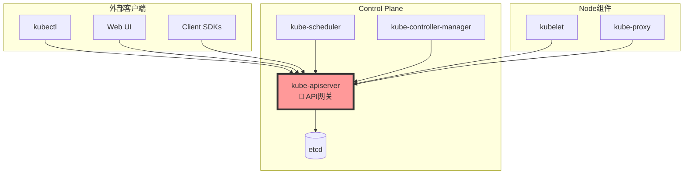
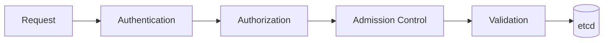
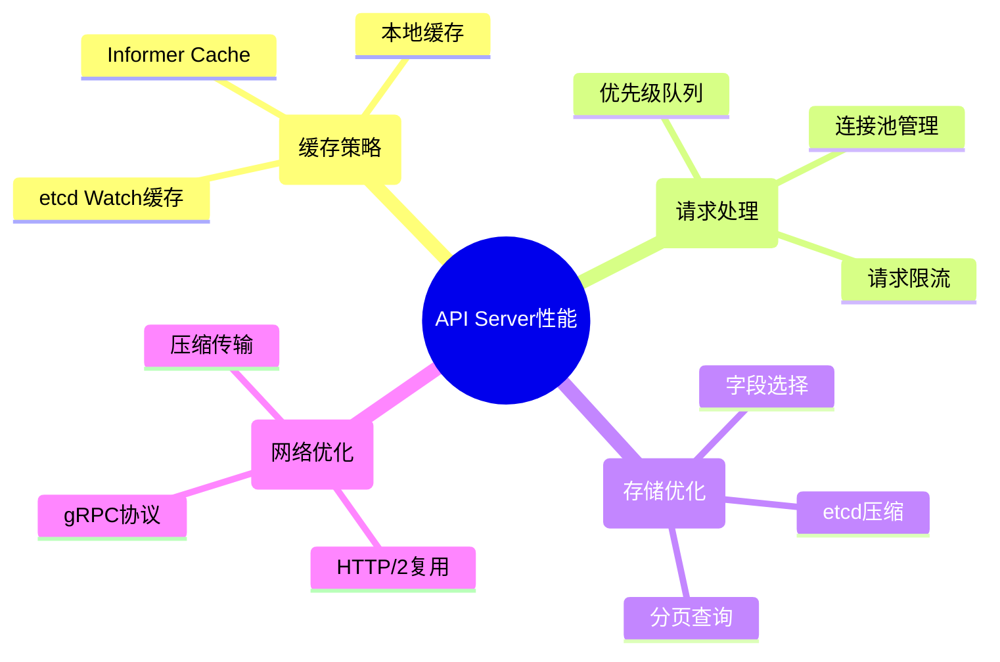

# API Server概述

## 定义与核心作用

**kube-apiserver** 是Kubernetes集群的控制平面核心组件，作为整个集群的**唯一API网关**，负责处理所有REST API请求，是集群内外所有组件通信的中枢。

### 核心职责
- **API网关**: 提供统一的RESTful API接口
- **认证授权**: 实现多层安全控制机制
- **数据持久化**: 与etcd交互管理集群状态
- **版本管理**: 处理API版本兼容性和演进
- **扩展支持**: 支持自定义资源和API聚合

## 在Kubernetes生态中的位置



## 核心功能列表

### 1. RESTful API服务 🌐
```bash
# API资源访问模式
GET    /api/v1/pods                    # 列出所有Pod
POST   /api/v1/namespaces/default/pods # 创建Pod
PUT    /api/v1/namespaces/default/pods/my-pod # 更新Pod
DELETE /api/v1/namespaces/default/pods/my-pod # 删除Pod
```

### 2. 多层安全控制 🔐


### 3. 资源版本管理 📊
| API版本 | 稳定性 | 说明 | 示例 |
|---------|--------|------|------|
| alpha | 实验性 | 可能随时删除 | v1alpha1 |
| beta | 相对稳定 | 向后兼容 | v1beta1 |
| stable | 生产就绪 | 长期支持 | v1, v2 |

### 4. Watch机制 👀
```go
// Watch机制示例
watch, err := clientset.CoreV1().Pods("default").Watch(context.TODO(), metav1.ListOptions{})
for event := range watch.ResultChan() {
    switch event.Type {
    case watch.Added:
        fmt.Println("Pod added:", event.Object.(*corev1.Pod).Name)
    case watch.Modified:
        fmt.Println("Pod modified:", event.Object.(*corev1.Pod).Name)
    case watch.Deleted:
        fmt.Println("Pod deleted:", event.Object.(*corev1.Pod).Name)
    }
}
```

## 关键特性分析

### 1. 高可用设计
- **多实例部署**: 支持Active-Active模式
- **负载均衡**: 通过Load Balancer分发请求
- **无状态设计**: 所有状态存储在etcd中

### 2. 性能优化机制
- **缓存层**: 减少etcd访问压力
- **分页查询**: 处理大量资源列表
- **字段选择器**: 减少网络传输数据

### 3. 扩展性支持
- **CRD**: 自定义资源定义
- **API聚合**: 扩展API接口
- **Webhook**: 动态扩展功能

## 面试重点知识

### 高频考点 📝
1. **API Server的核心作用是什么？**
   - 集群的唯一API入口
   - 处理所有REST请求
   - 管理集群状态持久化

2. **API Server如何保证安全性？**
   - 认证(Authentication): 验证身份
   - 授权(Authorization): 检查权限
   - 准入控制(Admission): 策略检查

3. **Watch机制的工作原理？**
   - 长连接监听资源变化
   - 事件驱动更新
   - 减少轮询开销

4. **API版本演进策略？**
   - alpha → beta → stable
   - 向后兼容保证
   - 废弃策略管理

### 深度分析题 🔍

**Q: 如何设计一个高性能的API Server？**

**A: 关键设计要素**


**Q: API Server故障会影响什么？**

**A: 影响范围分析**
- ❌ **控制平面**: 无法创建、更新、删除资源
- ❌ **kubectl命令**: 所有kubectl操作失效
- ❌ **调度器**: 无法获取Pod和Node信息
- ❌ **控制器**: 无法执行reconcile循环
- ✅ **运行中的Pod**: 继续正常运行
- ✅ **Service流量**: 现有连接不受影响

## 学习路径建议

### 🎯 面试准备 (1-2天)
1. 熟记核心概念和职责
2. 理解安全机制(认证+授权+准入)
3. 掌握API版本管理策略
4. 了解Watch机制原理

### 🔬 深度理解 (1周)
1. 研究RESTful API设计
2. 分析请求处理流程
3. 学习性能优化技巧
4. 实践故障排查方法

### 👨‍💻 专家级别 (1个月)
1. 阅读API Server源码
2. 自定义Admission Webhook
3. 开发API聚合扩展
4. 性能调优实战

## 实战练习建议

### 1. 基础操作练习
```bash
# 探索API资源
kubectl api-resources
kubectl api-versions

# 查看API Server配置
kubectl cluster-info
kubectl get componentstatuses
```

### 2. 安全机制验证
```bash
# 测试认证
kubectl auth can-i create pods
kubectl auth can-i list secrets --namespace=kube-system

# 查看权限配置
kubectl get clusterroles
kubectl describe clusterrole cluster-admin
```

### 3. 性能监控
```bash
# API Server指标
kubectl top node
kubectl get --raw /metrics | grep apiserver

# 查看API Server日志
kubectl logs -n kube-system kube-apiserver-master
```

## 常见问题解答

**Q: API Server和etcd的关系？**
A: API Server是etcd的唯一客户端，所有集群数据都通过API Server写入etcd，其他组件不直接访问etcd。

**Q: 为什么所有组件都要通过API Server通信？**
A: 统一安全控制、数据一致性保证、版本管理、审计日志等都在API Server层面实现。

**Q: API Server支持哪些数据格式？**
A: 主要支持JSON，也支持YAML(通过kubectl转换)和Protobuf(内部通信)。

---

**这是Kubernetes核心组件学习系列文章。**

**系列文章导航：**
- [Kubernetes集群架构深度解析](./kubernetes-cluster-architecture-overview) ← 上一篇
- [etcd分布式存储原理与实践](./kubernetes-etcd-distributed-storage) ← 下一篇
- [API Server架构设计与源码分析](./kubernetes-apiserver-architecture)
- [Container Runtime与CRI接口](./kubernetes-container-runtime-cri)