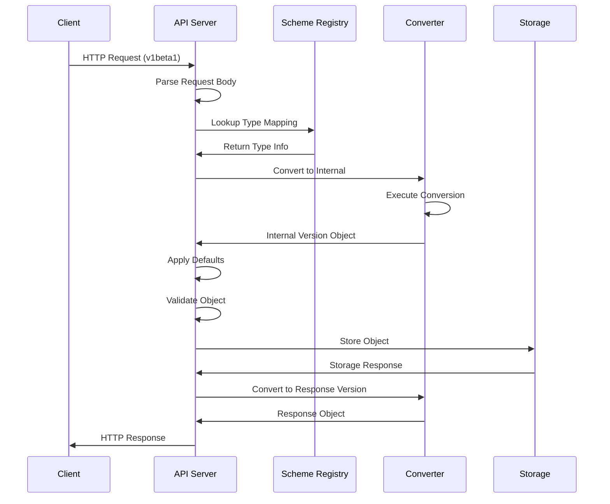

# Kubernetes API Server源码分析

## 源码架构概览

### 源码目录结构
```
k8s.io/kubernetes/cmd/kube-apiserver/
├── app/
│   ├── server.go                 # 服务器主要逻辑
│   └── options/
│       ├── options.go            # 启动选项
│       └── validation.go         # 参数验证
└── apiserver.go                  # 入口函数

k8s.io/apiserver/pkg/
├── server/
│   ├── config.go                 # 服务器配置
│   ├── handler.go                # HTTP处理器
│   └── routes/                   # 路由定义
├── authentication/               # 认证模块
├── authorization/                # 授权模块
├── admission/                    # 准入控制
├── endpoints/                    # API端点
├── registry/                     # 资源注册
└── storage/                      # 存储抽象层
```

### 核心组件关系图

```mermaid
graph TB
    subgraph "API Server架构层次"
        A[HTTP Server] --> B[Handler Chain]
        B --> C[Authentication]
        C --> D[Authorization]
        D --> E[Admission Control]
        E --> F[Resource Handler]
        F --> G[Storage Layer]
        G --> H[etcd Client]
    end

    subgraph "版本转换系统"
        I[External Version] --> J[Scheme Registry]
        J --> K[Conversion Functions]
        K --> L[Internal Version]
        L --> M[Storage Version]
    end

    subgraph "Watch机制"
        N[Watch Request] --> O[Watch Cache]
        O --> P[etcd Watch]
        P --> Q[Event Stream]
    end
```


## 启动流程源码分析

### 1. 主函数入口
```go
// cmd/kube-apiserver/apiserver.go
func main() {
    command := app.NewAPIServerCommand()
    code := cli.Run(command)
    os.Exit(code)
}

// 创建命令对象
func NewAPIServerCommand() *cobra.Command {
    s := options.NewServerOptions()
    cmd := &cobra.Command{
        Use: "kube-apiserver",
        RunE: func(cmd *cobra.Command, args []string) error {
            return Run(s, wait.NeverStop)
        },
    }

    // 添加命令行参数
    s.AddFlags(cmd.Flags())
    return cmd
}
```

### 2. 服务器配置构建流程
```go
// cmd/kube-apiserver/app/server.go
func Run(opts *options.ServerOptions, stopCh <-chan struct{}) error {
    // 1. 验证配置参数
    if errs := opts.Validate(); len(errs) != 0 {
        return fmt.Errorf("validation failed: %v", errs)
    }

    // 2. 构建服务器配置
    config, err := CreateServerConfig(opts)
    if err != nil {
        return err
    }

    // 3. 创建API服务器实例
    server, err := config.Complete().New("kube-apiserver", delegationTarget)
    if err != nil {
        return err
    }

    // 4. 启动服务器
    return server.PrepareRun().Run(stopCh)
}
```

### 3. 配置对象创建详解
```go
// CreateServerConfig构建完整的服务器配置
func CreateServerConfig(opts *options.ServerOptions) (*config.Config, error) {
    // 通用配置
    genericConfig, err := buildGenericConfig(opts)
    if err != nil {
        return nil, err
    }

    // 存储配置
    storageFactory, err := BuildStorageFactory(opts)
    if err != nil {
        return nil, err
    }

    // API组配置
    apiGroupInfo := []genericapiserver.APIGroupInfo{
        // 核心API组 (v1)
        {
            PrioritizedVersions: []schema.GroupVersion{{Group: "", Version: "v1"}},
            GroupMeta: apimachinery.GroupMeta{
                GroupVersion: schema.GroupVersion{Group: "", Version: "v1"},
            },
            VersionedResourcesStorageMap: map[string]map[string]rest.Storage{
                "v1": {
                    "pods": podStorage.Pod,
                    "services": serviceStorage.Service,
                    "nodes": nodeStorage.Node,
                    // ... 更多资源
                },
            },
        },
    }

    return &config.Config{
        GenericConfig: genericConfig,
        StorageFactory: storageFactory,
        APIGroupInfo: apiGroupInfo,
    }, nil
}
```

## 核心数据结构解析

### 1. 通用服务器配置
```go
// k8s.io/apiserver/pkg/server/config.go
type Config struct {
    // 基础配置
    SecureServing   *SecureServingInfo
    Authentication  AuthenticationInfo
    Authorization   AuthorizationInfo
    AdmissionControl admission.Interface

    // 存储配置
    RESTOptionsGetter generic.RESTOptionsGetter

    // 序列化配置
    Serializer runtime.NegotiatedSerializer

    // API配置
    MergedResourceConfig *serverstore.ResourceConfig

    // 生命周期钩子
    PostStartHooks map[string]PostStartHookFunc
    PreShutdownHooks map[string]PreShutdownHookFunc
}

// 认证信息配置
type AuthenticationInfo struct {
    Authenticator authenticator.Request

    // 支持的认证方式
    ClientCert     *x509.Config
    TokenAuth      *TokenAuthConfig
    BasicAuth      *BasicAuthConfig
    Anonymous      bool
}
```

### 2. REST存储接口设计
```go
// k8s.io/apiserver/pkg/registry/rest/rest.go
type Storage interface {
    // 基本操作接口
    Getter
    Lister
    CreaterUpdater
    GracefulDeleter

    // 可选接口
    Watcher
    Connecter
    StorageMetadata
}

// 具体的存储实现
type Store struct {
    // 核心配置
    NewFunc func() runtime.Object        // 创建新对象的函数
    NewListFunc func() runtime.Object    // 创建列表对象的函数
    KeyRootFunc func(ctx context.Context) string
    KeyFunc func(ctx context.Context, name string) (string, error)

    // 存储后端
    Storage storage.Interface

    // 对象转换
    CreateStrategy rest.CreateStrategy
    UpdateStrategy rest.UpdateStrategy
    DeleteStrategy rest.DeleteStrategy
}
```

## 核心处理机制源码

### 1. HTTP处理器链构建
```go
// k8s.io/apiserver/pkg/server/handler.go
func (s *GenericAPIServer) Handler() http.Handler {
    // 构建处理器链
    handler := NewAPIServerHandler(s.Mux, s.HandlerChainWaitGroup)

    // 添加中间件（责任链模式）
    handler = filterlatency.TrackCompleted(handler)
    handler = genericapifilters.WithAuthorization(handler, s.Authorizer, s.Serializer)
    handler = genericapifilters.WithAuthentication(handler, s.Authentication.Authenticator,
                                                   failedHandler, s.Authentication.APIAudiences)
    handler = genericapifilters.WithRequestInfo(handler, s.RequestInfoResolver)
    handler = genericapifilters.WithCacheControl(handler)
    handler = genericfilters.WithPanicRecovery(handler)
    handler = genericfilters.WithTimeoutForNonLongRunningRequests(handler, s.RequestTimeout)
    handler = genericfilters.WithMaxInFlightLimit(handler, s.maxRequestsInFlight,
                                                   s.maxMutatingRequestsInFlight, s.RequestWaitTimeout)
    handler = genericapifilters.WithImpersonation(handler, s.ImpersonationFilter, s.Serializer)
    handler = genericapifilters.WithAudit(handler, s.AuditBackend, s.AuditPolicyChecker)
    handler = genericfilters.WithCORS(handler, s.corsAllowedOriginList, nil, nil, "true")

    return handler
}

// API处理器结构
type APIServerHandler struct {
    // 完整处理器链
    FullHandlerChain http.Handler

    // 核心多路复用器
    GoRestfulContainer *restful.Container

    // 非API处理器
    NonGoRestfulMux *mux.PathRecorderMux

    // 目录处理器
    Director http.Handler
}
```

### 2. 资源注册机制实现
```go
// k8s.io/apiserver/pkg/endpoints/groupversion.go
func (g *APIGroupVersion) InstallREST(container *restful.Container) error {
    prefix := path.Join(g.Root, g.GroupVersion.Group, g.GroupVersion.Version)
    installer := &APIInstaller{
        group:             g,
        prefix:            prefix,
        minRequestTimeout: g.MinRequestTimeout,
    }

    // 为每个资源创建路由
    for resource, storage := range g.VersionedResourcesStorageMap {
        if err := installer.registerResourceHandlers(resource, storage, ws); err != nil {
            return err
        }
    }

    return nil
}

// 注册资源处理器
func (a *APIInstaller) registerResourceHandlers(resource string, storage rest.Storage,
                                                ws *restful.WebService) error {
    admit := a.group.Admit
    context := a.group.Context

    // 创建处理器
    handlers := &APIResourceHandlers{
        storage:     storage,
        admit:       admit,
        context:     context,
        serializer:  a.group.Serializer,
        kind:        a.group.Kind,
    }

    // 注册路由
    switch {
    case storage.Implements(rest.Getter):
        // GET /api/v1/namespaces/{namespace}/pods/{name}
        ws.Route(ws.GET(resourcePath).To(handlers.getResource))

    case storage.Implements(rest.Lister):
        // GET /api/v1/namespaces/{namespace}/pods
        ws.Route(ws.GET(resourceRootPath).To(handlers.listResource))

    case storage.Implements(rest.Creator):
        // POST /api/v1/namespaces/{namespace}/pods
        ws.Route(ws.POST(resourceRootPath).To(handlers.createResource))

    case storage.Implements(rest.Updater):
        // PUT /api/v1/namespaces/{namespace}/pods/{name}
        ws.Route(ws.PUT(resourcePath).To(handlers.updateResource))
    }

    return nil
}
```

### 3. 认证处理流程源码
```go
// k8s.io/apiserver/pkg/authentication/authenticator/interfaces.go
type Request interface {
    AuthenticateRequest(req *http.Request) (*Response, bool, error)
}

// 认证器组合（组合模式）
type Union struct {
    Handlers []Request
    FailOnError bool
}

func (authHandler *Union) AuthenticateRequest(req *http.Request) (*Response, bool, error) {
    var errlist []error

    // 依次尝试各个认证器
    for _, handler := range authHandler.Handlers {
        resp, ok, err := handler.AuthenticateRequest(req)
        if err != nil {
            if authHandler.FailOnError {
                return nil, false, err
            }
            errlist = append(errlist, err)
            continue
        }

        if ok {
            return resp, ok, err
        }
    }

    return nil, false, utilerrors.NewAggregate(errlist)
}

// X.509证书认证器实现
type x509Authenticator struct {
    verifier x509.CertificateVerifier
    user     UserConversion
}

func (a *x509Authenticator) AuthenticateRequest(req *http.Request) (*Response, bool, error) {
    // 检查是否有客户端证书
    if req.TLS == nil || len(req.TLS.PeerCertificates) == 0 {
        return nil, false, nil
    }

    // 验证证书
    cert := req.TLS.PeerCertificates[0]
    if err := a.verifier.Verify(cert); err != nil {
        return nil, false, err
    }

    // 提取用户信息
    user, ok, err := a.user.User(cert)
    if err != nil {
        return nil, false, err
    }

    if !ok {
        return nil, false, nil
    }

    return &Response{User: user}, true, nil
}
```

## Watch机制源码实现

### 1. Watch接口设计
```go
// k8s.io/apiserver/pkg/storage/etcd3/watcher.go
type watcher struct {
    client      clientv3.Client
    startRev    int64
    key         string
    recursive   bool
    transformer StorageTransformer
    ctx         context.Context
    cancel      context.CancelFunc
    incomingEventChan chan *event
    resultChan  chan watch.Event
    errChan     chan error
}

func (w *watcher) Watch() <-chan watch.Event {
    go w.run()
    return w.resultChan
}
```

### 2. Watch事件处理流程
```go
func (w *watcher) run() {
    defer close(w.resultChan)
    defer close(w.errChan)

    // 创建etcd watch
    watchChan := w.client.Watch(w.ctx, w.key, clientv3.WithRev(w.startRev),
                               clientv3.WithPrefix())

    for {
        select {
        case watchResp := <-watchChan:
            if watchResp.Err() != nil {
                w.errChan <- watchResp.Err()
                return
            }

            for _, event := range watchResp.Events {
                if err := w.processEvent(event); err != nil {
                    w.errChan <- err
                    return
                }
            }

        case <-w.ctx.Done():
            return
        }
    }
}

func (w *watcher) processEvent(e *clientv3.Event) error {
    // 反序列化对象
    object, err := w.transformer.TransformFromStorage(e.Kv.Value, authenticatedDataString(e.Kv.Key))
    if err != nil {
        return err
    }

    // 构建Watch事件
    var eventType watch.EventType
    switch e.Type {
    case clientv3.EventTypePut:
        if e.IsCreate() {
            eventType = watch.Added
        } else {
            eventType = watch.Modified
        }
    case clientv3.EventTypeDelete:
        eventType = watch.Deleted
    }

    // 发送事件
    event := watch.Event{
        Type:   eventType,
        Object: object,
    }

    select {
    case w.resultChan <- event:
        return nil
    case <-w.ctx.Done():
        return w.ctx.Err()
    }
}
```

## 性能优化源码分析

### 1. 请求处理热点优化
```go
// k8s.io/apiserver/pkg/endpoints/handlers/get.go
func GetResource(r rest.Getter, scope RequestScope) http.HandlerFunc {
    return func(w http.ResponseWriter, req *http.Request) {
        // 性能热点1: 请求信息解析
        namespace, name, err := scope.Namer.Name(req)
        if err != nil {
            scope.err(err, w, req)
            return
        }

        // 性能热点2: 对象获取
        result, err := r.Get(req.Context(), name, &metav1.GetOptions{})
        if err != nil {
            scope.err(err, w, req)
            return
        }

        // 性能热点3: 对象序列化
        responsewriters.WriteObjectNegotiated(scope.Serializer, scope.Kind.GroupVersion(),
                                             w, req, http.StatusOK, result)
    }
}

// 列表查询优化
func ListResource(r rest.Lister, scope RequestScope) http.HandlerFunc {
    return func(w http.ResponseWriter, req *http.Request) {
        // 解析查询参数
        opts := metainternalversion.ListOptions{}
        if err := scope.ParameterCodec.DecodeParameters(req.URL.Query(), scope.Kind.GroupVersion(), &opts); err != nil {
            scope.err(err, w, req)
            return
        }

        // 分页查询优化
        if opts.Limit == 0 {
            opts.Limit = 500 // 默认分页大小
        }

        // 执行查询
        result, err := r.List(req.Context(), &opts)
        if err != nil {
            scope.err(err, w, req)
            return
        }

        responsewriters.WriteObjectNegotiated(scope.Serializer, scope.Kind.GroupVersion(),
                                             w, req, http.StatusOK, result)
    }
}
```

### 2. 缓存机制实现
```go
// k8s.io/apiserver/pkg/storage/cacher/cacher.go
type Cacher struct {
    // 缓存存储
    storage storage.Interface

    // 对象类型
    objectType runtime.Object

    // Watch缓存
    watchCache *watchCache

    // 反射器，用于同步数据
    reflector  *cache.Reflector
}

func (c *Cacher) Get(ctx context.Context, key string, opts storage.GetOptions, objPtr runtime.Object) error {
    // 先尝试从缓存获取
    if obj, exists, err := c.watchCache.Get(objPtr); err != nil {
        return err
    } else if exists {
        return c.versioner.UpdateObject(objPtr, opts.ResourceVersion)
    }

    // 缓存未命中，从etcd获取
    return c.storage.Get(ctx, key, opts, objPtr)
}

func (c *Cacher) List(ctx context.Context, key string, opts storage.ListOptions, listObj runtime.Object) error {
    // 从缓存获取列表
    return c.watchCache.List(key, opts, listObj)
}
```

## 版本转换机制源码深度解析

### 1. Scheme注册机制
```go
// k8s.io/apimachinery/pkg/runtime/scheme.go
type Scheme struct {
    // gvkToType存储GroupVersionKind到Go类型的映射
    gvkToType map[schema.GroupVersionKind]reflect.Type

    // typeToGVK存储Go类型到GroupVersionKind的映射
    typeToGVK map[reflect.Type][]schema.GroupVersionKind

    // unversionedTypes存储不版本化的类型
    unversionedTypes map[reflect.Type]schema.GroupVersionKind

    // unversionedKinds存储不版本化的Kind
    unversionedKinds map[string]reflect.Type

    // 转换器
    converter *conversion.Converter

    // 字段标签解析器
    fieldLabelConversionFuncs map[schema.GroupVersionKind]FieldLabelConversionFunc

    // 默认值函数
    defaulterFuncs map[reflect.Type]func(interface{})
}

// AddKnownTypes向scheme注册已知类型
func (s *Scheme) AddKnownTypes(gv schema.GroupVersion, types ...Object) {
    s.addObservedVersion(gv)
    for _, obj := range types {
        t := reflect.TypeOf(obj)
        if t.Kind() != reflect.Ptr {
            panic("All types must be pointers to structs.")
        }

        t = t.Elem()
        s.gvkToType[gv.WithKind(t.Name())] = t
        s.typeToGVK[t] = append(s.typeToGVK[t], gv.WithKind(t.Name()))
    }
}
```

### 2. 转换函数注册与管理
```go
// k8s.io/apimachinery/pkg/conversion/converter.go
type Converter struct {
    // 转换函数映射
    conversionFuncs map[typePair]reflect.Value

    // 生成的转换函数
    generatedConversionFuncs map[typePair]reflect.Value

    // 转换的调用栈
    nameFunc func(t reflect.Type) string
}

// RegisterConversionFunc注册转换函数
func (c *Converter) RegisterConversionFunc(a, b interface{}, fn conversion.ConversionFunc) error {
    aType := reflect.TypeOf(a)
    bType := reflect.TypeOf(b)

    if aType.Kind() != reflect.Ptr || bType.Kind() != reflect.Ptr {
        return fmt.Errorf("both types must be pointers")
    }

    // 创建转换对
    pair := typePair{aType.Elem(), bType.Elem()}

    // 存储转换函数
    c.conversionFuncs[pair] = reflect.ValueOf(fn)

    return nil
}
```

### 3. Deployment版本转换实现
```go
// k8s.io/kubernetes/pkg/apis/apps/v1beta1/conversion.go

// 注册转换函数
func addConversionFuncs(scheme *runtime.Scheme) error {
    return scheme.AddConversionFuncs(
        Convert_v1beta1_Deployment_To_apps_Deployment,
        Convert_apps_Deployment_To_v1beta1_Deployment,
        Convert_v1beta1_DeploymentSpec_To_apps_DeploymentSpec,
        Convert_apps_DeploymentSpec_To_v1beta1_DeploymentSpec,
        // ... 更多转换函数
    )
}

// v1beta1 Deployment转换为内部版本
func Convert_v1beta1_Deployment_To_apps_Deployment(in *v1beta1.Deployment, out *apps.Deployment, s conversion.Scope) error {
    // 自动转换大部分字段
    if err := autoConvert_v1beta1_Deployment_To_apps_Deployment(in, out, s); err != nil {
        return err
    }

    // 特殊处理: 如果没有selector，从template.labels生成
    if out.Spec.Selector == nil && in.Spec.Template.Labels != nil {
        out.Spec.Selector = &metav1.LabelSelector{
            MatchLabels: in.Spec.Template.Labels,
        }
    }

    return nil
}

// 自动生成的转换函数
func autoConvert_v1beta1_Deployment_To_apps_Deployment(in *v1beta1.Deployment, out *apps.Deployment, s conversion.Scope) error {
    out.ObjectMeta = in.ObjectMeta
    if err := Convert_v1beta1_DeploymentSpec_To_apps_DeploymentSpec(&in.Spec, &out.Spec, s); err != nil {
        return err
    }
    if err := Convert_v1beta1_DeploymentStatus_To_apps_DeploymentStatus(&in.Status, &out.Status, s); err != nil {
        return err
    }
    return nil
}
```

### 4. 版本转换处理流程


## 内存管理优化实现

### 1. 对象池优化
```go
// 对象池减少GC压力
var requestInfoPool = &sync.Pool{
    New: func() interface{} {
        return &RequestInfo{}
    },
}

func GetRequestInfo() *RequestInfo {
    return requestInfoPool.Get().(*RequestInfo)
}

func PutRequestInfo(info *RequestInfo) {
    info.reset()
    requestInfoPool.Put(info)
}

// 字节缓冲池
var bufferPool = &sync.Pool{
    New: func() interface{} {
        return bytes.NewBuffer(make([]byte, 0, 1024))
    },
}
```

### 2. JSON序列化优化
```go
// k8s.io/apimachinery/pkg/runtime/serializer/json/json.go
type Serializer struct {
    meta    MetaFactory
    creater runtime.ObjectCreater
    typer   runtime.ObjectTyper
    yaml    bool
    pretty  bool
}

func (s *Serializer) Encode(obj runtime.Object, w io.Writer) error {
    // 使用对象池
    buf := bufferPool.Get().(*bytes.Buffer)
    defer bufferPool.Put(buf)

    // JSON编码
    encoder := json.NewEncoder(buf)
    if s.pretty {
        encoder.SetIndent("", "  ")
    }

    if err := encoder.Encode(obj); err != nil {
        return err
    }

    // 写入响应
    _, err := buf.WriteTo(w)
    return err
}
```

### 3. 转换性能优化
```go
// k8s.io/apimachinery/pkg/conversion/converter.go

// 转换缓存机制
type Converter struct {
    conversionFuncs         map[typePair]reflect.Value
    generatedConversionFuncs map[typePair]reflect.Value

    // 转换路径缓存
    conversionCache map[typePair][]reflect.Type
    cacheMutex      sync.RWMutex
}

// 查找转换路径（带缓存）
func (c *Converter) findConversionPath(in, out reflect.Type) ([]reflect.Type, error) {
    pair := typePair{in, out}

    // 检查缓存
    c.cacheMutex.RLock()
    if path, exists := c.conversionCache[pair]; exists {
        c.cacheMutex.RUnlock()
        return path, nil
    }
    c.cacheMutex.RUnlock()

    // 计算转换路径
    path, err := c.computeConversionPath(in, out)
    if err != nil {
        return nil, err
    }

    // 缓存结果
    c.cacheMutex.Lock()
    if c.conversionCache == nil {
        c.conversionCache = make(map[typePair][]reflect.Type)
    }
    c.conversionCache[pair] = path
    c.cacheMutex.Unlock()

    return path, nil
}
```

---

**这是Kubernetes API Server源码的深度技术分析，揭示了分布式系统设计的核心实现细节。理解这些源码实现有助于更好地使用和调试Kubernetes集群。**

**系列文章导航：**
- [Kubernetes API Server深度解析](./kubernetes-apiserver-deep-dive) ← 基础概述
- [Kubernetes API Server架构设计深度剖析](./kubernetes-apiserver-architecture-detailed) ← 架构详解
- [Kubernetes API Server核心概念详解](./kubernetes-apiserver-core-concepts) ← 核心概念
- [Kubernetes核心组件技术挑战与解决方案](./kubernetes-technical-challenges-solutions) ← 下一篇
- [Kubernetes故障排查完整指南](./kubernetes-troubleshooting-complete-guide) ← 故障排查