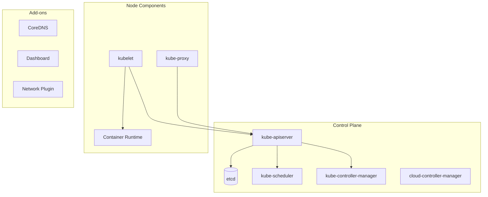
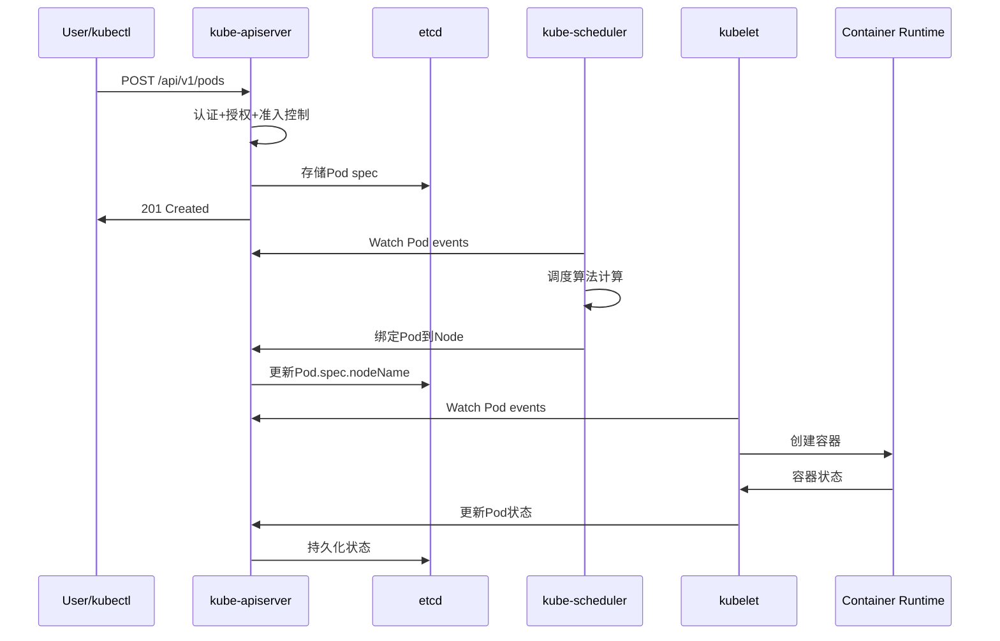

# Kubernetes集群架构概览

## 核心组件架构

## 组件职责概述

### Control Plane组件

#### kube-apiserver
- **核心职责**: 所有组件的统一API入口，处理REST请求
- **关键功能**: 认证、授权、准入控制、API版本管理
- **面试重点**: RESTful设计、RBAC、Admission Controllers

#### etcd
- **核心职责**: 分布式键值存储，保存集群状态
- **关键功能**: Raft共识算法、MVCC、Watch机制
- **面试重点**: 一致性保证、性能优化、备份恢复

#### kube-scheduler
- **核心职责**: Pod调度决策
- **关键功能**: 资源匹配、亲和性策略、优先级调度
- **面试重点**: 调度算法、资源预选、优选策略

### Node组件

#### kubelet
- **核心职责**: 节点代理，管理Pod生命周期
- **关键功能**: Pod创建/删除、健康检查、资源监控
- **面试重点**: CRI接口、Pod网络、存储卷

#### Container Runtime
- **核心职责**: 容器运行时，执行容器操作
- **关键功能**: 容器生命周期、镜像管理、资源隔离
- **面试重点**: CRI标准、安全隔离、性能优化

## 数据流向分析

### Pod创建流程

## 关键设计原则

### 1. 声明式API设计
- **期望状态vs当前状态**: 用户声明期望，系统负责达成
- **控制器模式**: Watch-List-Reconcile循环
- **幂等性**: 重复操作产生相同结果

### 2. 微服务架构
- **单一职责**: 每个组件专注特定功能
- **松耦合**: 通过API Server统一通信
- **可扩展**: 组件可独立扩容

### 3. 最终一致性
- **分布式共识**: 通过etcd保证数据一致性
- **事件驱动**: 异步处理避免阻塞
- **容错设计**: 组件故障不影响整体系统

## 面试常考点

### 高频问题
1. **Kubernetes的核心组件有哪些，各自的作用是什么？**
2. **Pod的创建流程是怎样的？**
3. **API Server如何保证安全性？**
4. **etcd在Kubernetes中的作用和重要性？**
5. **Container Runtime接口(CRI)是什么？**

### 深度分析题
1. **如何设计一个高可用的Kubernetes集群？**
2. **Kubernetes的调度算法是如何工作的？**
3. **如何排查Pod启动失败的问题？**
4. **Kubernetes的网络模型是怎样的？**

## 学习建议

### 面试准备重点
1. 熟记核心组件及其职责
2. 理解Pod生命周期管理
3. 掌握常见故障排查方法
4. 了解性能优化基本策略

### 深入学习方向
1. 源码阅读：从API Server开始
2. 实战练习：搭建本地集群
3. 性能调优：监控和优化实践
4. 故障模拟：人为引入故障进行排查

---

**这是Kubernetes核心组件学习系列的第一篇文章。接下来我们将深入探讨每个组件的架构设计、源码实现和最佳实践。**

**系列文章导航：**
- [API Server深度解析](./kubernetes-apiserver-deep-dive)
- [etcd分布式存储原理](./kubernetes-etcd-distributed-storage)
- [Container Runtime与CRI接口](./kubernetes-container-runtime-cri)