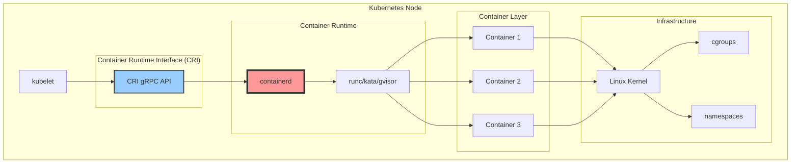
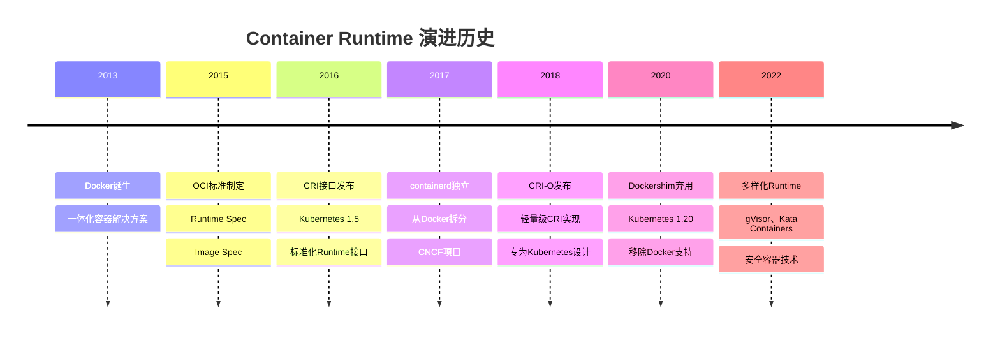
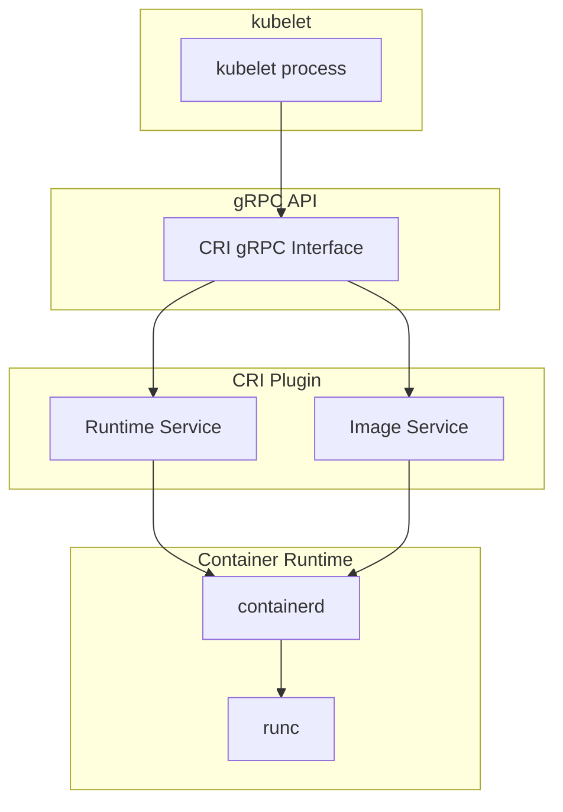
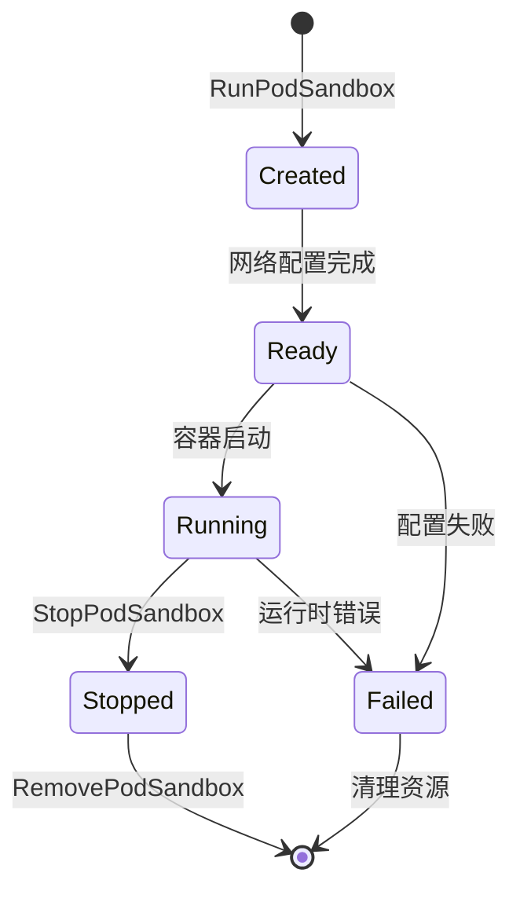
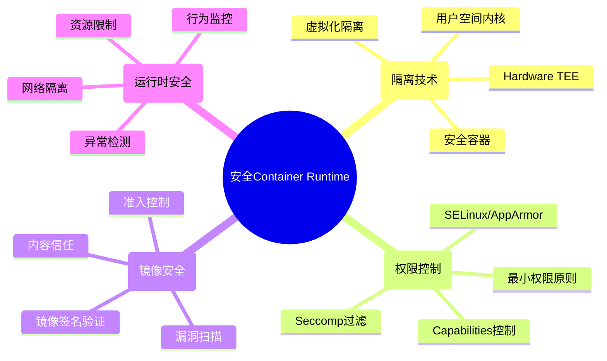

# Container Runtime概述

## 定义与核心作用

**Container Runtime** 是负责容器生命周期管理的底层组件，在Kubernetes集群中作为**容器执行引擎**，负责拉取镜像、创建容器、启动进程、管理存储和网络等核心功能。

### 核心职责
- **容器生命周期管理**: 创建、启动、停止、删除容器
- **镜像管理**: 拉取、存储、管理容器镜像
- **资源隔离**: 通过namespace和cgroups实现资源隔离
- **网络配置**: 配置容器网络接口和路由
- **存储管理**: 挂载卷和管理容器文件系统
- **安全控制**: 实现安全策略和权限控制

## 在Kubernetes生态中的位置



## Container Runtime演进历史

### 发展时间线


## 主流Container Runtime对比

### 核心Runtime对比
| 特性 | containerd | CRI-O | Docker | Podman |
|------|------------|-------|--------|--------|
| **CRI兼容** | ✅ 原生支持 | ✅ 专为CRI设计 | ❌ 需要Dockershim | ❌ 不支持 |
| **OCI兼容** | ✅ 完全兼容 | ✅ 完全兼容 | ✅ 兼容 | ✅ 完全兼容 |
| **守护进程** | ✅ 有 | ✅ 有 | ✅ 有 | ❌ 无守护进程 |
| **镜像格式** | OCI/Docker | OCI/Docker | Docker | OCI/Docker |
| **资源占用** | 轻量 | 最轻量 | 重量级 | 轻量 |
| **安全性** | 中等 | 高 | 中等 | 高 |
| **生态成熟度** | 高 | 中等 | 最高 | 中等 |

### 安全Runtime对比
| Runtime | 隔离技术 | 性能影响 | 安全级别 | 适用场景 |
|---------|----------|----------|----------|----------|
| **runc** | namespace+cgroups | 无 | 标准 | 通用容器 |
| **gVisor** | 用户空间内核 | 10-50% | 高 | 多租户环境 |
| **Kata Containers** | 轻量级虚拟机 | 20-30% | 很高 | 不信任代码 |
| **Firecracker** | 微虚拟机 | 15-25% | 很高 | Serverless |

## Container Runtime Interface (CRI)

### CRI架构设计


### CRI接口定义
```protobuf
// Runtime Service
service RuntimeService {
    // Pod sandbox 管理
    rpc RunPodSandbox(RunPodSandboxRequest) returns (RunPodSandboxResponse) {}
    rpc StopPodSandbox(StopPodSandboxRequest) returns (StopPodSandboxResponse) {}
    rpc RemovePodSandbox(RemovePodSandboxRequest) returns (RemovePodSandboxResponse) {}
    rpc PodSandboxStatus(PodSandboxStatusRequest) returns (PodSandboxStatusResponse) {}
    rpc ListPodSandbox(ListPodSandboxRequest) returns (ListPodSandboxResponse) {}

    // Container 管理
    rpc CreateContainer(CreateContainerRequest) returns (CreateContainerResponse) {}
    rpc StartContainer(StartContainerRequest) returns (StartContainerResponse) {}
    rpc StopContainer(StopContainerRequest) returns (StopContainerResponse) {}
    rpc RemoveContainer(RemoveContainerRequest) returns (RemoveContainerResponse) {}
    rpc ListContainers(ListContainersRequest) returns (ListContainersResponse) {}
    rpc ContainerStatus(ContainerStatusRequest) returns (ContainerStatusResponse) {}

    // 执行和连接
    rpc ExecSync(ExecSyncRequest) returns (ExecSyncResponse) {}
    rpc Exec(ExecRequest) returns (ExecResponse) {}
    rpc Attach(AttachRequest) returns (AttachResponse) {}
    rpc PortForward(PortForwardRequest) returns (PortForwardResponse) {}

    // 状态和统计
    rpc ContainerStats(ContainerStatsRequest) returns (ContainerStatsResponse) {}
    rpc ListContainerStats(ListContainerStatsRequest) returns (ListContainerStatsResponse) {}
    rpc UpdateRuntimeConfig(UpdateRuntimeConfigRequest) returns (UpdateRuntimeConfigResponse) {}
    rpc Status(StatusRequest) returns (StatusResponse) {}
}

// Image Service
service ImageService {
    rpc ListImages(ListImagesRequest) returns (ListImagesResponse) {}
    rpc ImageStatus(ImageStatusRequest) returns (ImageStatusResponse) {}
    rpc PullImage(PullImageRequest) returns (PullImageResponse) {}
    rpc RemoveImage(RemoveImageRequest) returns (RemoveImageResponse) {}
    rpc ImageFsInfo(ImageFsInfoRequest) returns (ImageFsInfoResponse) {}
}
```

## 核心功能特性

### 1. Pod Sandbox模型 🏗️
```bash
# Pod Sandbox概念
Pod Sandbox = 共享网络命名空间 + 共享IPC + 共享PID(可选)
├── pause容器 (Infrastructure Container)
├── 应用容器1
├── 应用容器2
└── sidecar容器
```

**Sandbox生命周期:**


### 2. 容器生命周期管理 ♻️
```go
// 容器状态定义
type ContainerState int32

const (
    CONTAINER_CREATED ContainerState = 0  // 已创建
    CONTAINER_RUNNING ContainerState = 1  // 运行中
    CONTAINER_EXITED  ContainerState = 2  // 已退出
    CONTAINER_UNKNOWN ContainerState = 3  // 状态未知
)

// 容器配置
type ContainerConfig struct {
    Metadata     *ContainerMetadata
    Image        *ImageSpec
    Command      []string           // 启动命令
    Args         []string          // 命令参数
    WorkingDir   string           // 工作目录
    Envs         []*KeyValue      // 环境变量
    Mounts       []*Mount         // 挂载点
    Devices      []*Device        // 设备
    Labels       map[string]string // 标签
    Annotations  map[string]string // 注解
    LogPath      string           // 日志路径
    Linux        *LinuxContainerConfig // Linux特定配置
}
```

### 3. 镜像管理 📦
```bash
# 镜像操作流程
Pull Image → Verify Signature → Extract Layers → Create Filesystem → Ready to Use

# 镜像存储结构
/var/lib/containerd/io.containerd.content.v1.content/
├── blobs/
│   └── sha256/
│       ├── layer1.tar.gz
│       ├── layer2.tar.gz
│       └── manifest.json
└── ingest/          # 临时下载目录
```

### 4. 资源隔离机制 🔒

#### namespace隔离
```bash
# Linux Namespaces
├── PID Namespace    # 进程ID隔离
├── NET Namespace    # 网络隔离
├── MNT Namespace    # 文件系统挂载隔离
├── UTS Namespace    # 主机名隔离
├── IPC Namespace    # 进程间通信隔离
├── USER Namespace   # 用户ID隔离
└── CGROUP Namespace # cgroup隔离
```

#### cgroups资源控制
```bash
# cgroups v1结构
/sys/fs/cgroup/
├── memory/          # 内存限制
├── cpu/             # CPU限制
├── blkio/           # 块设备I/O限制
├── net_cls/         # 网络分类
└── devices/         # 设备访问控制

# cgroups v2统一结构
/sys/fs/cgroup/
└── 统一层级结构
    ├── memory.max   # 内存限制
    ├── cpu.max      # CPU限制
    └── io.max       # I/O限制
```

## 面试重点知识

### 高频考点 📝

**Q1: Container Runtime在Kubernetes中的作用？**
- 负责容器的实际执行
- 通过CRI接口与kubelet通信
- 管理容器生命周期和资源
- 提供网络和存储抽象

**Q2: CRI接口的设计目标是什么？**
- 解耦Kubernetes和具体Runtime
- 标准化容器操作接口
- 支持多种Runtime实现
- 简化Runtime集成

**Q3: Docker和containerd的区别？**
- Docker: 完整的容器平台，包含Runtime
- containerd: 专注于Runtime功能
- containerd更轻量，更适合Kubernetes
- Docker已从Kubernetes中移除

**Q4: 什么是Pod Sandbox？**
- Pod内容器共享的基础设施
- 提供共享网络、IPC、PID命名空间
- 通常由pause容器实现
- 是Pod隔离的基本单元

### 深度分析题 🔍

**Q: 设计一个高安全性的容器运行时**

**考虑因素:**


## 学习路径建议

### 🎯 面试准备 (2-3天)
1. **基本概念**: CRI接口、Pod Sandbox、容器生命周期
2. **核心Runtime**: containerd、CRI-O、runc对比
3. **安全机制**: namespace、cgroups、安全容器
4. **故障排查**: 常见问题和诊断方法

### 🔬 深度学习 (1-2周)
1. **CRI实现**: 深入理解gRPC接口和实现
2. **Runtime架构**: containerd架构和插件机制
3. **安全技术**: gVisor、Kata Containers原理
4. **性能优化**: 启动速度、资源使用优化

### 👨‍💻 专家级别 (1个月+)
1. **源码分析**: Runtime核心模块源码
2. **自定义Runtime**: 开发自己的Runtime实现
3. **安全加固**: 企业级安全策略实施
4. **性能调优**: 大规模集群优化实践

## 实战练习建议

### 1. 基础操作
```bash
# containerd客户端操作
ctr images pull docker.io/library/nginx:latest
ctr containers create docker.io/library/nginx:latest nginx-test
ctr tasks start nginx-test
ctr containers list
```

### 2. CRI测试
```bash
# 使用crictl操作Runtime
crictl pull nginx:latest
crictl images
crictl run container.json pod.json
crictl ps
crictl logs <container-id>
```

### 3. 安全配置
```bash
# gVisor运行时
sudo runsc --platform=ptrace run nginx-secure

# Kata容器
sudo kata-runtime run kata-nginx
```

## 常见问题解答

**Q: 为什么Kubernetes移除了Docker支持？**
A:
1. Docker包含了过多K8s不需要的功能
2. CRI标准化后，专用Runtime更高效
3. containerd提供了更好的性能和稳定性
4. 简化了Kubernetes的维护复杂度

**Q: 容器和虚拟机的区别？**
A:
1. **隔离级别**: 容器进程级别，VM硬件级别
2. **资源开销**: 容器轻量，VM重量级
3. **启动速度**: 容器秒级，VM分钟级
4. **安全性**: VM更强，容器适中

**Q: 如何选择合适的Container Runtime？**
A:
1. **性能要求**: containerd适合高性能场景
2. **安全要求**: gVisor/Kata适合多租户
3. **兼容性**: 考虑现有工具链兼容
4. **维护成本**: 评估运维复杂度

---

**这是Kubernetes核心组件学习系列文章。**

**系列文章导航：**
- [Kubernetes集群架构深度解析](./kubernetes-cluster-architecture-overview)
- [Kubernetes API Server深度解析](./kubernetes-apiserver-deep-dive)
- [etcd分布式存储原理与实践](./kubernetes-etcd-distributed-storage) ← 上一篇
- [Container Runtime架构设计与实现](./kubernetes-container-runtime-architecture) ← 下一篇