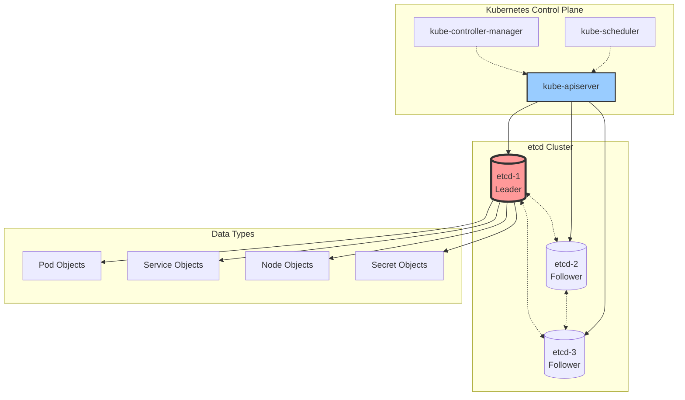
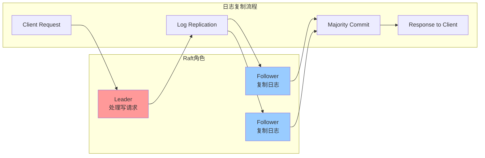
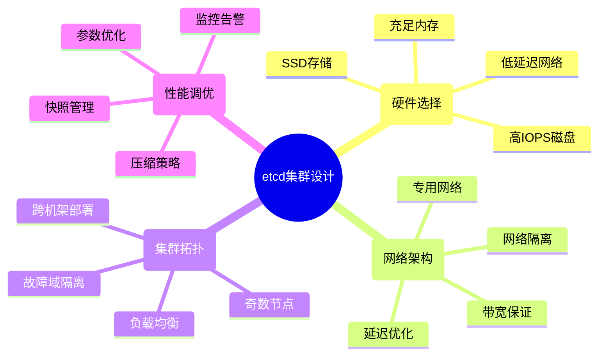

# etcd概述

## 定义与核心作用

**etcd** 是一个分布式、可靠的键值存储系统，专为分布式系统的协调而设计。在Kubernetes集群中，etcd作为**唯一的数据存储后端**，保存整个集群的状态信息。

### 核心职责
- **状态存储**: 保存所有Kubernetes对象的状态数据
- **分布式协调**: 提供强一致性的数据访问
- **配置管理**: 存储集群配置和元数据
- **服务发现**: 支持Watch机制实现实时事件通知
- **分布式锁**: 提供领导者选举和分布式锁服务

## 在Kubernetes生态中的位置



## 核心功能特性

### 1. 分布式共识算法 🗳️

**Raft共识算法**


### 2. MVCC多版本并发控制 📊
```bash
# etcd数据存储模型
Key: /registry/pods/default/my-pod
Revision: 12345
Value: {Pod JSON data}
CreateRevision: 12340
ModRevision: 12345
Version: 3
```

**版本控制特点:**
- **全局单调递增版本号**: 每次修改都会增加revision
- **历史版本保留**: 支持时间点查询和回滚
- **乐观并发控制**: 基于版本号的冲突检测
- **Watch增量更新**: 基于revision的增量事件推送

### 3. Watch机制实现 👀
```go
// Watch事件类型
type Event struct {
    Type EventType // PUT, DELETE
    Kv   *KeyValue
    PrevKv *KeyValue // 前一个版本的值
}

// Watch示例
watcher := client.Watch(context.Background(), "/registry/pods", clientv3.WithPrefix())
for resp := range watcher {
    for _, event := range resp.Events {
        switch event.Type {
        case mvccpb.PUT:
            fmt.Printf("PUT: %s = %s\n", event.Kv.Key, event.Kv.Value)
        case mvccpb.DELETE:
            fmt.Printf("DELETE: %s\n", event.Kv.Key)
        }
    }
}
```

### 4. 事务支持 ⚡
```go
// etcd事务示例
txn := client.Txn(ctx).
    If(clientv3.Compare(clientv3.Value("key1"), "=", "value1")).
    Then(clientv3.OpPut("key2", "value2")).
    Else(clientv3.OpPut("key2", "value3"))

resp, err := txn.Commit()
if err != nil {
    log.Fatal(err)
}

if resp.Succeeded {
    fmt.Println("Transaction succeeded")
} else {
    fmt.Println("Transaction failed")
}
```

## 关键技术特性

### 1. 强一致性保证
- **CP系统**: 在CAP理论中选择一致性和分区容错性
- **线性化**: 所有操作都表现为瞬时生效
- **顺序一致性**: 客户端看到的操作顺序与全局顺序一致

### 2. 高性能设计
- **BoltDB存储引擎**: 嵌入式B+树数据库
- **gRPC协议**: 高效的二进制通信协议
- **批量操作**: 支持事务和批量读写
- **压缩机制**: 定期压缩历史版本减少存储

### 3. 运维友好
- **集群管理**: 动态成员变更
- **备份恢复**: 快照和增量备份
- **监控指标**: 丰富的Prometheus指标
- **日志审计**: 详细的操作日志

## etcd在Kubernetes中的数据模型

### 存储结构
```bash
/registry/
├── apiregistration.k8s.io/
│   └── apiservices/
├── certificatesigningrequests/
├── clusterroles/
├── clusterrolebindings/
├── configmaps/
│   └── {namespace}/
│       └── {configmap-name}
├── controllerrevisions/
├── cronjobs/
├── daemonsets/
├── deployments/
│   └── {namespace}/
│       └── {deployment-name}
├── events/
├── namespaces/
│   └── {namespace-name}
├── nodes/
│   └── {node-name}
├── persistentvolumeclaims/
├── persistentvolumes/
├── pods/
│   └── {namespace}/
│       └── {pod-name}
├── secrets/
│   └── {namespace}/
│       └── {secret-name}
├── serviceaccounts/
└── services/
    └── {namespace}/
        └── {service-name}
```

### 数据示例
```bash
# 查看etcd中存储的Pod数据
ETCDCTL_API=3 etcdctl get /registry/pods/default/my-pod \
    --cert=/etc/kubernetes/pki/etcd/server.crt \
    --key=/etc/kubernetes/pki/etcd/server.key \
    --cacert=/etc/kubernetes/pki/etcd/ca.crt

# 输出（Proto格式，需要解码）
k8s:enc:aescbc:v1:key1:...
```

## 面试重点知识

### 高频考点 📝

**Q1: etcd在Kubernetes中的作用？**
- 集群状态的唯一数据源
- 通过API Server统一访问
- 存储所有Kubernetes对象
- 提供Watch机制支持实时更新

**Q2: etcd如何保证数据一致性？**
- Raft共识算法确保Leader选举
- 写操作必须通过Leader
- 日志复制到多数节点才提交
- 读操作可以从任意节点（可配置）

**Q3: etcd集群最少需要几个节点？**
- 最少1个节点（开发环境）
- 生产推荐3个或5个节点（奇数）
- 容错公式：(N-1)/2，3节点容忍1个故障

**Q4: etcd的Watch机制原理？**
- 基于HTTP/2长连接
- 客户端指定Watch的key前缀
- etcd推送增量变更事件
- 支持历史版本回放

### 深度分析题 🔍

**Q: 设计一个高性能的etcd集群**

**关键考虑因素:**


## 学习路径建议

### 🎯 面试准备 (2-3天)
1. **基本概念**: 分布式一致性、Raft算法、MVCC
2. **架构理解**: etcd在K8s中的角色和数据流
3. **关键特性**: Watch机制、事务、集群管理
4. **故障场景**: 脑裂、数据丢失、性能问题

### 🔬 深度学习 (1-2周)
1. **Raft算法深入**: 领导者选举、日志复制、安全性
2. **存储引擎**: BoltDB原理、B+树结构
3. **性能优化**: 参数调优、监控指标
4. **运维实践**: 备份恢复、集群扩容、故障处理

### 👨‍💻 专家级别 (1个月+)
1. **源码分析**: etcd核心模块源码
2. **性能测试**: 压力测试、基准测试
3. **扩展开发**: 基于etcd的分布式应用
4. **贡献社区**: 参与etcd开源项目

## 实战练习建议

### 1. 基础操作
```bash
# 安装etcd客户端工具
curl -L https://github.com/etcd-io/etcd/releases/download/v3.5.0/etcd-v3.5.0-linux-amd64.tar.gz \
    -o etcd-v3.5.0-linux-amd64.tar.gz
tar xzvf etcd-v3.5.0-linux-amd64.tar.gz

# 基本CRUD操作
export ETCDCTL_API=3
etcdctl put mykey myvalue
etcdctl get mykey
etcdctl del mykey
```

### 2. 集群操作
```bash
# 查看集群状态
etcdctl endpoint status --cluster -w table
etcdctl endpoint health --cluster

# 集群成员管理
etcdctl member list
etcdctl member add node4 --peer-urls=http://10.0.0.4:2380
```

### 3. 性能测试
```bash
# 写性能测试
etcdctl check perf

# 自定义压力测试
benchmark put --total=100000 --val-size=1024
benchmark range key --total=100000
```

## 常见问题解答

**Q: etcd数据过大如何处理？**
A:
1. 定期压缩历史版本
2. 设置自动压缩策略
3. 清理不必要的数据
4. 增加存储配额

**Q: etcd集群脑裂如何避免？**
A:
1. 部署奇数个节点
2. 合理的网络架构
3. 监控集群健康状态
4. 设置合理的选举超时

**Q: 如何备份etcd数据？**
A:
1. 定期创建快照
2. 存储到外部系统
3. 验证备份完整性
4. 练习恢复流程

---

**这是Kubernetes核心组件学习系列文章。**

**系列文章导航：**
- [Kubernetes集群架构深度解析](./kubernetes-cluster-architecture-overview)
- [Kubernetes API Server深度解析](./kubernetes-apiserver-deep-dive) ← 上一篇
- [Container Runtime与CRI接口详解](./kubernetes-container-runtime-cri) ← 下一篇
- [etcd架构设计与源码分析](./kubernetes-etcd-architecture)