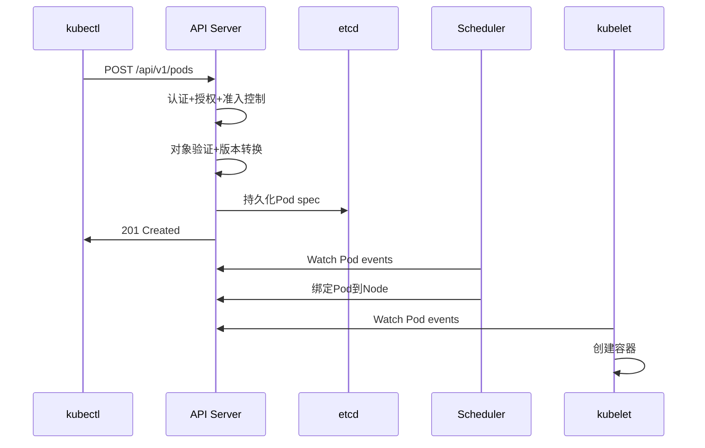

# Kubernetes核心组件面试题精选

## API Server面试题

### 基础概念题

**Q1: API Server在Kubernetes中的作用是什么？**

**答案**:
- **唯一API入口**: 所有组件都通过API Server通信
- **认证授权**: 实现多层安全控制机制
- **数据持久化**: 与etcd交互管理集群状态
- **版本管理**: 处理API版本兼容性和演进
- **扩展支持**: 支持CRD和API聚合

**Q2: API Server的安全机制有哪些？**

**答案**: 三层安全控制
1. **认证(Authentication)**:
   - 证书认证、Token认证、OIDC
   - 验证请求来源身份
2. **授权(Authorization)**:
   - RBAC、ABAC、Webhook
   - 检查操作权限
3. **准入控制(Admission Control)**:
   - Mutating/Validating Webhooks
   - 策略检查和资源修改

### 深度分析题

**Q3: API Server如何处理一个Pod创建请求？**

**答案**: 完整流程


**Q4: 如何设计API Server的高可用架构？**

**答案**: 关键要素
- **无状态设计**: 状态全部存在etcd中
- **多实例部署**: Active-Active模式
- **负载均衡**: 通过LB分发请求
- **共享etcd**: 多个API Server共享etcd集群
- **健康检查**: 自动故障切换

## etcd面试题

### 基础概念题

**Q5: etcd是什么？为什么Kubernetes选择etcd？**

**答案**:
- **定义**: 分布式键值存储，基于Raft共识算法
- **选择理由**:
  - 强一致性保证（CP系统）
  - Watch机制支持实时通知
  - 成熟的分布式一致性算法
  - 高性能和可靠性

**Q6: etcd如何保证数据一致性？**

**答案**: Raft共识算法
- **Leader选举**: 确保单点写入
- **日志复制**: 写操作复制到多数节点
- **两阶段提交**: 保证操作原子性
- **MVCC**: 多版本并发控制

### 深度分析题

**Q7: 解释Raft算法的工作原理**

**答案**: 三个角色和两个过程

**角色**:
- Leader: 处理所有写请求
- Follower: 复制Leader的日志
- Candidate: 选举状态的节点

**选举过程**:
1. Follower超时后变成Candidate
2. 向其他节点请求投票
3. 获得多数票成为Leader
4. 发送心跳维持领导地位

**日志复制**:
1. Leader接收客户端请求
2. 创建日志条目并发送给Follower
3. 收到多数确认后提交
4. 应用到状态机

**Q8: etcd集群脑裂问题如何解决？**

**答案**: 多数派原则
- **奇数节点**: 确保能产生明确多数
- **投票机制**: 只有获得多数票才能成为Leader
- **网络分区**: 少数派自动变为只读状态
- **监控告警**: 及时发现网络分区问题

## Container Runtime面试题

### 基础概念题

**Q9: 什么是CRI？为什么需要CRI？**

**答案**:
- **定义**: Container Runtime Interface，容器运行时接口
- **目的**:
  - 解耦Kubernetes和具体Runtime
  - 标准化容器操作接口
  - 支持多种Runtime实现
  - 简化Runtime集成

**Q10: Docker和containerd的区别？**

**答案**:
- **Docker**: 完整容器平台，包含Runtime、镜像构建、网络等
- **containerd**: 专注Runtime功能，更轻量
- **关系**: containerd是从Docker拆分出来的核心组件
- **Kubernetes**: 1.20+移除Docker支持，推荐使用containerd

### 深度分析题

**Q11: 什么是Pod Sandbox？如何实现？**

**答案**:
- **定义**: Pod内容器共享的基础设施
- **功能**: 提供共享的网络、IPC、PID命名空间
- **实现**: 通常由pause容器（Infrastructure Container）提供
- **生命周期**: 先于应用容器创建，后于应用容器销毁

**Q12: 容器的资源隔离是如何实现的？**

**答案**: Linux内核机制
- **Namespace隔离**:
  - PID: 进程ID隔离
  - Network: 网络隔离
  - Mount: 文件系统隔离
  - UTS: 主机名隔离
  - IPC: 进程间通信隔离
  - User: 用户ID隔离

- **Cgroups控制**:
  - CPU: 处理器使用限制
  - Memory: 内存使用限制
  - BlkIO: 块设备I/O限制
  - Network: 网络带宽控制

## 综合场景题

### Q13: 集群中Pod无法启动，如何排查？

**答案**: 分层排查思路

**1. kubelet层**:
```bash
# 检查kubelet状态
systemctl status kubelet
journalctl -u kubelet -f

# 查看kubelet配置
ps aux | grep kubelet
```

**2. Container Runtime层**:
```bash
# containerd状态
systemctl status containerd
crictl ps -a
crictl logs <container-id>
```

**3. API Server层**:
```bash
# 查看Pod事件
kubectl describe pod <pod-name>
kubectl get events --sort-by='.lastTimestamp'
```

**4. 网络和存储**:
```bash
# 网络连接
kubectl exec -it <pod> -- netstat -an
# 存储挂载
kubectl get pv,pvc
```

### Q14: 如何设计高性能的etcd集群？

**答案**: 全方位优化

**硬件选择**:
- SSD存储（IOPS>3000）
- 低延迟网络（<10ms）
- 充足内存（8GB+）
- 多核CPU

**网络架构**:
- 专用网络段
- 网络带宽保证
- 跨机架部署（容错）

**配置优化**:
```bash
# 性能参数
--heartbeat-interval=100
--election-timeout=1000
--snapshot-count=100000
--quota-backend-bytes=8589934592

# 压缩策略
--auto-compaction-retention=1h
--auto-compaction-mode=periodic
```

**监控告警**:
- 延迟指标监控
- 磁盘使用率
- 网络延迟
- 集群健康状态

## 面试技巧

### 回答策略
1. **分层回答**: 从概念到实现到优化
2. **举例说明**: 结合具体场景
3. **对比分析**: 不同方案的优缺点
4. **实战经验**: 分享真实项目经历

### 深入准备
1. **源码阅读**: 关键组件核心模块
2. **实验验证**: 本地集群搭建测试
3. **问题复现**: 主动制造故障练习排查
4. **性能测试**: 了解各组件性能特性

### 加分项
- **最新技术**: 了解Kubernetes最新特性
- **生产经验**: 大规模集群运维经验
- **开源贡献**: 参与社区项目
- **架构思维**: 系统性思考问题

---

**这是Kubernetes面试准备系列的核心文章。建议结合实际项目经验和动手实践，深入理解每个组件的工作原理和最佳实践。**

**相关阅读：**
- [Kubernetes集群架构深度解析](./kubernetes-cluster-architecture-overview)
- [Kubernetes API Server深度解析](./kubernetes-apiserver-deep-dive)
- [etcd分布式存储原理与实践](./kubernetes-etcd-distributed-storage)
- [Container Runtime与CRI接口详解](./kubernetes-container-runtime-cri)