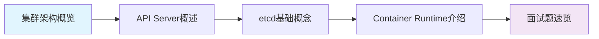
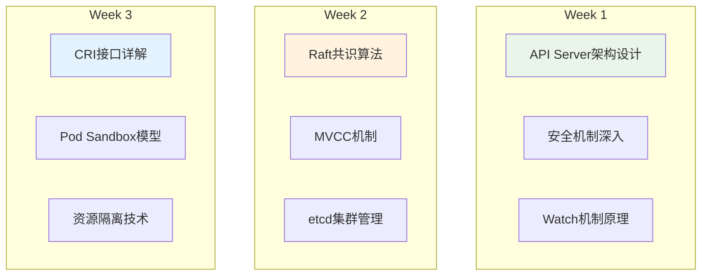
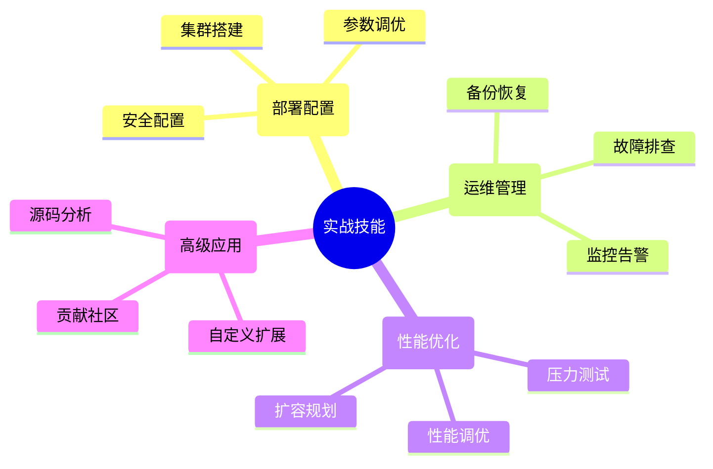

# Kubernetes核心组件学习系列

## 🎯 学习目标

本系列文章深入解析Kubernetes三大核心组件：**API Server**、**etcd**和**Container Runtime**，为您提供：

- 📚 **深度理论知识**: 从架构设计到源码实现
- 🛠️ **实战操作指南**: 部署配置到故障排查
- 💼 **面试准备**: 高频问题到深度分析
- 🚀 **最佳实践**: 生产环境优化经验

## 📖 文章目录

### 🏗️ 架构基础
**[Kubernetes集群架构深度解析](./kubernetes-cluster-architecture-overview)**
- 核心组件架构图与职责分工
- Pod创建流程详解
- 关键设计原则：声明式API、微服务架构、最终一致性
- 面试高频考点和学习建议

### 🌐 API Server专题
**[Kubernetes API Server深度解析](./kubernetes-apiserver-deep-dive)**
- API网关设计与核心职责
- 多层安全控制机制
- Watch机制与版本管理
- 高可用架构设计
- 性能优化策略

### 💾 etcd专题
**[etcd分布式存储原理与实践](./kubernetes-etcd-distributed-storage)**
- Raft共识算法详解
- MVCC多版本并发控制
- Watch机制实现原理
- 集群管理与高可用设计
- 数据一致性保证

**[etcd实战操作指南](./kubernetes-etcd-hands-on-guide)**
- 集群部署与安全配置
- 备份恢复完整流程
- 性能监控与故障排查
- 生产环境最佳实践
- 自动化运维脚本

### 🐳 Container Runtime专题
**[Container Runtime与CRI接口详解](./kubernetes-container-runtime-cri)**
- CRI接口设计原理
- Pod Sandbox模型
- 主流Runtime对比分析
- 资源隔离机制
- 安全容器技术

### 🎯 面试准备
**[Kubernetes核心组件面试题精选](./kubernetes-interview-questions-comprehensive)**
- 基础概念到深度分析
- 实战场景问题解答
- 面试技巧与回答策略
- 加分项和深入准备建议

## 🗺️ 学习路线图

### 🚀 快速入门 (1周)


**目标**: 建立整体认知，掌握核心概念
- 理解Kubernetes整体架构
- 掌握三大组件基本职责
- 熟悉常用术语和概念
- 能够回答基础面试问题

### 📚 深度学习 (2-3周)


**目标**: 深入技术细节，理解设计思想
- 掌握各组件内部架构
- 理解关键算法和机制
- 能够分析技术选型
- 具备架构设计能力

### 🛠️ 实战进阶 (3-4周)


**目标**: 具备生产环境实战能力
- 独立部署和管理集群
- 熟练进行故障排查
- 掌握性能优化技巧
- 能够自定义扩展

## 🎯 不同角色的学习建议

### 👨‍💻 开发工程师
**重点关注**:
- API Server的RESTful设计
- 资源对象定义和操作
- CRD自定义资源扩展
- 客户端SDK使用

**学习路径**:
1. 集群架构概览 → API Server详解
2. Container Runtime → CRI接口
3. 面试题 → 实战操作

### 🔧 运维工程师
**重点关注**:
- etcd集群管理和备份恢复
- 系统监控和故障排查
- 性能优化和容量规划
- 安全配置和最佳实践

**学习路径**:
1. 集群架构概览 → etcd详解
2. 实战操作指南 → 监控告警
3. 故障排查 → 性能优化

### 👔 架构师/技术负责人
**重点关注**:
- 整体架构设计思想
- 各组件的设计权衡
- 分布式系统理论
- 大规模集群设计

**学习路径**:
1. 架构概览 → 深度技术分析
2. 设计原则 → 最佳实践
3. 源码研究 → 贡献社区

### 🎓 面试准备者
**重点关注**:
- 高频面试问题
- 深度技术分析
- 实战场景应对
- 项目经验总结

**学习路径**:
1. 基础概念速览 → 面试题精选
2. 技术细节深入 → 实战案例
3. 模拟面试 → 查漏补缺

## 📅 学习时间规划

### ⚡ 面试冲刺 (3-5天)
```
Day 1: 架构概览 + API Server概述
Day 2: etcd基础 + Container Runtime基础
Day 3: 面试题集中练习
Day 4: 实战操作体验
Day 5: 模拟面试和查漏补缺
```

### 📖 系统学习 (2-4周)
```
Week 1: 基础概念和架构理解
Week 2: API Server和etcd深入
Week 3: Container Runtime和实战
Week 4: 高级主题和项目实践
```

### 🚀 专家成长 (2-6个月)
```
Month 1-2: 深度理论和源码分析
Month 3-4: 大规模生产实践
Month 5-6: 开源贡献和技术分享
```

## 🛠️ 实验环境搭建

### 本地开发环境
```bash
# 安装kubectl
curl -LO "https://dl.k8s.io/release/$(curl -L -s https://dl.k8s.io/release/stable.txt)/bin/linux/amd64/kubectl"

# 安装kind (本地Kubernetes集群)
go install sigs.k8s.io/kind@latest

# 创建测试集群
kind create cluster --name learning-cluster

# 安装etcd客户端
curl -L https://github.com/etcd-io/etcd/releases/download/v3.5.0/etcd-v3.5.0-linux-amd64.tar.gz \
  -o etcd.tar.gz && tar -xzf etcd.tar.gz
```

### 实验项目建议
1. **部署三节点etcd集群**
2. **自定义CRD资源**
3. **编写Admission Webhook**
4. **实现简单的Controller**
5. **故障注入和恢复演练**

## 📚 扩展学习资源

### 官方文档
- [Kubernetes Documentation](https://kubernetes.io/docs/)
- [etcd Documentation](https://etcd.io/docs/)
- [Container Runtime Interface](https://github.com/kubernetes/cri-api)

### 源码仓库
- [kubernetes/kubernetes](https://github.com/kubernetes/kubernetes)
- [etcd-io/etcd](https://github.com/etcd-io/etcd)
- [containerd/containerd](https://github.com/containerd/containerd)

### 推荐书籍
- 《Kubernetes in Action》
- 《Programming Kubernetes》
- 《Kubernetes源码剖析》

## 🤝 学习交流

### 社区参与
- **CNCF Slack**: kubernetes.slack.com
- **GitHub Discussions**: 各项目的讨论区
- **技术会议**: KubeCon、云原生社区meetup

### 贡献方式
- **文档改进**: 完善官方文档
- **Bug报告**: 提交问题和修复
- **功能开发**: 参与新功能开发
- **社区分享**: 写文章、做演讲

---

## 🎉 开始学习之旅

选择适合您当前水平的学习路径，循序渐进地深入Kubernetes核心技术。记住，最好的学习方式是**理论结合实践**，在动手操作中加深理解。

祝您学习顺利，早日成为Kubernetes专家！🚀

**快速导航：**
- [开始学习](./kubernetes-cluster-architecture-overview) →
- [面试准备](./kubernetes-interview-questions-comprehensive) →
- [实战操作](./kubernetes-etcd-hands-on-guide) →