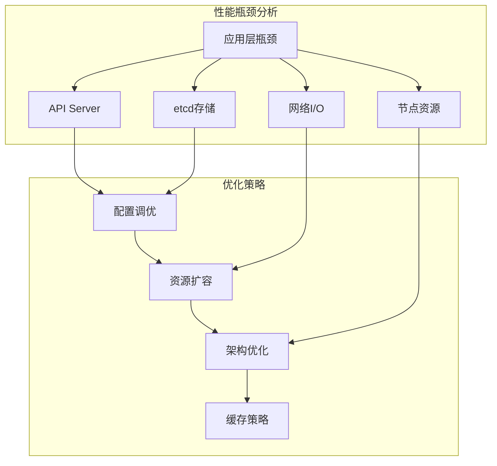
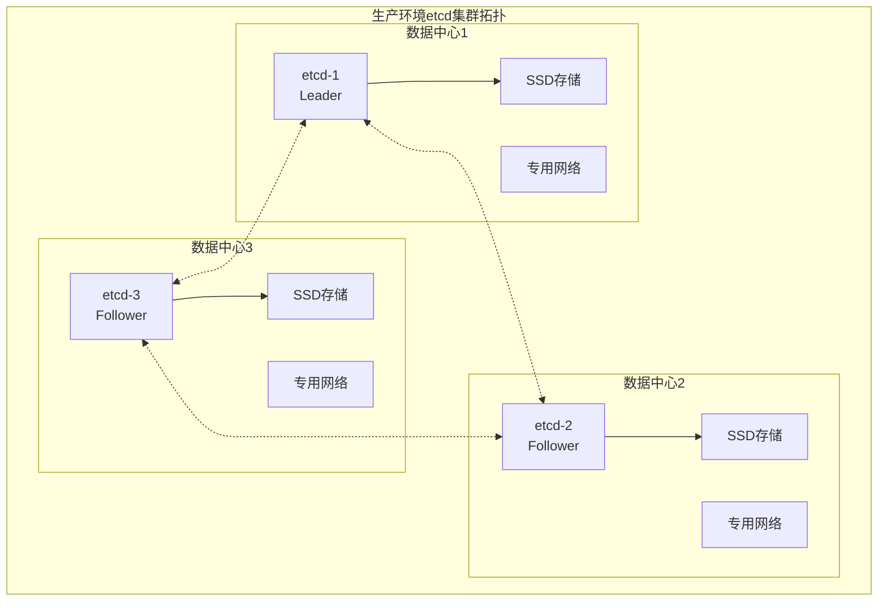

# Kubernetes性能优化完整指南

## 性能优化概览

### 性能瓶颈分析框架



### 关键性能指标体系

#### 1. API Server性能指标

```bash
# 延迟指标
apiserver_request_duration_seconds_bucket{verb="GET",resource="pods"}
apiserver_request_duration_seconds_bucket{verb="LIST",resource="pods"}
apiserver_request_duration_seconds_bucket{verb="CREATE",resource="pods"}

# 吞吐量指标
rate(apiserver_request_total[5m])
rate(apiserver_request_total{code!~"5.."}[5m])  # 成功率

# 并发控制指标
apiserver_current_inflight_requests
apiserver_longrunning_gauge

# Watch性能指标
apiserver_watch_events_total
apiserver_watch_events_sizes_bucket
```

#### 2. etcd性能指标

```bash
# etcd延迟
etcd_disk_wal_fsync_duration_seconds
etcd_disk_backend_commit_duration_seconds
etcd_request_duration_seconds

# etcd吞吐量
rate(etcd_server_proposals_committed_total[5m])
rate(etcd_server_proposals_applied_total[5m])

# 集群健康指标
etcd_server_leader_changes_seen_total
etcd_server_proposals_failed_total
```

## API Server性能优化

### 1. 连接池优化

```yaml
# API Server配置优化
apiVersion: v1
kind: Pod
metadata:
  name: kube-apiserver
spec:
  containers:
  - name: kube-apiserver
    command:
    - kube-apiserver
    # 连接限制优化
    - --max-requests-inflight=3000           # 增加并发请求限制
    - --max-mutating-requests-inflight=1000   # 变更操作并发限制
    - --request-timeout=300s                 # 请求超时时间
    - --min-request-timeout=1800             # Watch最小超时

    # etcd连接优化
    - --etcd-compaction-interval=300s        # etcd压缩间隔
    - --etcd-count-metric-poll-period=60s    # 指标轮询间隔

    # 缓存优化
    - --watch-cache-sizes=default#1000,pods#5000,nodes#1000
    - --default-watch-cache-size=1000
    - --enable-priority-and-fairness=true

    # 认证缓存
    - --authentication-token-webhook-cache-ttl=300s
    - --authorization-webhook-cache-authorized-ttl=300s

    resources:
      requests:
        cpu: 2000m
        memory: 4Gi
      limits:
        cpu: 4000m
        memory: 8Gi
```

### 2. API Priority and Fairness (APF)配置

```yaml
# 高优先级流量配置
apiVersion: flowcontrol.apiserver.k8s.io/v1beta2
kind: PriorityLevelConfiguration
metadata:
  name: system-high
spec:
  type: Limited
  limited:
    assuredConcurrencyShares: 100
    limitResponse:
      type: Queue
      queuing:
        queues: 64
        handSize: 6
        queueLengthLimit: 50

---
apiVersion: flowcontrol.apiserver.k8s.io/v1beta2
kind: FlowSchema
metadata:
  name: system-leader-election
spec:
  priorityLevelConfiguration:
    name: system-high
  matchingPrecedence: 200
  rules:
  - subjects:
    - kind: User
      user:
        name: system:kube-controller-manager
    - kind: User
      user:
        name: system:kube-scheduler
    resourceRules:
    - verbs: ["create", "update"]
      resources: ["leases"]
      namespaces: ["kube-system"]

---
# 普通工作负载配置
apiVersion: flowcontrol.apiserver.k8s.io/v1beta2
kind: PriorityLevelConfiguration
metadata:
  name: workload-medium
spec:
  type: Limited
  limited:
    assuredConcurrencyShares: 50
    limitResponse:
      type: Queue
      queuing:
        queues: 128
        handSize: 6
        queueLengthLimit: 50
```

### 3. 认证与授权优化

```yaml
# 高效的RBAC配置
apiVersion: rbac.authorization.k8s.io/v1
kind: ClusterRole
metadata:
  name: monitoring-reader
rules:
# 使用具体资源名而非通配符
- apiGroups: [""]
  resources: ["nodes", "pods", "services", "endpoints"]
  verbs: ["get", "list"]
# 避免过于宽泛的权限
- apiGroups: ["apps"]
  resources: ["deployments", "replicasets"]
  verbs: ["get", "list"]

---
# ServiceAccount Token优化
apiVersion: v1
kind: ServiceAccount
metadata:
  name: monitoring-sa
  namespace: default
# 使用有限的Token生命周期
secrets:
- name: monitoring-token
automountServiceAccountToken: true
```

### 4. Watch性能优化

```go
// 客户端Watch优化示例
func optimizedWatch(clientset kubernetes.Interface) {
    // 使用ResourceVersion避免重复事件
    listOptions := metav1.ListOptions{
        ResourceVersion: "0",  // 从最新版本开始
        Watch:           true,
    }

    // 使用超时和重连机制
    ctx, cancel := context.WithTimeout(context.Background(), 30*time.Minute)
    defer cancel()

    watcher, err := clientset.CoreV1().Pods("default").Watch(ctx, listOptions)
    if err != nil {
        log.Fatal(err)
    }

    // 批量处理事件
    eventBuffer := make([]watch.Event, 0, 100)
    ticker := time.NewTicker(1 * time.Second)
    defer ticker.Stop()

    for {
        select {
        case event, ok := <-watcher.ResultChan():
            if !ok {
                return
            }
            eventBuffer = append(eventBuffer, event)

        case <-ticker.C:
            if len(eventBuffer) > 0 {
                processBatchEvents(eventBuffer)
                eventBuffer = eventBuffer[:0] // 清空buffer
            }
        }
    }
}
```

## etcd性能优化

### 1. 硬件和系统优化

```bash
#!/bin/bash
# etcd系统优化脚本

echo "🔧 etcd系统优化配置"

# 磁盘优化
echo "1. 配置磁盘调度器"
echo deadline > /sys/block/sda/queue/scheduler
echo 1024 > /sys/block/sda/queue/read_ahead_kb

# 网络优化
echo "2. 网络参数优化"
sysctl -w net.core.rmem_max=134217728
sysctl -w net.core.wmem_max=134217728
sysctl -w net.ipv4.tcp_rmem="4096 65536 134217728"
sysctl -w net.ipv4.tcp_wmem="4096 65536 134217728"

# 文件描述符优化
echo "3. 文件描述符限制"
echo "etcd soft nofile 65536" >> /etc/security/limits.conf
echo "etcd hard nofile 65536" >> /etc/security/limits.conf

# 内存优化
echo "4. 内存管理优化"
sysctl -w vm.swappiness=1
sysctl -w vm.dirty_ratio=15
sysctl -w vm.dirty_background_ratio=5

echo "✅ 系统优化完成"
```

### 2. etcd配置优化

```yaml
# etcd优化配置
apiVersion: v1
kind: Pod
metadata:
  name: etcd
spec:
  containers:
  - name: etcd
    image: quay.io/coreos/etcd:v3.5.0
    command:
    - etcd
    # 数据目录
    - --data-dir=/var/lib/etcd
    - --wal-dir=/var/lib/etcd/wal       # 独立WAL目录

    # 网络配置
    - --listen-client-urls=https://0.0.0.0:2379
    - --listen-peer-urls=https://0.0.0.0:2380
    - --advertise-client-urls=https://10.0.0.1:2379
    - --initial-advertise-peer-urls=https://10.0.0.1:2380

    # 性能调优参数
    - --snapshot-count=100000           # 快照触发条目数
    - --heartbeat-interval=100          # 心跳间隔(ms)
    - --election-timeout=1000           # 选举超时(ms)
    - --max-snapshots=5                 # 最大快照数
    - --max-wals=5                      # 最大WAL文件数

    # 存储配置
    - --quota-backend-bytes=8589934592  # 8GB存储配额
    - --backend-batch-limit=10000       # 后端批处理限制
    - --backend-batch-interval=100ms    # 批处理间隔

    # 压缩配置
    - --auto-compaction-retention=1h    # 自动压缩保留时间
    - --auto-compaction-mode=periodic   # 周期性压缩

    # 安全配置
    - --client-cert-auth=true
    - --peer-cert-file=/etc/kubernetes/pki/etcd/peer.crt
    - --peer-key-file=/etc/kubernetes/pki/etcd/peer.key
    - --peer-trusted-ca-file=/etc/kubernetes/pki/etcd/ca.crt

    resources:
      requests:
        cpu: 1000m
        memory: 2Gi
      limits:
        cpu: 2000m
        memory: 4Gi

    volumeMounts:
    - name: etcd-data
      mountPath: /var/lib/etcd
    - name: etcd-wal
      mountPath: /var/lib/etcd/wal

  volumes:
  - name: etcd-data
    hostPath:
      path: /var/lib/etcd
      type: DirectoryOrCreate
  - name: etcd-wal
    hostPath:
      path: /var/lib/etcd-wal
      type: DirectoryOrCreate
```

### 3. etcd集群拓扑优化



### 4. 自动化维护脚本

```bash
#!/bin/bash
# etcd-maintenance.sh - 自动化维护脚本

ETCD_ENDPOINTS="https://10.0.0.1:2379,https://10.0.0.2:2379,https://10.0.0.3:2379"
ETCD_CACERT="/etc/kubernetes/pki/etcd/ca.crt"
ETCD_CERT="/etc/kubernetes/pki/etcd/server.crt"
ETCD_KEY="/etc/kubernetes/pki/etcd/server.key"

echo "🔧 etcd自动化维护开始"

# 1. 健康检查
echo "1. 集群健康检查"
ETCDCTL_API=3 etcdctl endpoint health \
  --endpoints=$ETCD_ENDPOINTS \
  --cacert=$ETCD_CACERT \
  --cert=$ETCD_CERT \
  --key=$ETCD_KEY

# 2. 检查数据库大小
echo "2. 检查数据库大小"
ETCDCTL_API=3 etcdctl endpoint status \
  --endpoints=$ETCD_ENDPOINTS \
  --cacert=$ETCD_CACERT \
  --cert=$ETCD_CERT \
  --key=$ETCD_KEY \
  -w table

# 3. 自动压缩
echo "3. 执行数据压缩"
rev=$(ETCDCTL_API=3 etcdctl endpoint status \
  --endpoints=$ETCD_ENDPOINTS \
  --cacert=$ETCD_CACERT \
  --cert=$ETCD_CERT \
  --key=$ETCD_KEY \
  --write-out="json" | jq -r '.[] | .Status.header.revision' | sort -n | tail -1)

if [ $rev -gt 100000 ]; then
  echo "压缩到版本: $rev"
  ETCDCTL_API=3 etcdctl compact $rev \
    --endpoints=$ETCD_ENDPOINTS \
    --cacert=$ETCD_CACERT \
    --cert=$ETCD_CERT \
    --key=$ETCD_KEY
fi

# 4. 碎片整理
echo "4. 执行碎片整理"
ETCDCTL_API=3 etcdctl defrag \
  --endpoints=$ETCD_ENDPOINTS \
  --cacert=$ETCD_CACERT \
  --cert=$ETCD_CERT \
  --key=$ETCD_KEY

# 5. 备份创建
echo "5. 创建数据备份"
BACKUP_DIR="/backup/etcd/$(date +%Y%m%d)"
mkdir -p $BACKUP_DIR

ETCDCTL_API=3 etcdctl snapshot save \
  ${BACKUP_DIR}/etcd-snapshot-$(date +%H%M%S).db \
  --endpoints=$ETCD_ENDPOINTS \
  --cacert=$ETCD_CACERT \
  --cert=$ETCD_CERT \
  --key=$ETCD_KEY

echo "✅ etcd维护完成"
```

## 监控和告警配置

### 1. Prometheus告警规则

```yaml
# kubernetes-performance-alerts.yml
groups:
- name: kubernetes.performance
  rules:
  # API Server性能告警
  - alert: APIServerHighLatency
    expr: histogram_quantile(0.99, sum(rate(apiserver_request_duration_seconds_bucket[5m])) by (le)) > 1
    for: 10m
    labels:
      severity: warning
    annotations:
      summary: "API Server high latency detected"
      description: "API Server 99th percentile latency is {{ $value }}s"

  - alert: APIServerHighErrorRate
    expr: sum(rate(apiserver_request_total{code=~"5.."}[5m])) / sum(rate(apiserver_request_total[5m])) > 0.05
    for: 5m
    labels:
      severity: critical
    annotations:
      summary: "API Server high error rate"

  - alert: APIServerRequestInflightHigh
    expr: apiserver_current_inflight_requests > 2000
    for: 5m
    labels:
      severity: warning
    annotations:
      summary: "API Server request queue is full"

  # etcd性能告警
  - alert: EtcdHighCommitDuration
    expr: histogram_quantile(0.99, rate(etcd_disk_backend_commit_duration_seconds_bucket[5m])) > 0.1
    for: 5m
    labels:
      severity: warning
    annotations:
      summary: "etcd high commit duration"

  - alert: EtcdHighFsyncDuration
    expr: histogram_quantile(0.99, rate(etcd_disk_wal_fsync_duration_seconds_bucket[5m])) > 0.1
    for: 5m
    labels:
      severity: warning
    annotations:
      summary: "etcd high fsync duration"

  - alert: EtcdDatabaseSizeHigh
    expr: etcd_mvcc_db_total_size_in_bytes > 2147483648  # 2GB
    for: 5m
    labels:
      severity: warning
    annotations:
      summary: "etcd database size is too large"
```

### 2. Grafana仪表板配置

```json
{
  "dashboard": {
    "title": "Kubernetes Performance Dashboard",
    "panels": [
      {
        "title": "API Server Request Rate",
        "type": "graph",
        "targets": [
          {
            "expr": "sum(rate(apiserver_request_total[5m])) by (verb, code)",
            "legendFormat": "{{verb}} - {{code}}"
          }
        ]
      },
      {
        "title": "API Server Request Duration",
        "type": "graph",
        "targets": [
          {
            "expr": "histogram_quantile(0.95, sum(rate(apiserver_request_duration_seconds_bucket[5m])) by (le, verb))",
            "legendFormat": "95th percentile - {{verb}}"
          }
        ]
      },
      {
        "title": "etcd Request Duration",
        "type": "graph",
        "targets": [
          {
            "expr": "histogram_quantile(0.99, sum(rate(etcd_request_duration_seconds_bucket[5m])) by (le, operation))",
            "legendFormat": "99th percentile - {{operation}}"
          }
        ]
      }
    ]
  }
}
```

## 容量规划和扩展策略

### 1. 容量评估模型

```go
// 容量规划计算器
type CapacityPlanner struct {
    NodesCount        int
    PodsPerNode       int
    ServicesCount     int
    ConfigMapsCount   int
    SecretsCount      int

    // 预计增长率
    GrowthRatePercent float64
}

func (cp *CapacityPlanner) CalculateAPIServerRequirements() APIServerSpecs {
    totalObjects := cp.NodesCount*cp.PodsPerNode + cp.ServicesCount +
                   cp.ConfigMapsCount + cp.SecretsCount

    // 基于对象数量计算资源需求
    cpuCores := int(math.Max(2, float64(totalObjects)/1000))
    memoryGB := int(math.Max(4, float64(totalObjects)/500))

    // 考虑增长率
    futureTotal := float64(totalObjects) * (1 + cp.GrowthRatePercent/100)
    futureCPU := int(math.Max(float64(cpuCores), futureTotal/1000))
    futureMemory := int(math.Max(float64(memoryGB), futureTotal/500))

    return APIServerSpecs{
        CurrentCPU:    cpuCores,
        CurrentMemory: memoryGB,
        FutureCPU:     futureCPU,
        FutureMemory:  futureMemory,
    }
}

func (cp *CapacityPlanner) CalculateEtcdRequirements() EtcdSpecs {
    // etcd存储计算（每个对象平均2KB）
    totalObjects := cp.NodesCount*cp.PodsPerNode + cp.ServicesCount
    storageGB := int(math.Max(20, float64(totalObjects)*2/1024/1024))

    // IOPS需求（每个对象1个写操作）
    iops := int(math.Max(3000, float64(totalObjects)/10))

    return EtcdSpecs{
        StorageGB: storageGB,
        IOPS:      iops,
        Nodes:     3, // 生产环境推荐
    }
}
```

### 2. 水平扩展策略

```yaml
# API Server水平扩展配置
apiVersion: apps/v1
kind: Deployment
metadata:
  name: kube-apiserver-additional
spec:
  replicas: 2  # 额外的API Server实例
  selector:
    matchLabels:
      app: kube-apiserver-additional
  template:
    metadata:
      labels:
        app: kube-apiserver-additional
    spec:
      containers:
      - name: kube-apiserver
        image: k8s.gcr.io/kube-apiserver:v1.28.0
        command:
        - kube-apiserver
        - --advertise-address=$(POD_IP)
        # 其他配置参数...
        env:
        - name: POD_IP
          valueFrom:
            fieldRef:
              fieldPath: status.podIP

---
# 负载均衡器配置
apiVersion: v1
kind: Service
metadata:
  name: kubernetes-api
spec:
  selector:
    component: kube-apiserver
  ports:
  - port: 443
    targetPort: 6443
  type: LoadBalancer
```

## 性能基准测试

### 1. API Server压力测试

```bash
#!/bin/bash
# api-server-benchmark.sh

echo "🚀 API Server性能测试"

# 创建测试namespace
kubectl create namespace perf-test

# 并发创建Pod测试
echo "1. 并发创建Pod测试"
time for i in {1..1000}; do
    kubectl run test-pod-$i --image=nginx --namespace=perf-test &
    if (( i % 100 == 0 )); then
        wait  # 每100个等待一次
    fi
done
wait

echo "2. 大量GET请求测试"
# 使用ab进行并发GET测试
ab -n 10000 -c 100 \
   -H "Authorization: Bearer $(kubectl get secret $(kubectl get serviceaccount default -o jsonpath='{.secrets[0].name}') -o jsonpath='{.data.token}' | base64 -d)" \
   https://kubernetes.default.svc.cluster.local/api/v1/pods

echo "3. Watch性能测试"
# 测试Watch连接数
for i in {1..100}; do
    kubectl get pods --watch --namespace=perf-test > /dev/null &
done

# 清理
kubectl delete namespace perf-test

echo "✅ 性能测试完成"
```

### 2. etcd性能测试

```bash
#!/bin/bash
# etcd-benchmark.sh

echo "⚡ etcd性能基准测试"

ETCD_ENDPOINTS="https://10.0.0.1:2379"

# 写入性能测试
echo "1. 写入性能测试"
ETCDCTL_API=3 etcdctl check perf \
  --endpoints=$ETCD_ENDPOINTS

# 自定义读写测试
echo "2. 自定义读写测试"
benchmark put --total=100000 --val-size=1024 \
  --endpoints=$ETCD_ENDPOINTS

benchmark range key --total=100000 \
  --endpoints=$ETCD_ENDPOINTS

echo "✅ etcd性能测试完成"
```

---

**这是Kubernetes性能优化的完整实战指南，涵盖了从监控到调优的全流程。建议根据实际集群规模和业务特点，选择适合的优化策略。**

**系列文章导航：**
- [Kubernetes API Server架构设计深度剖析](./kubernetes-apiserver-architecture-detailed)
- [etcd架构设计深度剖析](./etcd-architecture-deep-dive)
- [Kubernetes故障排查完整指南](./kubernetes-troubleshooting-complete-guide)
- [Kubernetes核心组件技术挑战与解决方案](./kubernetes-technical-challenges-solutions)
- [Kubernetes核心组件学习系列概览](./kubernetes-learning-series-overview)