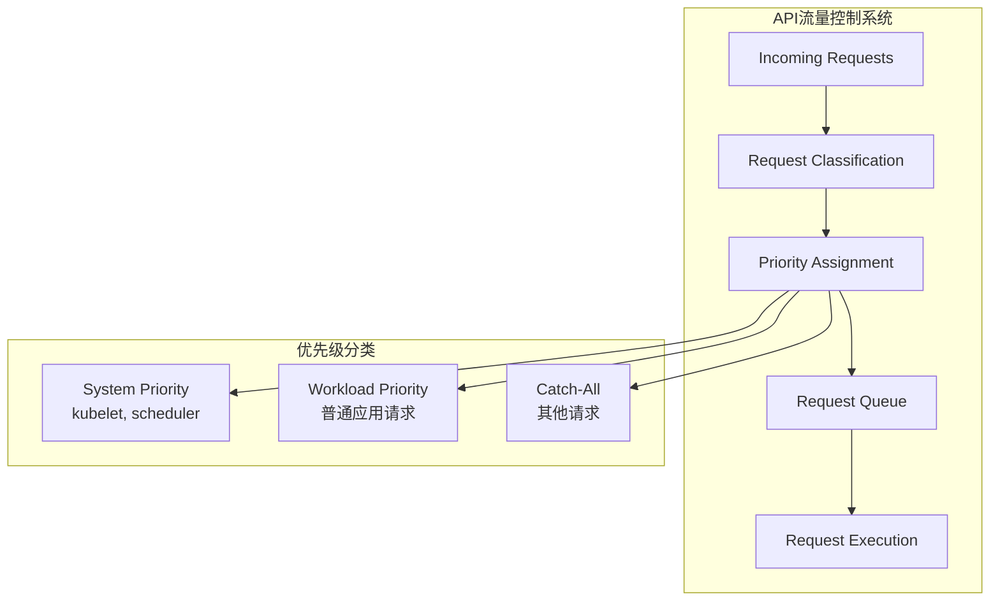
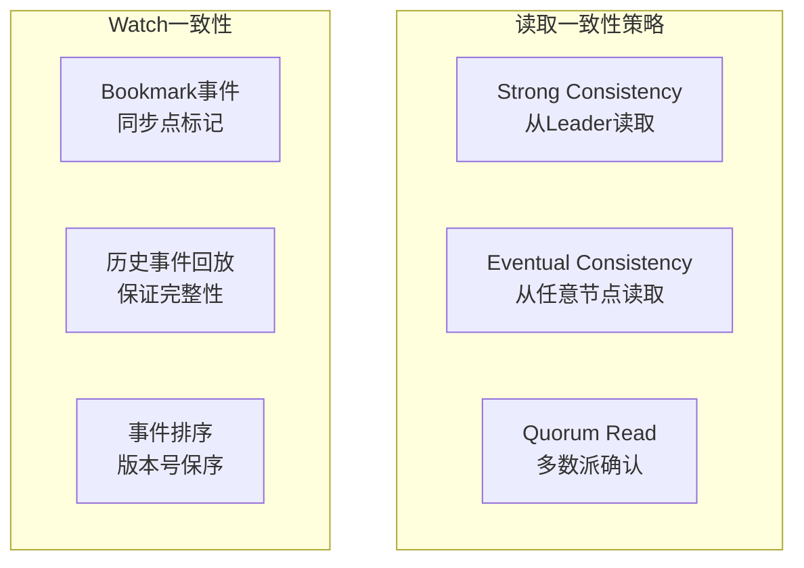
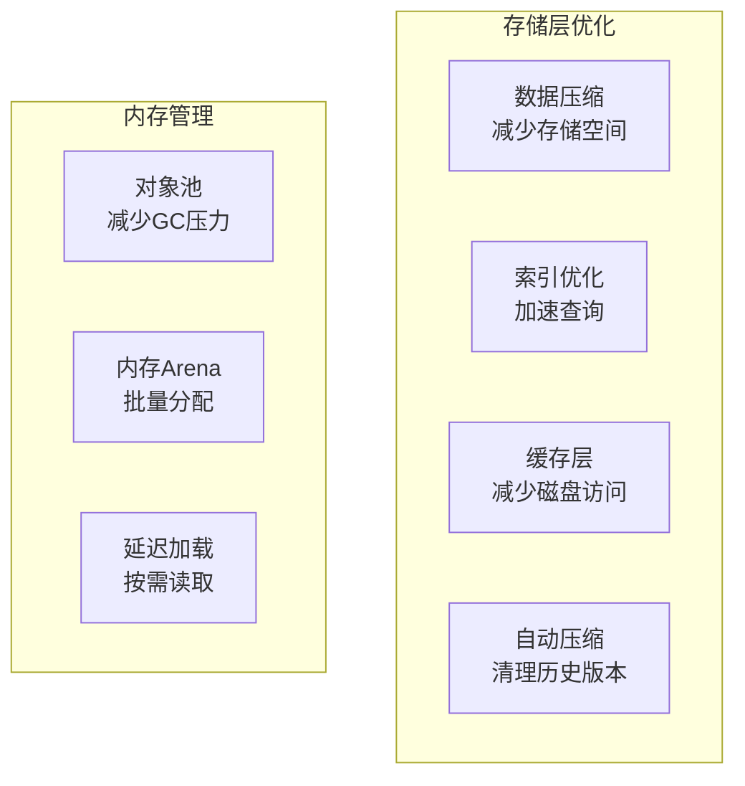
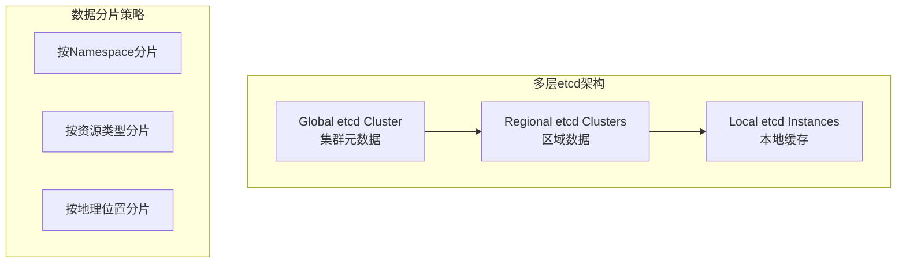
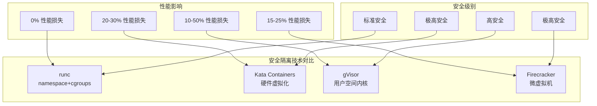

# Kubernetes核心组件技术挑战与解决方案

## API Server技术挑战

### 1. 高并发请求处理

#### 挑战描述
- **大量客户端同时访问**: 数千个Pod、控制器同时请求API
- **Watch连接管理**: 长连接数量巨大，消耗内存和文件描述符
- **突发流量处理**: 集群重启或故障恢复时的流量峰值

#### 解决方案架构



**连接池和复用实现:**
```go
// HTTP/2连接复用配置
type Transport struct {
    TLSHandshakeTimeout:   10 * time.Second,
    IdleConnTimeout:       90 * time.Second,
    MaxIdleConns:          100,
    MaxIdleConnsPerHost:   50,
    MaxConnsPerHost:       200,
    ForceAttemptHTTP2:     true,
}

// Watch连接管理
type WatchConnectionManager struct {
    connections map[string]*WatchConnection
    maxPerUser  int
    mutex       sync.RWMutex
}

func (wcm *WatchConnectionManager) AddConnection(user string, conn *WatchConnection) error {
    wcm.mutex.Lock()
    defer wcm.mutex.Unlock()

    userConns := wcm.getConnectionsByUser(user)
    if len(userConns) >= wcm.maxPerUser {
        return fmt.Errorf("too many watch connections for user %s", user)
    }

    wcm.connections[conn.ID] = conn
    return nil
}
```

**API Priority and Fairness (APF) 配置:**
```yaml
apiVersion: flowcontrol.apiserver.k8s.io/v1beta2
kind: FlowSchema
metadata:
  name: system-priority
spec:
  priorityLevelConfiguration:
    name: system
  matchingPrecedence: 1000
  rules:
  - subjects:
    - kind: User
      user:
        name: system:kube-scheduler
    - kind: User
      user:
        name: system:kube-controller-manager
    resources:
    - resource: "*"
      verbs: ["*"]
```

### 2. 数据一致性挑战

#### 挑战分析
- **读写分离的一致性**: Watch事件可能滞后于写操作
- **版本转换的数据完整性**: 不同API版本间的字段映射
- **并发更新的冲突处理**: 乐观锁和资源版本管理

#### 解决方案设计

**MVCC版本控制:**
```go
// 资源版本管理
type ResourceVersion struct {
    Version    string    // etcd revision
    Generation int64     // 对象变更代数
    UID        string    // 对象唯一标识
}

// 乐观锁更新
func (s *Store) Update(ctx context.Context, key string, obj runtime.Object,
                      updateFunc func(runtime.Object) runtime.Object) error {
    // 1. 读取当前版本
    current, err := s.Get(ctx, key)
    if err != nil {
        return err
    }

    // 2. 应用更新函数
    updated := updateFunc(current)

    // 3. 检查版本冲突
    if current.GetResourceVersion() != updated.GetResourceVersion() {
        return errors.NewConflict(...)
    }

    // 4. 原子性更新
    return s.store(ctx, key, updated)
}
```

**读取一致性保证:**


### 3. 扩展性设计挑战

#### 水平扩展难题
- **状态管理**: API Server无状态设计的挑战
- **缓存一致性**: 多实例间的缓存同步
- **负载均衡**: Watch连接的会话保持问题

#### 解决方案实现

**无状态化设计:**
```go
// API Server无状态配置
type APIServerConfig struct {
    // 所有状态存储在etcd
    EtcdClient     etcdclient.Client

    // 无状态缓存(可重建)
    InformerFactory informers.SharedInformerFactory

    // 无会话状态的认证
    TokenAuthenticator authenticator.Token

    // 无状态的授权
    Authorizer authorizer.Authorizer
}

// Watch负载均衡策略
type WatchLoadBalancer struct {
    endpoints []string
    strategy  string // "round-robin", "sticky-session", "hash"
}

func (wlb *WatchLoadBalancer) SelectEndpoint(watchKey string) string {
    switch wlb.strategy {
    case "hash":
        // 基于watch key的一致性哈希
        return wlb.hashSelect(watchKey)
    case "sticky-session":
        // 基于客户端的会话保持
        return wlb.stickySelect(watchKey)
    default:
        // 轮询
        return wlb.roundRobinSelect()
    }
}
```

## etcd技术挑战

### 1. Raft共识算法的复杂性

#### 核心挑战
- **网络分区处理**: 脑裂预防和恢复
- **Leader选举效率**: 减少选举时间和频率
- **日志复制性能**: 大量写入时的吞吐量

#### 优化策略

**Pre-Vote机制防止不必要选举:**
```go
// Pre-Vote阶段减少干扰
type PreVoteRequest struct {
    Term         uint64
    LastLogIndex uint64
    LastLogTerm  uint64
    CandidateID  uint64
}

func (r *Raft) preVote() {
    // 预投票不增加任期
    responses := r.sendPreVoteRequests()

    if r.hasMajorityPreVotes(responses) {
        // 只有获得多数预投票才开始真正选举
        r.startElection()
    }
}
```

**批量日志复制优化:**
```go
// 批量AppendEntries优化
type BatchAppendEntries struct {
    Entries      []Entry
    BatchSize    int
    PipelineSize int // 流水线深度
}

func (r *Raft) sendBatchAppendEntries(followerID uint64, entries []Entry) {
    // 批量发送，减少网络往返
    batchSize := r.config.MaxBatchSize
    for i := 0; i < len(entries); i += batchSize {
        end := min(i+batchSize, len(entries))
        batch := entries[i:end]

        go func(batch []Entry) {
            r.sendAppendEntriesRPC(followerID, batch)
        }(batch)
    }
}
```

### 2. 存储性能瓶颈

#### 性能挑战识别
- **WAL写入延迟**: 磁盘I/O成为瓶颈
- **BoltDB事务开销**: B+树更新的锁竞争
- **内存使用优化**: 大量键值对的内存占用

#### 存储优化方案

**WAL性能优化:**
```go
// WAL批量写入优化
type WALBatcher struct {
    entries    []Entry
    batchSize  int
    flushTimer *time.Timer
    mutex      sync.Mutex
}

func (wb *WALBatcher) Append(entry Entry) {
    wb.mutex.Lock()
    defer wb.mutex.Unlock()

    wb.entries = append(wb.entries, entry)

    // 达到批量大小或超时则刷盘
    if len(wb.entries) >= wb.batchSize {
        wb.flush()
    } else {
        wb.resetFlushTimer()
    }
}

func (wb *WALBatcher) flush() {
    if len(wb.entries) == 0 {
        return
    }

    // 批量写入WAL文件
    err := wb.wal.SaveEntries(wb.entries)
    if err == nil {
        wb.entries = wb.entries[:0] // 清空buffer
    }
}
```

**MVCC存储优化:**


### 3. 大规模集群的挑战

#### 扩展性限制
- **单点写入**: Leader节点成为写入瓶颈
- **Watch扩展**: 大量Watch连接的内存消耗
- **网络开销**: 集群间通信的带宽占用

#### 解决方案架构

**分层架构设计:**


**Watch连接优化:**
```go
// Watch连接池管理
type WatchConnectionPool struct {
    pools map[string]*ConnectionPool // 按资源类型分池
    mutex sync.RWMutex
}

// 智能Watch聚合
type WatchAggregator struct {
    watchers map[string][]chan Event // 聚合相同前缀的watcher
    buffer   []Event                // 事件缓冲区
    ticker   *time.Ticker            // 定时批量推送
}

func (wa *WatchAggregator) AddWatcher(prefix string, ch chan Event) {
    wa.mutex.Lock()
    defer wa.mutex.Unlock()

    wa.watchers[prefix] = append(wa.watchers[prefix], ch)

    // 如果是第一个watcher，开始监听
    if len(wa.watchers[prefix]) == 1 {
        go wa.startWatching(prefix)
    }
}
```

## Container Runtime技术挑战

### 1. 安全隔离平衡

#### 挑战权衡
- **性能vs安全**: 强隔离带来的性能损失
- **兼容性vs安全**: OCI标准与安全增强的平衡
- **易用性vs控制**: 简化使用与精细控制的矛盾

#### 解决方案对比



**安全策略配置:**
```yaml
# SecurityContext配置示例
apiVersion: v1
kind: Pod
spec:
  securityContext:
    runAsNonRoot: true
    runAsUser: 1000
    runAsGroup: 1000
    fsGroup: 1000
    seLinuxOptions:
      level: "s0:c123,c456"
    seccompProfile:
      type: RuntimeDefault
    supplementalGroups: [1000, 2000]
  containers:
  - name: app
    securityContext:
      allowPrivilegeEscalation: false
      readOnlyRootFilesystem: true
      capabilities:
        drop:
        - ALL
        add:
        - NET_BIND_SERVICE
```

### 2. 镜像管理的复杂性

#### 技术挑战
- **镜像分层优化**: 减少重复存储和传输
- **镜像安全扫描**: 运行时漏洞检测
- **多架构支持**: 不同CPU架构的镜像适配

#### 解决方案实现

**内容寻址存储优化:**
```go
// 镜像内容存储优化
type ContentStore struct {
    store   map[digest.Digest][]byte  // 内容寻址存储
    refMap  map[string]digest.Digest // 引用到内容的映射
    lockMap map[digest.Digest]*sync.RWMutex // 并发控制
}

// 去重存储
func (cs *ContentStore) Put(data []byte) digest.Digest {
    dgst := digest.SHA256.FromBytes(data)

    cs.lockMap[dgst].Lock()
    defer cs.lockMap[dgst].Unlock()

    // 只存储一次相同内容
    if _, exists := cs.store[dgst]; !exists {
        cs.store[dgst] = data
    }

    return dgst
}

// 镜像层共享
type LayerStore struct {
    layers map[digest.Digest]*Layer
    refs   map[digest.Digest]int // 引用计数
}
```

**多架构镜像管理:**
```json
{
  "schemaVersion": 2,
  "mediaType": "application/vnd.docker.distribution.manifest.list.v2+json",
  "manifests": [
    {
      "mediaType": "application/vnd.docker.distribution.manifest.v2+json",
      "size": 1234,
      "digest": "sha256:abc123...",
      "platform": {
        "architecture": "amd64",
        "os": "linux"
      }
    },
    {
      "mediaType": "application/vnd.docker.distribution.manifest.v2+json",
      "size": 1234,
      "digest": "sha256:def456...",
      "platform": {
        "architecture": "arm64",
        "os": "linux"
      }
    }
  ]
}
```

## 性能优化最佳实践

### 1. 系统级优化

**内核参数调优:**
```bash
#!/bin/bash
# kubernetes-kernel-tuning.sh

# 网络优化
echo 'net.core.somaxconn = 65535' >> /etc/sysctl.conf
echo 'net.ipv4.ip_local_port_range = 1024 65535' >> /etc/sysctl.conf
echo 'net.ipv4.tcp_max_tw_buckets = 65535' >> /etc/sysctl.conf

# 文件描述符优化
echo 'fs.file-max = 1048576' >> /etc/sysctl.conf
echo 'fs.nr_open = 1048576' >> /etc/sysctl.conf

# 内存优化
echo 'vm.max_map_count = 262144' >> /etc/sysctl.conf
echo 'vm.swappiness = 1' >> /etc/sysctl.conf

# 应用更改
sysctl -p
```

### 2. 应用级优化

**API Server配置优化:**
```yaml
apiVersion: v1
kind: Pod
metadata:
  name: kube-apiserver
spec:
  containers:
  - name: kube-apiserver
    command:
    - kube-apiserver
    # 性能优化参数
    - --max-requests-inflight=3000
    - --max-mutating-requests-inflight=1000
    - --request-timeout=300s
    - --min-request-timeout=1800
    # etcd优化
    - --etcd-compaction-interval=300s
    - --etcd-count-metric-poll-period=60s
    # 缓存优化
    - --watch-cache-sizes=default#1000,pods#5000,nodes#1000
    - --default-watch-cache-size=1000
    resources:
      requests:
        cpu: 2000m
        memory: 4Gi
      limits:
        cpu: 4000m
        memory: 8Gi
```

**etcd配置优化:**
```yaml
# etcd优化配置
data-dir: /var/lib/etcd
wal-dir: /var/lib/etcd/wal
snapshot-count: 100000
heartbeat-interval: 100
election-timeout: 1000
quota-backend-bytes: 8589934592  # 8GB
max-snapshots: 5
max-wals: 5
auto-compaction-retention: 1h
auto-compaction-mode: periodic
```

---

**这篇文章深入分析了Kubernetes核心组件面临的技术挑战和解决方案，为理解系统设计权衡提供了详细的技术视角。在实际应用中，需要根据具体场景选择合适的优化策略。**

**系列文章导航：**
- [Kubernetes集群架构深度解析](./kubernetes-cluster-architecture-overview)
- [Kubernetes API Server架构设计深度剖析](./kubernetes-apiserver-architecture-detailed)
- [etcd架构设计深度剖析](./etcd-architecture-deep-dive)
- [Kubernetes故障排查完整指南](./kubernetes-troubleshooting-complete-guide)
- [Kubernetes核心组件学习系列概览](./kubernetes-learning-series-overview)