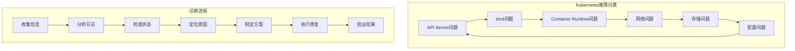
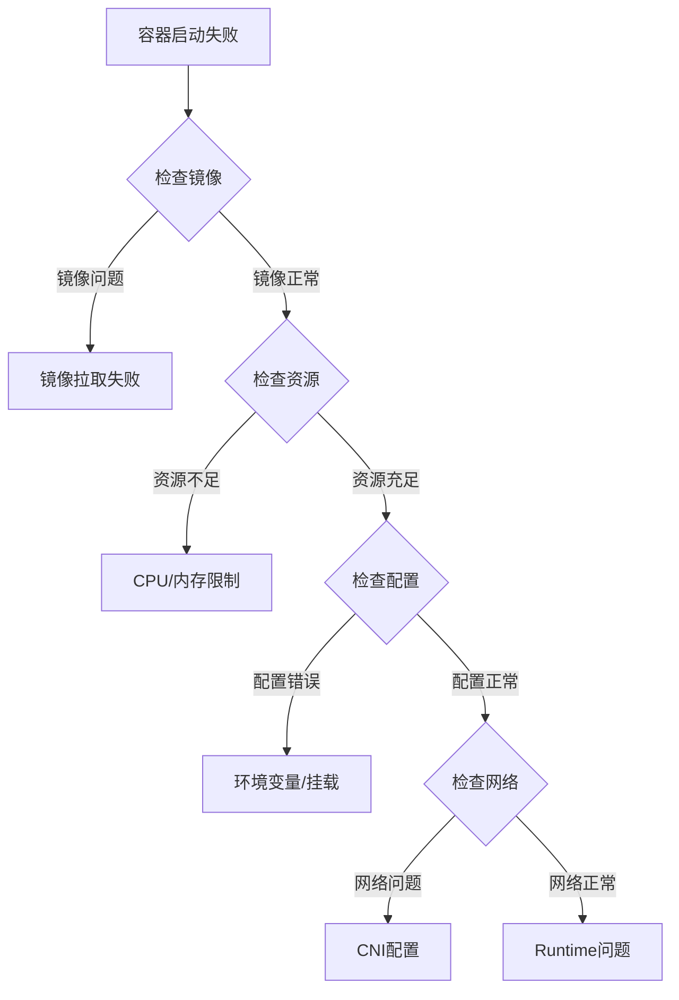

# Kubernetes核心组件故障排查完整指南

## 故障分类和诊断流程

### 故障分类体系



### 通用诊断工具集

**综合诊断脚本**

```bash
#!/bin/bash
# kubernetes-diagnose.sh - Kubernetes集群故障诊断工具

echo "🩺 Kubernetes故障诊断工具"
echo "=========================="

# 颜色定义
RED='\033[0;31m'
GREEN='\033[0;32m'
YELLOW='\033[1;33m'
BLUE='\033[0;34m'
NC='\033[0m' # No Color

# 检查函数
check_status() {
    local service=$1
    local cmd=$2
    echo -n "检查 $service: "

    if eval $cmd >/dev/null 2>&1; then
        echo -e "${GREEN}✓${NC}"
        return 0
    else
        echo -e "${RED}✗${NC}"
        return 1
    fi
}

# 显示详细信息函数
show_details() {
    local title=$1
    local cmd=$2
    echo -e "\n${BLUE}=== $title ===${NC}"
    eval $cmd
}

echo "1. 基础连接测试"
echo "---------------"

# 检查kubectl连接
check_status "kubectl连接" "kubectl cluster-info"

# 检查API Server
check_status "API Server健康" "kubectl get --raw='/healthz'"

# 检查节点状态
check_status "节点状态" "kubectl get nodes | grep -v NotReady"

# 检查系统Pod
check_status "系统Pod状态" "kubectl get pods -n kube-system | grep -v Running | grep -v Completed | grep -v Succeeded"

echo -e "\n2. 组件详细状态"
echo "---------------"

# API Server详情
show_details "API Server状态" "kubectl get pods -n kube-system -l component=kube-apiserver"

# etcd详情
show_details "etcd状态" "kubectl get pods -n kube-system -l component=etcd"

# 控制器管理器详情
show_details "Controller Manager状态" "kubectl get pods -n kube-system -l component=kube-controller-manager"

# 调度器详情
show_details "Scheduler状态" "kubectl get pods -n kube-system -l component=kube-scheduler"

echo -e "\n3. 资源使用情况"
echo "---------------"

# 节点资源
show_details "节点资源使用" "kubectl top nodes"

# Pod资源
show_details "Pod资源使用" "kubectl top pods -A | head -20"

echo -e "\n4. 事件信息"
echo "-----------"

# 集群事件
show_details "最近事件" "kubectl get events --sort-by=.metadata.creationTimestamp | tail -20"

echo -e "\n诊断完成！"
```

## API Server故障排查

### 常见问题诊断

#### 1. API Server无法启动

**症状识别:**
```bash
# 检查API Server状态
kubectl get pods -n kube-system -l component=kube-apiserver
systemctl status kubelet

# 查看日志
journalctl -u kubelet -f
kubectl logs -n kube-system <apiserver-pod-name>
```

**常见原因和解决方案:**

| 问题 | 症状 | 解决方案 |
|------|------|----------|
| 证书问题 | TLS握手失败 | 检查证书有效期和权限 |
| etcd连接失败 | connection refused | 验证etcd服务状态 |
| 端口冲突 | address already in use | 检查端口占用情况 |
| 配置错误 | invalid configuration | 验证配置文件语法 |

**详细排查步骤:**
```bash
# 1. 检查证书
sudo openssl x509 -in /etc/kubernetes/pki/apiserver.crt -text -noout
sudo openssl verify -CAfile /etc/kubernetes/pki/ca.crt /etc/kubernetes/pki/apiserver.crt

# 2. 检查etcd连接
ETCDCTL_API=3 etcdctl --endpoints=https://127.0.0.1:2379 \
  --cacert=/etc/kubernetes/pki/etcd/ca.crt \
  --cert=/etc/kubernetes/pki/etcd/server.crt \
  --key=/etc/kubernetes/pki/etcd/server.key \
  endpoint health

# 3. 检查配置文件
sudo kubeadm config view

# 4. 手动启动测试
sudo kube-apiserver --config=/etc/kubernetes/manifests/kube-apiserver.yaml --dry-run
```

#### 2. API Server响应慢

**性能诊断工具:**
```bash
# API Server指标监控
kubectl get --raw /metrics | grep -E "(apiserver_request_duration|apiserver_request_total)"

# 连接池状态
kubectl get --raw /metrics | grep -E "(rest_client_request_duration|rest_client_requests_total)"

# 存储延迟
kubectl get --raw /metrics | grep -E "etcd_request_duration"
```

**优化建议:**
```yaml
# API Server配置优化
apiVersion: v1
kind: Pod
metadata:
  name: kube-apiserver
spec:
  containers:
  - name: kube-apiserver
    command:
    - kube-apiserver
    - --max-requests-inflight=3000        # 增加并发请求数
    - --max-mutating-requests-inflight=1000
    - --request-timeout=300s              # 调整请求超时
    - --watch-cache-sizes=100            # 优化Watch缓存
```

## etcd故障排查

### 诊断脚本详解

```bash
#!/bin/bash
# etcd-troubleshoot.sh - etcd专项故障排查

ETCD_ENDPOINTS="https://127.0.0.1:2379"
ETCD_CACERT="/etc/kubernetes/pki/etcd/ca.crt"
ETCD_CERT="/etc/kubernetes/pki/etcd/server.crt"
ETCD_KEY="/etc/kubernetes/pki/etcd/server.key"

echo "🔧 etcd故障排查工具"
echo "=================="

# etcd健康检查
echo "1. etcd健康状态"
echo "---------------"
ETCDCTL_API=3 etcdctl endpoint health \
  --endpoints=$ETCD_ENDPOINTS \
  --cacert=$ETCD_CACERT \
  --cert=$ETCD_CERT \
  --key=$ETCD_KEY

# 集群成员状态
echo -e "\n2. 集群成员状态"
echo "---------------"
ETCDCTL_API=3 etcdctl member list -w table \
  --endpoints=$ETCD_ENDPOINTS \
  --cacert=$ETCD_CACERT \
  --cert=$ETCD_CERT \
  --key=$ETCD_KEY

# 性能检测
echo -e "\n3. 性能检测"
echo "----------"
ETCDCTL_API=3 etcdctl check perf \
  --endpoints=$ETCD_ENDPOINTS \
  --cacert=$ETCD_CACERT \
  --cert=$ETCD_CERT \
  --key=$ETCD_KEY

# 数据库状态
echo -e "\n4. 数据库状态"
echo "----------"
ETCDCTL_API=3 etcdctl endpoint status -w table \
  --endpoints=$ETCD_ENDPOINTS \
  --cacert=$ETCD_CACERT \
  --cert=$ETCD_CERT \
  --key=$ETCD_KEY

# 告警检查
echo -e "\n5. 告警状态"
echo "----------"
ETCDCTL_API=3 etcdctl alarm list \
  --endpoints=$ETCD_ENDPOINTS \
  --cacert=$ETCD_CACERT \
  --cert=$ETCD_CERT \
  --key=$ETCD_KEY

echo -e "\netcd诊断完成！"
```

### 常见etcd问题

#### 1. 存储空间不足

**问题症状:**
```bash
# 检查存储配额
ETCDCTL_API=3 etcdctl alarm list

# 查看数据库大小
ETCDCTL_API=3 etcdctl endpoint status -w table
```

**解决方案:**
```bash
# 1. 压缩历史版本
rev=$(ETCDCTL_API=3 etcdctl endpoint status --write-out="json" | \
  jq '.[] | .Status.header.revision')
ETCDCTL_API=3 etcdctl compact $rev

# 2. 碎片整理
ETCDCTL_API=3 etcdctl defrag --cluster

# 3. 清除告警
ETCDCTL_API=3 etcdctl alarm disarm

# 4. 增加存储配额
etcd --quota-backend-bytes=8589934592  # 8GB
```

#### 2. 集群脑裂

**诊断脚本:**
```bash
#!/bin/bash
# check-split-brain.sh

echo "检查etcd集群脑裂状态..."

ENDPOINTS=(
  "https://10.0.0.1:2379"
  "https://10.0.0.2:2379"
  "https://10.0.0.3:2379"
)

for endpoint in "${ENDPOINTS[@]}"; do
    echo "检查节点: $endpoint"

    # 检查节点状态
    status=$(ETCDCTL_API=3 etcdctl endpoint status \
      --endpoints=$endpoint \
      --cacert=$ETCD_CACERT \
      --cert=$ETCD_CERT \
      --key=$ETCD_KEY \
      --write-out=json 2>/dev/null)

    if [ $? -eq 0 ]; then
        leader=$(echo $status | jq -r '.[0].Status.leader')
        term=$(echo $status | jq -r '.[0].Status.header.revision')
        echo "  Leader: $leader, Term: $term"
    else
        echo "  节点不可达"
    fi
done
```

## Container Runtime故障排查

### containerd诊断

```bash
#!/bin/bash
# containerd-diagnose.sh

echo "🐳 Container Runtime诊断工具"
echo "============================"

# 检查containerd服务
echo "1. containerd服务状态"
echo "-------------------"
systemctl is-active containerd
systemctl status containerd --no-pager -l

# 检查CRI插件
echo -e "\n2. CRI插件状态"
echo "-------------"
crictl info

# 检查运行容器
echo -e "\n3. 运行容器状态"
echo "-------------"
crictl ps -a | head -10

# 检查镜像
echo -e "\n4. 镜像状态"
echo "----------"
crictl images | head -10

# 检查网络插件
echo -e "\n5. 网络插件状态"
echo "--------------"
ls -la /etc/cni/net.d/
cat /etc/cni/net.d/* | head -20

echo -e "\ncontainerd诊断完成！"
```

### 容器启动失败排查

**常见问题诊断流程:**



**详细排查命令:**
```bash
# 1. 检查Pod状态
kubectl describe pod <pod-name>

# 2. 查看容器日志
kubectl logs <pod-name> -c <container-name>

# 3. 检查镜像拉取
crictl inspecti <image-id>

# 4. 检查容器配置
crictl inspect <container-id>

# 5. 进入容器调试
kubectl exec -it <pod-name> -- /bin/sh

# 6. 检查节点资源
kubectl top node
kubectl describe node <node-name>
```

## 网络问题排查

### Pod网络诊断

```bash
#!/bin/bash
# network-diagnose.sh

POD_NAME=$1
NAMESPACE=${2:-default}

echo "🌐 Pod网络诊断: $POD_NAME"
echo "========================="

# 检查Pod IP
echo "1. Pod网络信息"
echo "-------------"
kubectl get pod $POD_NAME -n $NAMESPACE -o wide

# 检查Service关联
echo -e "\n2. Service关联"
echo "-------------"
kubectl get svc -n $NAMESPACE

# DNS解析测试
echo -e "\n3. DNS解析测试"
echo "-------------"
kubectl exec $POD_NAME -n $NAMESPACE -- nslookup kubernetes.default.svc.cluster.local

# 网络连通性测试
echo -e "\n4. 网络连通性"
echo "-------------"
kubectl exec $POD_NAME -n $NAMESPACE -- ping -c 3 8.8.8.8

# CNI插件状态
echo -e "\n5. CNI插件状态"
echo "-------------"
ls -la /etc/cni/net.d/
cat /etc/cni/net.d/10-*.conf
```

## 监控和告警

### Prometheus监控配置

```yaml
# kubernetes-monitoring.yaml
apiVersion: v1
kind: ConfigMap
metadata:
  name: prometheus-config
data:
  prometheus.yml: |
    global:
      scrape_interval: 15s

    rule_files:
      - "/etc/prometheus/rules/*.yml"

    scrape_configs:
    # API Server监控
    - job_name: 'kubernetes-apiservers'
      kubernetes_sd_configs:
      - role: endpoints
      relabel_configs:
      - source_labels: [__meta_kubernetes_namespace, __meta_kubernetes_service_name, __meta_kubernetes_endpoint_port_name]
        action: keep
        regex: default;kubernetes;https

    # etcd监控
    - job_name: 'kubernetes-etcd'
      static_configs:
      - targets: ['10.0.0.1:2379', '10.0.0.2:2379', '10.0.0.3:2379']
      scheme: https
      tls_config:
        ca_file: /etc/ssl/etcd/ca.pem
        cert_file: /etc/ssl/etcd/client.pem
        key_file: /etc/ssl/etcd/client-key.pem

    # Kubelet监控
    - job_name: 'kubernetes-kubelet'
      kubernetes_sd_configs:
      - role: node
      relabel_configs:
      - action: labelmap
        regex: __meta_kubernetes_node_label_(.+)
```

### 告警规则配置

```yaml
# kubernetes-alerts.yml
groups:
- name: kubernetes.alerts
  rules:
  # API Server告警
  - alert: KubernetesAPIServerDown
    expr: up{job="kubernetes-apiservers"} == 0
    for: 5m
    labels:
      severity: critical
    annotations:
      summary: "Kubernetes API Server is down"
      description: "Kubernetes API Server has been down for more than 5 minutes"

  - alert: KubernetesAPIServerHighRequestLatency
    expr: histogram_quantile(0.99, apiserver_request_duration_seconds_bucket) > 1
    for: 5m
    labels:
      severity: warning
    annotations:
      summary: "High API Server request latency"

  # etcd告警
  - alert: EtcdClusterDown
    expr: up{job="kubernetes-etcd"} == 0
    for: 5m
    labels:
      severity: critical
    annotations:
      summary: "etcd cluster is down"

  - alert: EtcdHighNumberOfLeaderChanges
    expr: increase(etcd_server_leader_changes_seen_total[1h]) > 3
    for: 5m
    labels:
      severity: warning
    annotations:
      summary: "High number of leader changes"

  # 节点告警
  - alert: KubernetesNodeNotReady
    expr: kube_node_status_condition{condition="Ready",status="true"} == 0
    for: 5m
    labels:
      severity: critical
    annotations:
      summary: "Kubernetes node not ready"
```

## 预防性维护

### 健康检查脚本

```bash
#!/bin/bash
# health-check.sh - 定期健康检查

LOG_FILE="/var/log/kubernetes-health-check.log"

log_message() {
    echo "$(date): $1" >> $LOG_FILE
}

# 集群健康检查
check_cluster_health() {
    log_message "开始集群健康检查..."

    # 检查API Server
    if kubectl cluster-info >/dev/null 2>&1; then
        log_message "✓ API Server健康"
    else
        log_message "✗ API Server异常"
        return 1
    fi

    # 检查节点状态
    not_ready_nodes=$(kubectl get nodes | grep NotReady | wc -l)
    if [ $not_ready_nodes -eq 0 ]; then
        log_message "✓ 所有节点就绪"
    else
        log_message "✗ $not_ready_nodes 个节点未就绪"
    fi

    # 检查系统Pod
    failed_pods=$(kubectl get pods -n kube-system | grep -E "(Error|CrashLoopBackOff|Failed)" | wc -l)
    if [ $failed_pods -eq 0 ]; then
        log_message "✓ 系统Pod正常"
    else
        log_message "✗ $failed_pods 个系统Pod异常"
    fi
}

# 性能检查
check_performance() {
    log_message "开始性能检查..."

    # 检查API Server延迟
    latency=$(kubectl get --raw /metrics 2>/dev/null | \
        grep apiserver_request_duration_seconds | head -1)
    log_message "API Server延迟指标: $latency"

    # 检查etcd延迟
    etcd_latency=$(ETCDCTL_API=3 etcdctl check perf 2>/dev/null | \
        grep "PASS" | wc -l)
    if [ $etcd_latency -gt 0 ]; then
        log_message "✓ etcd性能正常"
    else
        log_message "✗ etcd性能异常"
    fi
}

# 执行检查
check_cluster_health
check_performance

log_message "健康检查完成"
```

### 自动修复脚本

```bash
#!/bin/bash
# auto-healing.sh - 自动修复脚本

# 重启失败的Pod
restart_failed_pods() {
    failed_pods=$(kubectl get pods -A | grep -E "(Error|CrashLoopBackOff)" | awk '{print $1","$2}')

    for pod_info in $failed_pods; do
        namespace=$(echo $pod_info | cut -d',' -f1)
        pod=$(echo $pod_info | cut -d',' -f2)

        echo "重启失败的Pod: $namespace/$pod"
        kubectl delete pod $pod -n $namespace
    done
}

# 清理驱逐的Pod
cleanup_evicted_pods() {
    echo "清理驱逐的Pod..."
    kubectl get pods -A | grep Evicted | awk '{print $2 " -n " $1}' | xargs kubectl delete pod
}

# 压缩etcd
compact_etcd() {
    echo "压缩etcd数据..."
    rev=$(ETCDCTL_API=3 etcdctl endpoint status --write-out="json" | \
        jq '.[] | .Status.header.revision')

    if [ $rev -gt 100000 ]; then
        ETCDCTL_API=3 etcdctl compact $rev
        echo "etcd压缩完成，压缩到版本: $rev"
    fi
}

# 执行自动修复
restart_failed_pods
cleanup_evicted_pods
compact_etcd

echo "自动修复完成"
```

---

**这是Kubernetes故障排查的完整指南，涵盖了从诊断到修复的全流程。建议将这些脚本保存到运维工具库中，并定期执行健康检查。**

**系列文章导航：**
- [Kubernetes集群架构深度解析](./kubernetes-cluster-architecture-overview)
- [Kubernetes API Server深度解析](./kubernetes-apiserver-deep-dive)
- [etcd分布式存储原理与实践](./kubernetes-etcd-distributed-storage)
- [etcd实战操作指南](./kubernetes-etcd-hands-on-guide)
- [Container Runtime与CRI接口详解](./kubernetes-container-runtime-cri)