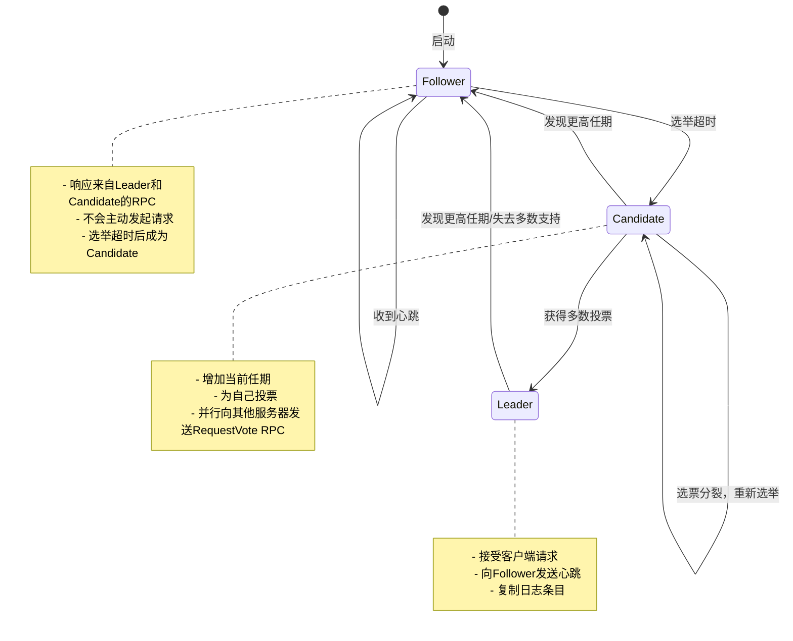
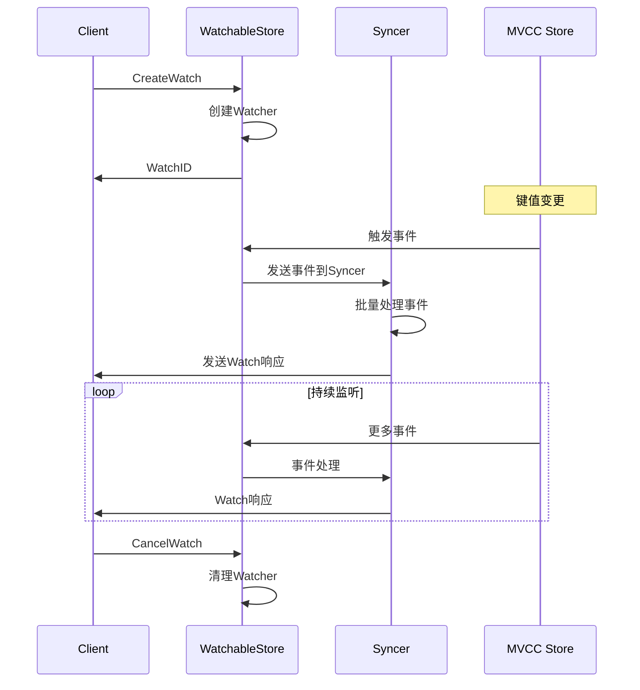
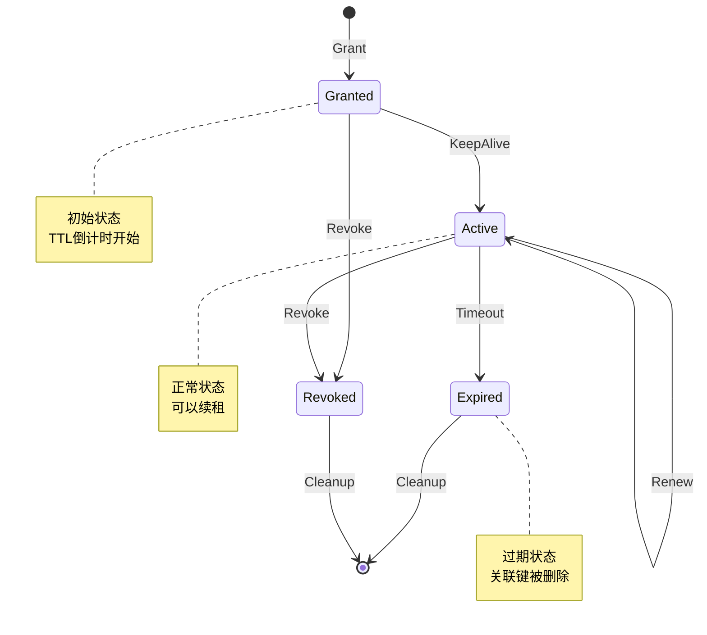
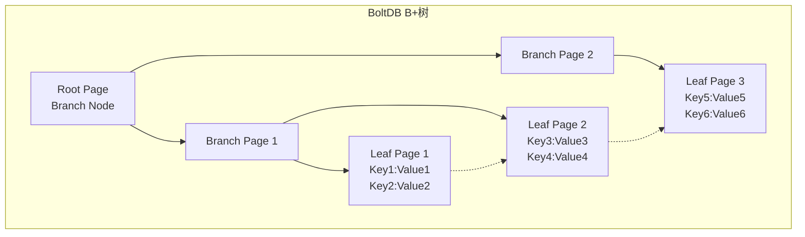

# etcd核心概念与MVCC机制

## Raft共识算法详解

### Raft核心原理

#### 角色状态转换


#### Leader选举算法
```bash
# 选举过程伪代码
function startElection():
    currentTerm++                    # 增加任期
    votedFor = self                  # 为自己投票
    resetElectionTimeout()           # 重置选举计时器
    voteCount = 1                    # 初始票数为1

    for each server in cluster:
        send RequestVote RPC to server

function onReceiveVote(vote):
    if vote.granted:
        voteCount++
        if voteCount > (clusterSize / 2):
            becomeLeader()           # 成为Leader
    else:
        if vote.term > currentTerm:
            currentTerm = vote.term
            becomeFollower()         # 成为Follower
```

#### 日志复制机制
```go
// 日志条目结构
type LogEntry struct {
    Term    uint64      // 领导者任期
    Index   uint64      // 日志索引
    Type    EntryType   // 条目类型
    Data    []byte      // 应用数据
}

// AppendEntries RPC参数
type AppendEntriesRequest struct {
    Term              uint64      // 领导者任期
    LeaderID          uint64      // 领导者ID
    PrevLogIndex      uint64      // 前一个日志条目索引
    PrevLogTerm       uint64      // 前一个日志条目任期
    Entries           []LogEntry  // 新的日志条目
    LeaderCommit      uint64      // 领导者已提交索引
}

type AppendEntriesResponse struct {
    Term       uint64 // 当前任期
    Success    bool   // 是否成功
    MatchIndex uint64 // 匹配的日志索引
}
```

### Raft安全性保证

#### 选举安全性
- **每个任期最多一个Leader**: 通过多数投票机制保证
- **Leader完整性**: 新Leader必须包含所有已提交的日志条目

```go
// 投票限制：只有日志更新的候选者才能获得投票
func (rf *Raft) RequestVote(args *RequestVoteArgs, reply *RequestVoteReply) {
    rf.mu.Lock()
    defer rf.mu.Unlock()

    // 拒绝过期任期的请求
    if args.Term < rf.currentTerm {
        reply.Term = rf.currentTerm
        reply.VoteGranted = false
        return
    }

    // 更新任期
    if args.Term > rf.currentTerm {
        rf.currentTerm = args.Term
        rf.votedFor = -1
        rf.state = Follower
    }

    reply.Term = rf.currentTerm

    // 检查是否已经投票
    if rf.votedFor != -1 && rf.votedFor != args.CandidateId {
        reply.VoteGranted = false
        return
    }

    // 检查候选者日志是否至少与自己一样新
    lastLogIndex := len(rf.log) - 1
    lastLogTerm := rf.log[lastLogIndex].Term

    logUpToDate := args.LastLogTerm > lastLogTerm ||
                   (args.LastLogTerm == lastLogTerm && args.LastLogIndex >= lastLogIndex)

    if logUpToDate {
        rf.votedFor = args.CandidateId
        rf.resetElectionTimeout()
        reply.VoteGranted = true
    } else {
        reply.VoteGranted = false
    }
}
```

## MVCC多版本并发控制

### 版本控制模型

#### 全局版本号机制
```bash
# etcd版本号示例
Global Revision: 12345
├── Key: /registry/pods/default/pod-1
│   ├── CreateRevision: 12340
│   ├── ModRevision: 12345
│   ├── Version: 3
│   └── Value: {pod data}
├── Key: /registry/pods/default/pod-2
│   ├── CreateRevision: 12341
│   ├── ModRevision: 12341
│   ├── Version: 1
│   └── Value: {pod data}
```

#### MVCC存储结构
```go
// Key-Value存储结构
type KeyValue struct {
    Key            []byte  // 实际键
    CreateRevision int64   // 创建时的全局版本号
    ModRevision    int64   // 最后修改时的全局版本号
    Version        int64   // 该键的版本号（单调递增）
    Value          []byte  // 值
    Lease          int64   // 租约ID
}

// 索引结构
type TreeIndex struct {
    tree BTree
}

// B-Tree节点
type keyIndex struct {
    key         []byte        // 键
    modified    revision      // 最后修改版本
    generations []generation  // 历史版本
}

type generation struct {
    ver     int64      // 版本号
    created revision   // 创建版本
    revs    []revision // 修改历史
}
```

### 事务隔离级别

#### 快照隔离(Snapshot Isolation)
```go
// 读取指定版本的数据
type RangeRequest struct {
    Key      []byte
    RangeEnd []byte
    Limit    int64
    Revision int64  // 指定读取的版本号
}

// 实现时间点查询
func (s *store) Range(r RangeRequest) (*RangeResult, error) {
    if r.Revision <= 0 {
        // 读取最新版本
        r.Revision = s.currentRev()
    }

    // 从指定版本读取数据
    kvs, rev, err := s.rangeKeys(r.Key, r.RangeEnd, r.Limit, r.Revision)
    if err != nil {
        return nil, err
    }

    return &RangeResult{
        KVs: kvs,
        Rev: rev,
    }, nil
}
```

#### 乐观并发控制
```go
// Compare操作实现乐观锁
type Compare struct {
    Result      Compare_CompareResult
    Target      Compare_CompareTarget
    Key         []byte
    TargetUnion interface{} // Version, CreateRevision, ModRevision, Value
}

// 事务请求
type TxnRequest struct {
    Compare []Compare    // 前置条件
    Success []RequestOp  // 条件满足时执行
    Failure []RequestOp  // 条件不满足时执行
}

// 使用示例：实现分布式锁
func acquireLock(client *clientv3.Client, key string, value string) error {
    resp, err := client.Txn(context.Background()).
        // 如果键不存在
        If(clientv3.Compare(clientv3.CreateRevision(key), "=", 0)).
        // 则创建键
        Then(clientv3.OpPut(key, value)).
        // 否则获取锁失败
        Else(clientv3.OpGet(key)).
        Commit()

    if err != nil {
        return err
    }

    if !resp.Succeeded {
        return errors.New("lock already held")
    }

    return nil
}
```

## Watch机制原理

### Watch事件模型

#### 事件类型定义
```go
// Watch事件类型
type Event struct {
    Type EventType  // PUT, DELETE
    Kv   *KeyValue  // 当前键值
    PrevKv *KeyValue // 前一个版本的键值
}

type EventType int32

const (
    PUT    EventType = 0  // 创建或更新
    DELETE EventType = 1  // 删除
)

// Watch请求
type WatchRequest struct {
    RequestUnion interface{} // CreateRequest, CancelRequest
}

type WatchCreateRequest struct {
    Key               []byte  // 监听的键
    RangeEnd          []byte  // 范围结束键
    StartRevision     int64   // 开始监听的版本
    ProgressNotify    bool    // 是否发送进度通知
    Filters           []WatchCreateRequest_FilterType // 事件过滤器
    PrevKv           bool    // 是否返回前一个版本
    WatchId          int64   // Watch ID
}
```

#### Watch实现机制


### Watch性能优化

#### 事件聚合机制
```go
// Syncer负责批量发送事件
type syncer struct {
    watcherGroup watchergroup
    victims      []watcherBatch  // 批量事件
}

type watcherBatch struct {
    watchers []watcher
    revs     []revision
}

// 批量发送优化
func (s *syncer) sync() {
    var victims []watcherBatch

    // 收集需要发送事件的watcher
    s.watcherGroup.visit(func(w *watcher) bool {
        if w.needsNotification() {
            victims = append(victims, watcherBatch{
                watchers: []watcher{*w},
                revs:     w.getPendingRevisions(),
            })
        }
        return true
    })

    // 批量发送事件
    for _, victim := range victims {
        s.sendEvents(victim)
    }
}
```

#### Watch缓存策略
```go
// Watchable Store实现
type watchableStore struct {
    store    *store
    mu       sync.RWMutex
    watchers watcherGroup
    victims  []watcherBatch
    victimc  chan watcherBatch

    // 事件历史缓存
    eventsBuffer []mvccpb.Event
    startRev     int64
}

// 从历史事件恢复Watch
func (ws *watchableStore) NewWatchStream() WatchStream {
    return &watchStream{
        watchable: ws,
        ch:        make(chan WatchResponse, chanBufLen),
        recvc:     make(chan *WatchRequest, recvBufLen),
    }
}
```

## 租约系统(Lease)

### 租约模型设计

#### 租约生命周期


#### 租约数据结构
```go
// 租约实现
type Lease struct {
    ID           LeaseID
    ttl          int64            // 原始TTL
    remainingTTL int64            // 剩余TTL
    expiry       time.Time        // 过期时间
    mu           sync.RWMutex
    itemSet      map[LeaseItem]struct{} // 关联的项目
}

type LeaseItem struct {
    Key []byte
}

// 租约管理器
type lessor struct {
    mu             sync.RWMutex
    leaseMap       map[LeaseID]*Lease
    leaseExpiredC  chan []*Lease      // 过期租约通道
    stopC          chan struct{}
    doneC          chan struct{}

    // TTL检查器
    checkpointInterval time.Duration
    expiredC          chan []*Lease
}

// 租约操作接口
type Lessor interface {
    // 授予租约
    Grant(id LeaseID, ttl int64) (*Lease, error)

    // 撤销租约
    Revoke(id LeaseID) error

    // 续约
    Renew(id LeaseID) (int64, error)

    // 查找租约
    Lookup(id LeaseID) *Lease

    // 获取过期租约
    ExpiredLeasesC() <-chan []*Lease
}
```

### 租约过期检测

#### TTL管理算法
```go
// 租约过期检查器
type LeaseTimeoutChecker struct {
    lessor  *lessor
    ticker  *time.Ticker
    stopC   chan struct{}
}

func (ltc *LeaseTimeoutChecker) run() {
    defer ltc.ticker.Stop()

    for {
        select {
        case <-ltc.ticker.C:
            expired := ltc.findExpiredLeases()
            if len(expired) > 0 {
                ltc.lessor.expiredC <- expired
            }
        case <-ltc.stopC:
            return
        }
    }
}

func (ltc *LeaseTimeoutChecker) findExpiredLeases() []*Lease {
    ltc.lessor.mu.RLock()
    defer ltc.lessor.mu.RUnlock()

    now := time.Now()
    var expired []*Lease

    for _, lease := range ltc.lessor.leaseMap {
        if now.After(lease.expiry) {
            expired = append(expired, lease)
        }
    }

    return expired
}
```

#### 租约与键值关联
```go
// 绑定键到租约
func (le *lessor) Attach(id LeaseID, items []LeaseItem) error {
    le.mu.Lock()
    defer le.mu.Unlock()

    lease := le.leaseMap[id]
    if lease == nil {
        return ErrLeaseNotFound
    }

    lease.mu.Lock()
    defer lease.mu.Unlock()

    for _, item := range items {
        lease.itemSet[item] = struct{}{}
    }

    return nil
}

// 租约过期时清理关联的键
func (le *lessor) revokeExpiredLeases() {
    expired := <-le.ExpiredLeasesC()

    for _, lease := range expired {
        le.mu.Lock()
        delete(le.leaseMap, lease.ID)
        le.mu.Unlock()

        // 删除关联的键
        lease.mu.RLock()
        for item := range lease.itemSet {
            le.backend.DeleteRange(item.Key, nil)
        }
        lease.mu.RUnlock()
    }
}
```

## 存储引擎深入

### BoltDB存储原理

#### B+树结构


#### 页面管理
```go
// BoltDB页面类型
const (
    branchPageFlag = 0x01  // 分支页
    leafPageFlag   = 0x02  // 叶子页
    metaPageFlag   = 0x04  // 元数据页
    freelistPageFlag = 0x10 // 空闲列表页
)

// 页面结构
type page struct {
    id       pgid   // 页面ID
    flags    uint16 // 页面类型标志
    count    uint16 // 元素数量
    overflow uint32 // 溢出页数量
}

// 事务管理
type Tx struct {
    writable bool
    managed  bool
    db       *DB
    meta     *meta
    root     Bucket
    pages    map[pgid]*page
    stats    TxStats
    commitHandlers []func()

    WriteFlag int  // 写入标志
}
```

### etcd存储抽象层

#### Backend接口设计
```go
// 后端存储接口
type Backend interface {
    ReadTx() ReadTx
    BatchTx() BatchTx
    ConcurrentReadTx() ReadTx
    Snapshot() Snapshot
    Hash(ignores map[IgnoreKey]struct{}) (uint32, error)
    Size() int64
    SizeInUse() int64
    OpenReadTxN() int64
    Defrag() error
    ForceCommit()
    Close() error
}

// 读事务接口
type ReadTx interface {
    Lock()
    Unlock()
    RLock()
    RUnlock()
    UnsafeRange(bucket Bucket, key, endKey []byte, limit int64) (keys [][]byte, vals [][]byte)
    UnsafeForEach(bucket Bucket, visitor func(k, v []byte) error) error
}

// 批量写事务接口
type BatchTx interface {
    ReadTx
    UnsafePut(bucket Bucket, key []byte, value []byte)
    UnsafeSeqPut(bucket Bucket, key []byte, value []byte)
    UnsafeDelete(bucket Bucket, key []byte)
    Commit()
    CommitAndStop()
}
```

#### MVCC存储层
```go
// KV存储实现
type store struct {
    cfg StoreConfig

    // 互斥锁
    mu sync.RWMutex

    // 修订版本
    currentRev int64

    // 后端存储
    b backend.Backend

    // 索引
    kvindex index

    // 租约管理
    le lease.Lessor

    // 压缩相关
    compactMainRev int64  // 主要压缩版本
    fifoSched      schedule.Scheduler // FIFO调度器

    stopc chan struct{}
    donec chan struct{}
}

// 存储配置
type StoreConfig struct {
    CompactionBatchLimit int           // 压缩批次限制
    CompactionSleepInterval time.Duration // 压缩睡眠间隔
}
```

## 网络通信协议

### gRPC协议栈

#### 服务定义
```protobuf
syntax = "proto3";

package etcdserverpb;

// KV服务
service KV {
    // Range gets the keys in the range from the key-value store.
    rpc Range(RangeRequest) returns (RangeResponse) {}

    // Put puts the given key into the key-value store.
    rpc Put(PutRequest) returns (PutResponse) {}

    // DeleteRange deletes the given range from the key-value store.
    rpc DeleteRange(DeleteRangeRequest) returns (DeleteRangeResponse) {}

    // Txn processes multiple requests in a single transaction.
    rpc Txn(TxnRequest) returns (TxnResponse) {}

    // Compact compacts the event history in the etcd key-value store.
    rpc Compact(CompactionRequest) returns (CompactionResponse) {}
}

// Watch服务
service Watch {
    // Watch watches for events happening or that have happened.
    rpc Watch(stream WatchRequest) returns (stream WatchResponse) {}
}
```

#### 负载均衡策略
```go
// 客户端负载均衡
type Balancer interface {
    // 获取端点
    Endpoint() (string, error)

    // 获取所有端点
    Endpoints() []string

    // 标记端点不健康
    HostPortError(hostPort string, err error)

    // 标记端点健康
    HostPortSuccess(hostPort string)

    // 更新端点列表
    UpdateAddrs(addrs ...string) error

    // 关闭负载均衡器
    Close() error
}

// 轮询负载均衡器
type roundRobinBalancer struct {
    mu        sync.RWMutex
    endpoints []string
    next      int
}

func (rrb *roundRobinBalancer) Endpoint() (string, error) {
    rrb.mu.Lock()
    defer rrb.mu.Unlock()

    if len(rrb.endpoints) == 0 {
        return "", ErrNoAvailableEndpoints
    }

    endpoint := rrb.endpoints[rrb.next]
    rrb.next = (rrb.next + 1) % len(rrb.endpoints)

    return endpoint, nil
}
```

---

**这是etcd核心概念的深度技术解析，涵盖了Raft共识算法、MVCC多版本控制、Watch机制和租约系统的完整实现原理。理解这些概念是掌握etcd和分布式系统设计的关键基础。**

**系列文章导航：**
- [etcd分布式存储原理与实践](./kubernetes-etcd-distributed-storage) ← 基础概述
- [etcd架构设计深度剖析](./etcd-architecture-deep-dive) ← 架构详解
- [etcd源码分析与性能优化](./etcd-source-code-performance) ← 下一篇
- [etcd实战操作指南](./kubernetes-etcd-hands-on-guide) ← 实战操作
- [Kubernetes核心组件学习系列概览](./kubernetes-learning-series-overview)